[TOC]

## 查壳

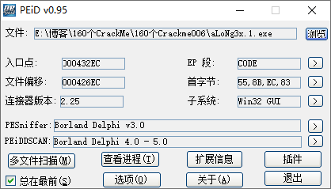

同样也是用Delphi写的，没有壳。

## 导入符号

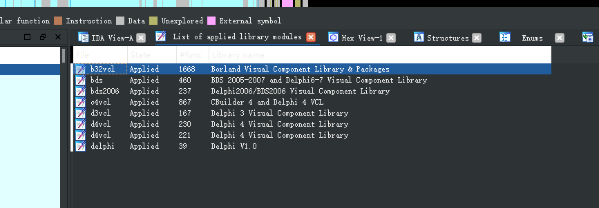

将程序载入到IDA，添加所有的Delphi的签名，然后导出为map文件，在OD中加载map文件，强大的签名库可以减少后面的分析时间。

## 分析程序

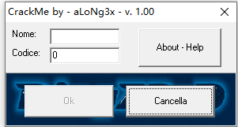

接下来分析一下这个程序，OK那个按钮被禁用了，这是什么套路？

旁边还有个help，不过都是英文的，上翻译。

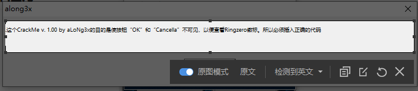

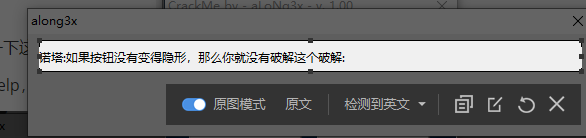

好，大概了解了。我们的目的就是要让那两个按钮变成隐藏的。

再拖到Darkde4里面查看一下按钮事件和窗口

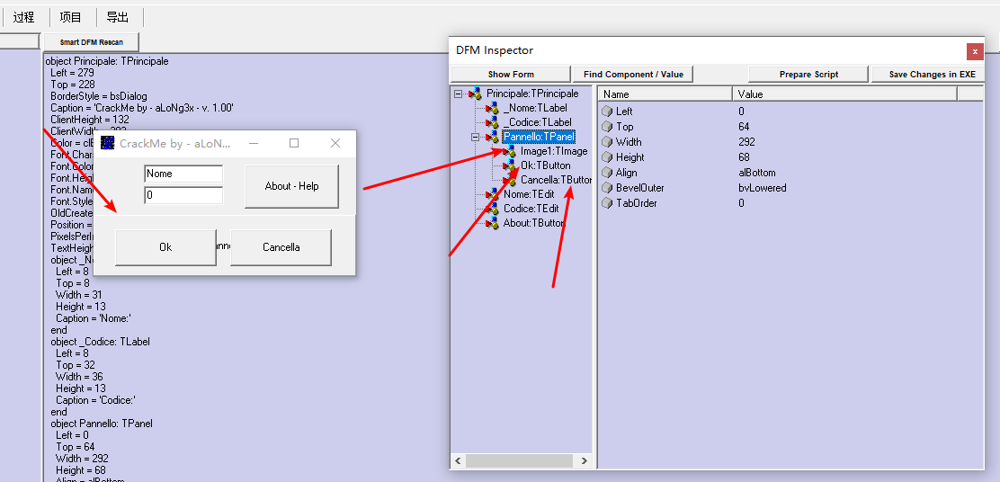

从控件窗口可以看到在下面这个控件里有一个OK按钮 有一个Cancella按钮，还有一个图片。我们的目的应该就是让那个图片显示出来。

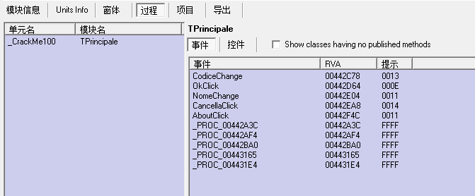


事件按钮有如下几个响应事件，每个响应事件都有对应的RVA:

- 代码变换事件
- OK按钮点击事件
- 用户名变换事件
- Cancella按钮点击事件
- About按钮的点击事件

那么既然要让这两个按钮变的不可见，就从Cancella这个按钮的点击事件开始分析

##分析Cancella按钮点击事件

找到Cancella按钮点击事件对应的RVA0x442EA8，随便输入一个账号密码，下断分析。


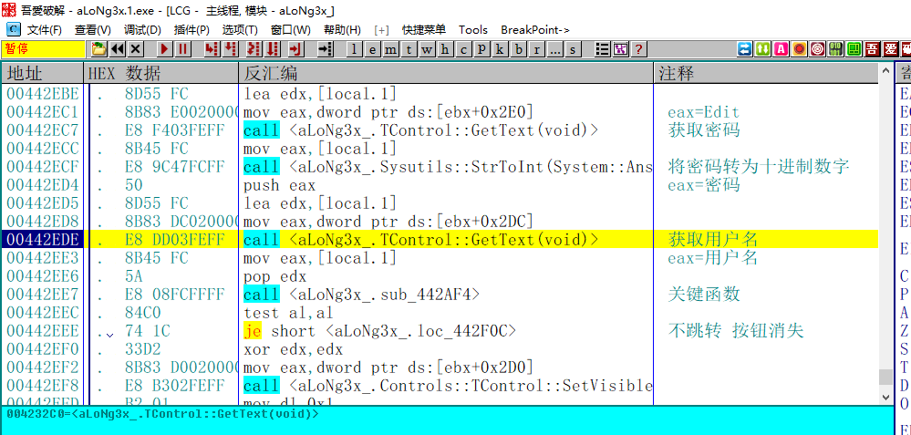

首先会获取输入的密码，然后将密码转为十进制数。接着获取用户名，然后是一个关键函数，这个函数如果返回值为1，那么就不跳转，按钮就会消失。接下来分析下这个关键函数。

### 分析关键函数

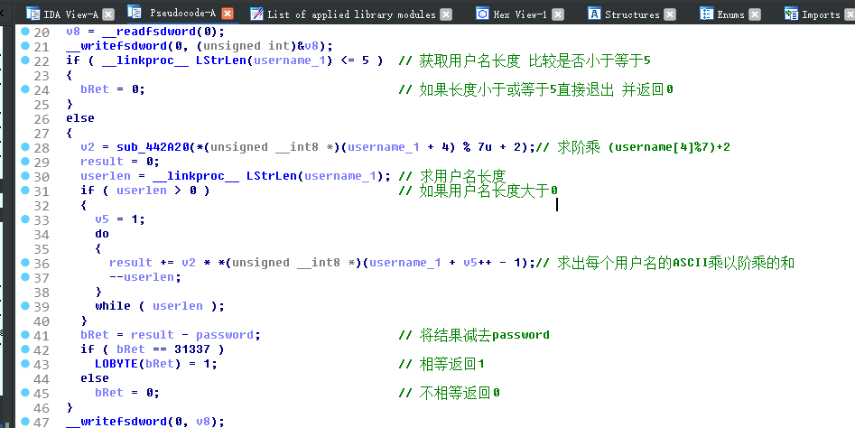

这里直接贴出IDA的分析结果，如果想要详细的过程可以去看我的udd文件。首先对用户名的做取模运算之后求阶乘，然后将每个用户名的ASCII乘以阶乘相加，最后把结果减去输入的密码，如果等于31337就返回1，否则返回零。也就是说，我们只要复制上面的过程，然后将结果减去31337，就能得到正确的密钥。

### 写出注册机

```C++
//计算第二个按钮Cancella所需要的密码
int CalcKey1()
{
	int key = 0;
	int nTemp = 0;
	int num = 0;		
	char username[20] = { 0 };
	printf("请输入用户名,长度必须在六位以上:");
	scanf_s("%s", username, 20);

	//检查长度
	if (strlen(username)<=5)
	{
		printf("用户名长度不满足 请重新输入");
		return 0;
	}

	//求阶乘
	num = ((int)username[4]) % 7 + 2;

	nTemp = num;
	for (int i=1;i< nTemp;i++)
	{
		num *= i;
	}
	nTemp = num;
	int result = 0;
	//求用户名的ASCII和乘以阶乘
	for (int i=0;i<strlen(username);i++)
	{
		result += nTemp * username[i];
	}
	//取出正确的密码
	key = result - 0x7A69;
	printf("%d\n", key);

}
```

### 验证结果

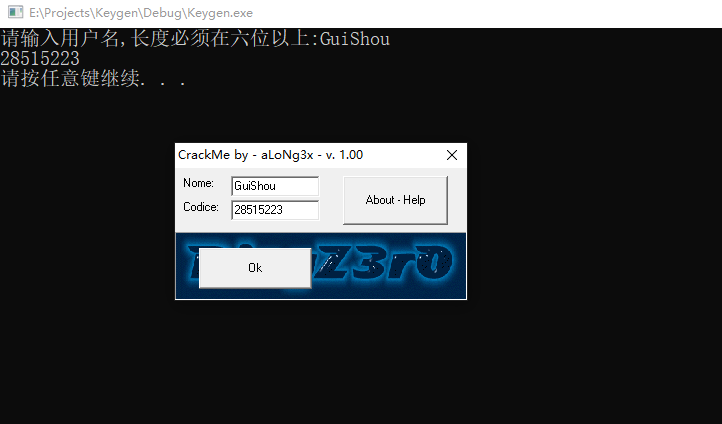

输入计算的结果，点击 我们可以看到右边的按钮消失了，并且左边的OK按钮也解除了禁用状态。

## 分析ok按钮点击事件

接下来来到的位置，来分析OK按钮的点击事件。

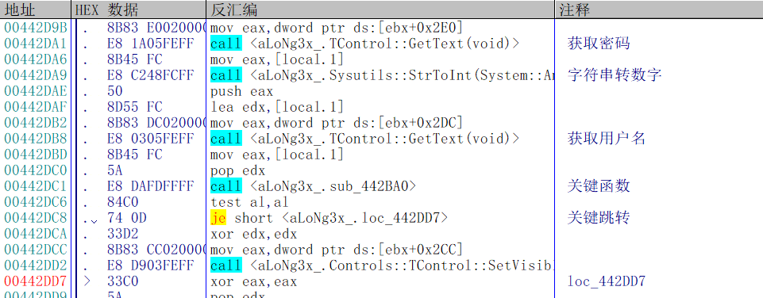

还是同样的套路，有一个关键的算法函数，这个函数返回1，按钮就消失，否则不成功。

### 分析关键函数

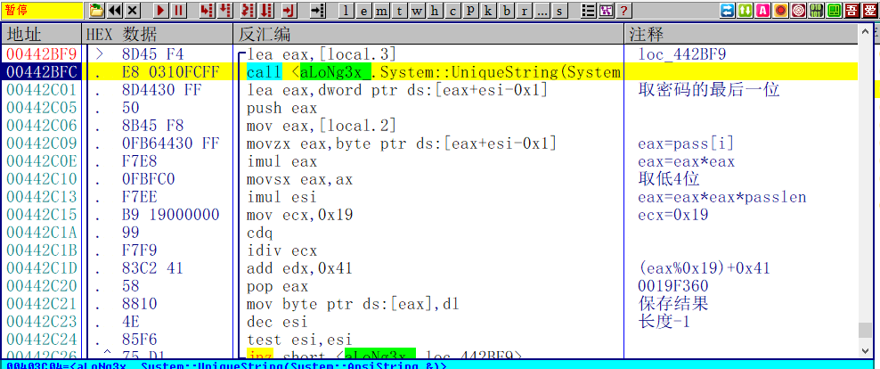

整个关键函数校验如下，首先取出密码的最后一位，然后做平方运算，接着乘以当前的密码长度，也就是index，然后对0x19取模，最后加上0x41然后保存结果，每个结果对应一位用户名。

### 写出注册机

接下来还原算法写出注册机

```C++
//计算第一个按钮OK所需要的密码
int CalcKey2()
{
	char key[20] = { 0 };
	char username[20] = { 0 };
	printf("请输入注册码,长度必须在六位以上:");

	//输入密码
	scanf_s("%s", key, 20);

	//检查长度
	if (strlen(key) <= 5)
	{
		printf("密码长度不满足 请重新输入");
		return 0;
	}
	for (int i= strlen(key)-1;i!=-1;i--)
	{
		username[i] = (key[i] * key[i] * (i + 1)) % 0x19 + 0x41;

	}
	printf("%s", username);
}
```

### 校验结果

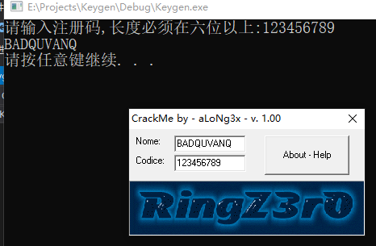

输入序列号，然后自动生成用户名，可以看到OK按钮也跟着消失了。

需要相关文件的可以到我的Github下载：https://github.com/TonyChen56/160-Crackme


