[TOC]

007这个crackme跟006是同一个作者，只不过难度上升了一颗星。先来查一下壳吧

## 查壳

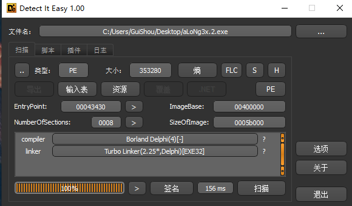

还是Delphi写的程序，没有壳。接下来用Darkde分析一下程序。

## Darkde分析程序

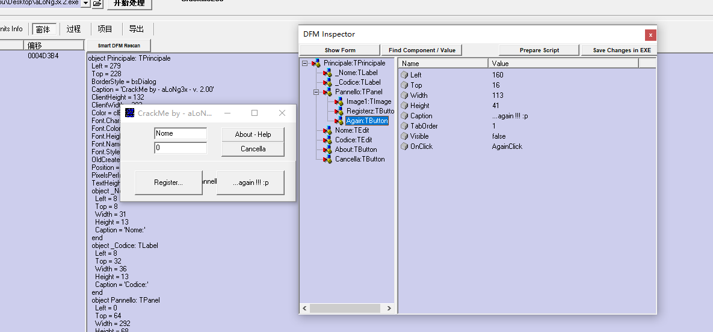

右边这个again按钮是被隐藏的。然后再来看事件

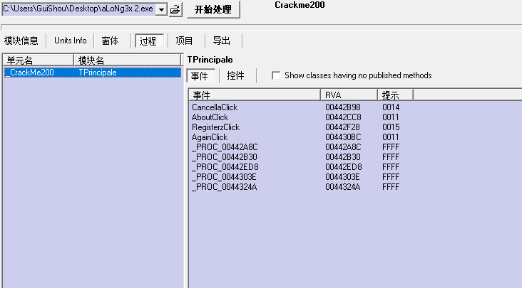

这里有以下几个事件:

- Cancella按钮的点击事件
- About按钮的点击事件
- Registerz按钮的点击事件
- Again按钮的点击事件

总共四个按钮事件。我们就从Registerz按钮的点击事件开始分析。

## 导入符号

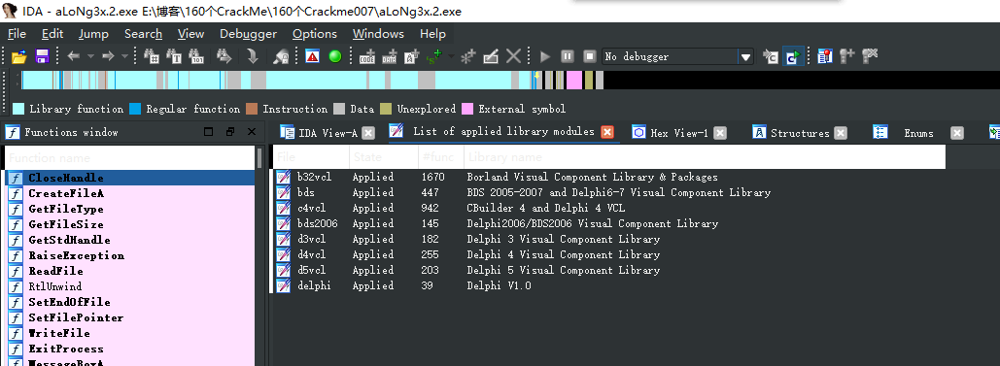

接下来拖到IDA里，添加所有的Delphi签名。导出Map文件，导入到OD里，方便接下来的分析。

##分析Register按钮事件

找到0x442F28的位置，下断点分析。

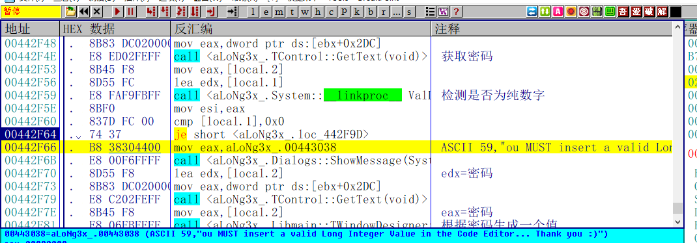

函数首先获取密码，然后检测密码是否为纯数字，不是则报错。但是我们必须让他报一次错。因为当密码不为纯数字的时候，他会根据密码生成一个值，这个值在后面必须要用到。如果密码为纯数字，则这个必须的值恒为零，注册永远不会成功。

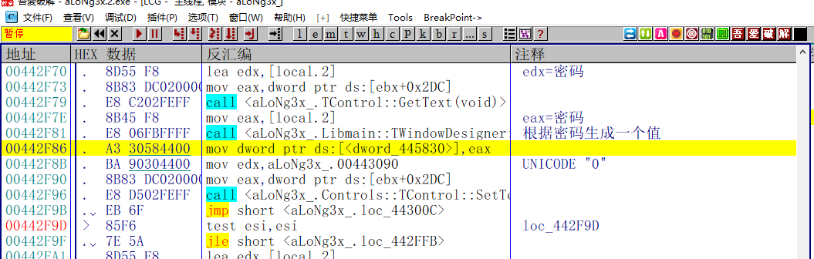

接着如果输入的密码不是纯数字，那么则会根据输入的密码生成一个值，这个值在后面的核心算法会用到，至于是怎么算的我就不知道了。所以我将这个值固定一下，把第一次输入的密码固定为GuiShou，。

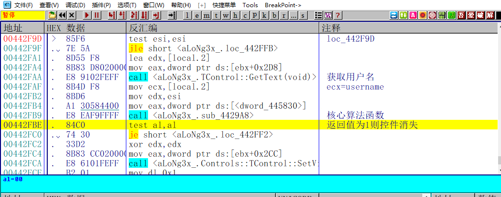

接下来获取用户名，然后有一个核心的算法，算法通过返回值为1则控件消失，否则不通过。接下来分析核心算法。

### 分析核心算法

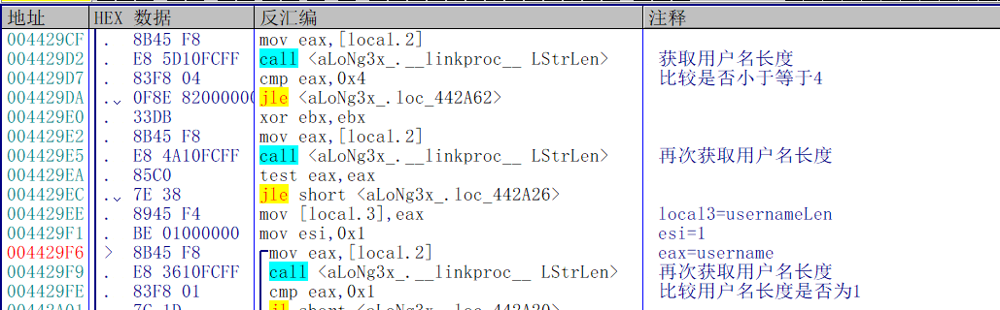

首先获取用户名的长度，判断用户名长度是否小于等于4。是则报错。

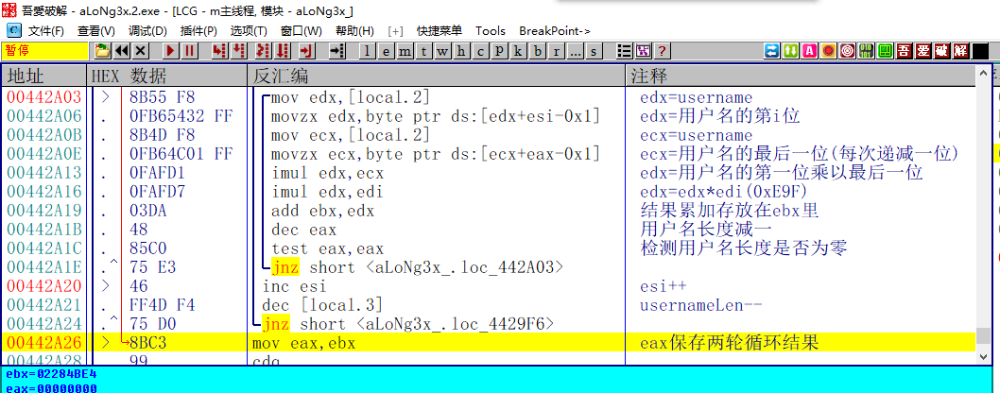

接下来是个两层循环，计算的是用户名的第一位和最后一位的乘积，然后再乘以刚刚用用户名计算出来的被我固定的值。外层循环变换用户名最后一位，每次往前移动一位。内层循环变换用户名第一位，每次往后移动一位。接着将结果保存到eax。

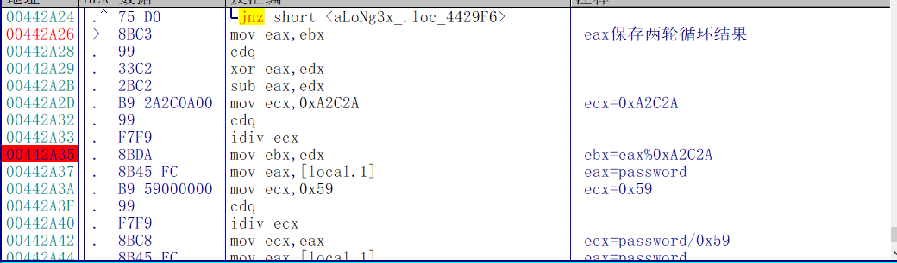

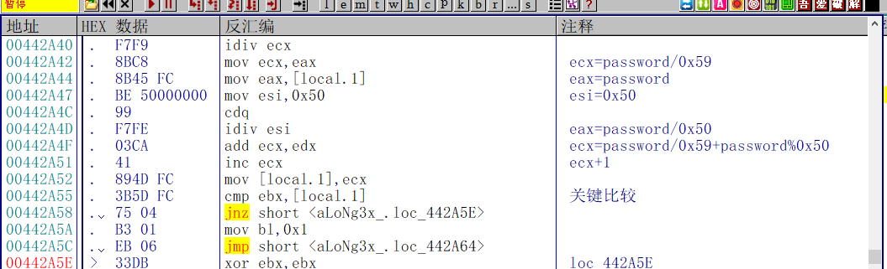

接着将eax对0xA2C2A取模，记为结果1，然后将输入的密码除以0x59加上密码模以0x50再加1的值，记为结果2。然后比较结果1和结果2是否相等。相等则返回1，消失按钮。不相等则返回0。

### 写出注册机

为了防止最后计算的结果产生溢出，所以我将用户名固定为5位。代码如下。

```C++
int CalcKey1()
{
	int nKey = 0x1C48;
	char szName[10] = { 0 };
	int nCode = 0;
	int nTemp = 0;

	printf("请输入用户名:");
	scanf_s("%s", szName, 10);
	if (strlen(szName)!=5)
	{
		printf("请输入五位用户名\n");
		return 0;
	}

	//根据name字符串计算
	for (int i = 1; i <= 5; i++)
	{
		for (int j = 5; j >= 1; j--)
		{
			nTemp += szName[i - 1] * szName[j - 1] * nKey;
		}
	}

	//取模
	nTemp = nTemp % 0xA2C2A;
	//反推code
	nCode = (0x50 - ((nTemp - 1) * 0x59 % 0x50)) + (nTemp - 1) * 0x59;
	printf("%d\n", nCode);
	return 0;
}
```

### 校验结果

首先输入用户名为12345(不固定 但限制长度必须为5)，密码输入GuiShou(密码已固定)。然后点击，提示报错信息直接点击确定。

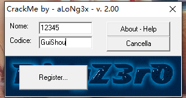


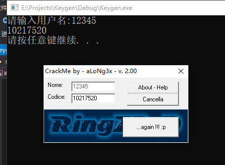

接着将用户名输入到注册机中，然后复制生成的序列号，点击注册，可以看到注册按钮消失。

## 分析again按钮事件

接下来来到0x4430BC这个位置，分析整个again按钮的点击事件。这个按钮事件跟Register完全一样。

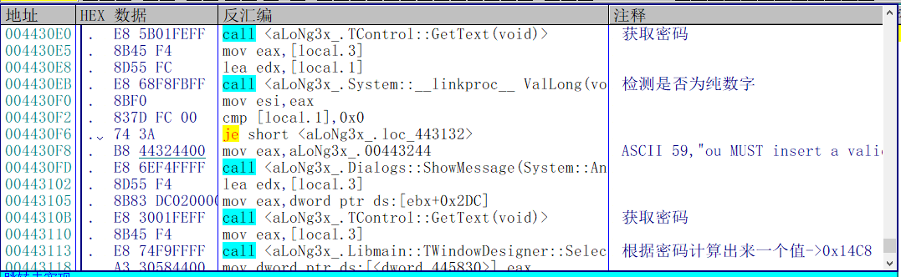

首先是获取密码，然后检测密码是否为纯数字，不是则报错，然后根据非纯数字的密码计算出一个值。

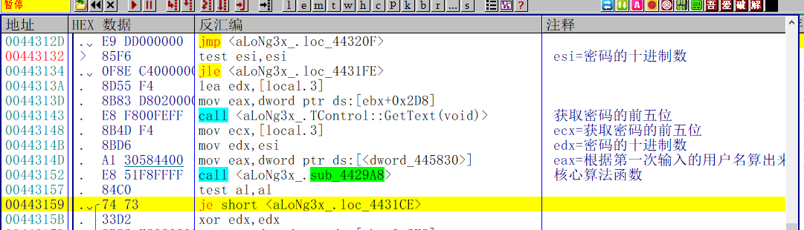

接着传入参数，又到了核心的算法函数，这个函数跟之前分析的一模一样。所以这个crackme到这里就算了完全结束了。最后做一下总结。

## 校验步骤

1. 首先输入用户名(内容随意，长度必须的五位数，为了防止最后的结果溢出)，然后输入固定的密码GuiShou，点击注册，弹框报错直接点击确定即可

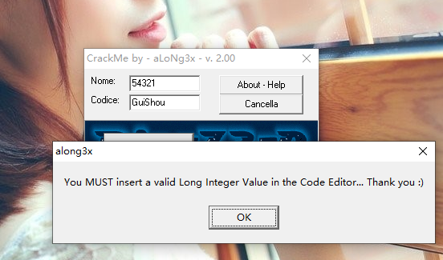

2. 接着将用户名输入到注册机，会算出一个序列号，再把这个序列号粘贴到Codice处，按钮消失。如图:


3. 接着再次再密码框输入GuiShou，报错后点击确定

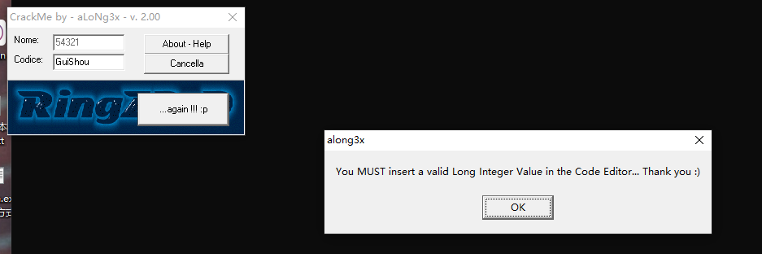

4. 接着还是输入刚才注册机计算出来的序列号，点击again按钮，按钮消失，破解完成

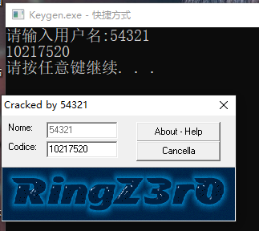

需要相关文件的可以到我的Github下载：https://github.com/TonyChen56/160-Crackme

