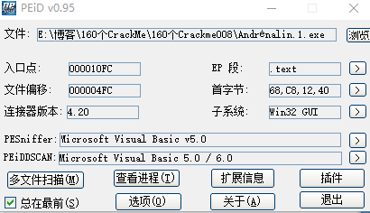
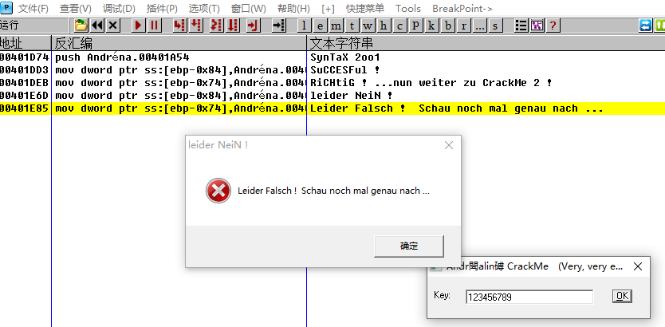
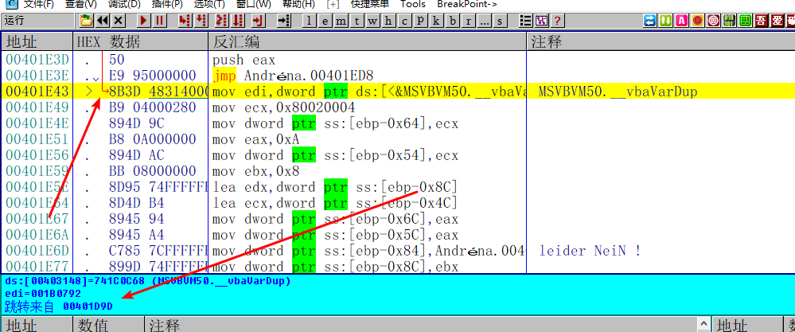
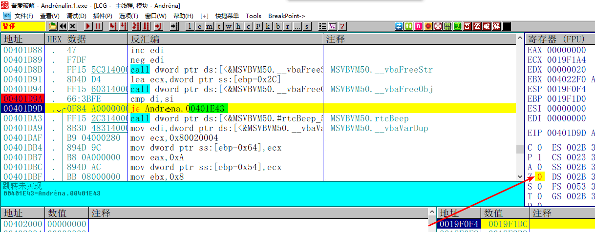
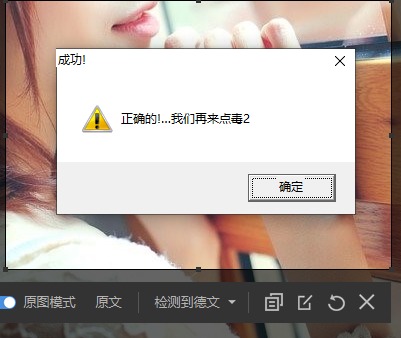
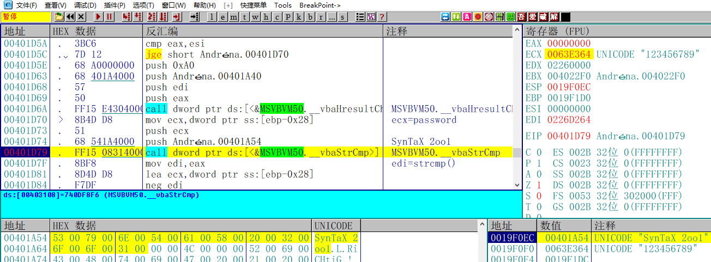
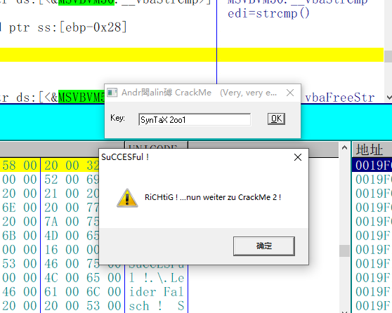

[TOC]

接下来分析008这个crackme，难度是一颗星

## 查壳

VB写的 没有壳。既然是VB写的程序，那IDA就帮不上什么忙了，VB的反编译工具反编译出来的源码我也看不懂，算了直接上OD吧。

## OD分析

首先根据错误提示查找到字符串跟进去，

这里是报错的地方，一步一步往上跟，看看到底是什么地方跳转到这里的。

紧接着就看到这个地址的跳转是来自于00401D9D，OK继续跟来到00401D9D

这里会比较di和si，手动把ZF标志位修改下不让程序跳转，看看什么情况

OK，提示成功了，那么再往上跟

这里有一个比较，将ecx也就是输入的密码和硬编码的一个字符串SynTaX 2oo1做比较，再将结果保存到edi，基于刚刚看到的di和si的比较，那么基本就可以确定这个字符串就是密码了。

## 校验密码

输入拿到的字符串，点击OK，提示成功。这个crackme也就完成了。果然是一星难度，没有坑我。

需要相关文件的可以到我的Github下载：https://github.com/TonyChen56/160-Crackme

