[TOC]

## 查壳

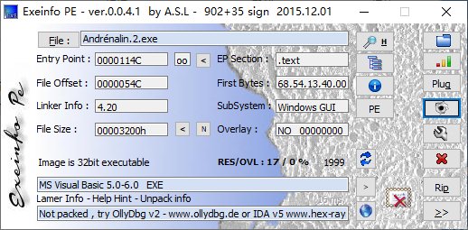

先来查一下壳，这个程序是用VB写的，和008是同一个作者，用的是用户名和序列号的保护方式，难度可能会有所上升，所以得分析整个按钮点击事件的算法。

## VB Decompiler分析程序

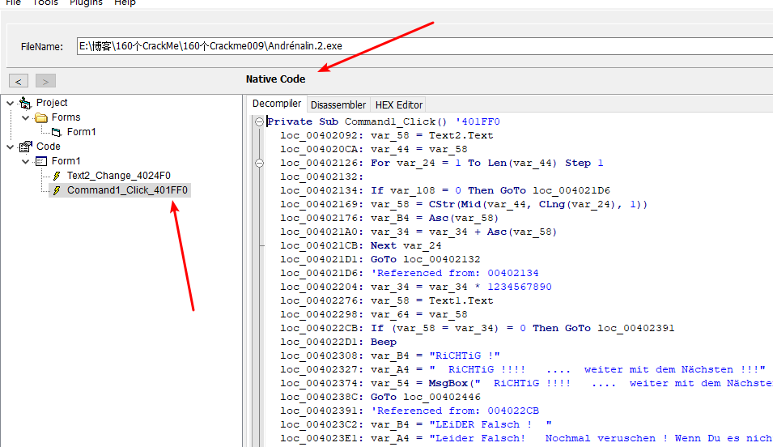

把程序拖到VB Decompiler里，这个可是VB的逆向神器啊。

重要的信息有两个，一个是Native Code，说明是自然编译的，程序在编译的时候能够被编译为机器码，以Native Code方式编译的VB程序可以直接用OD调试。

另外一个就是Click的按钮点击事件了，因为整个程序只有一个OK按钮，所以直接就能判定这个就ok按钮的点击事件。

记下偏移，来到0x401FF0处。

## 前置知识

想要分析出来这个Crackme，必须具备两个VB的前置知识

- 第一个就是VB的变量特征，VB是采用寄存器接收变量地址，地址是指向一个结构体，首地址存放的是类型编号，首地址+0x8。如果是字符串则首地址+0x8的位置是字符串的地址
- 第二个VB反汇编中很多时候会在[ebp-0x34]这个堆栈地址中看到最终的计算的结果，至于为什么 待会就知道了

如果你不知道上面两个规律 这个Crackme绝对会逆的一脸蒙蔽

## OD分析算法

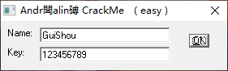

随便输入一个账号密码，直接来到按钮事件开头，开始分析整个算法。

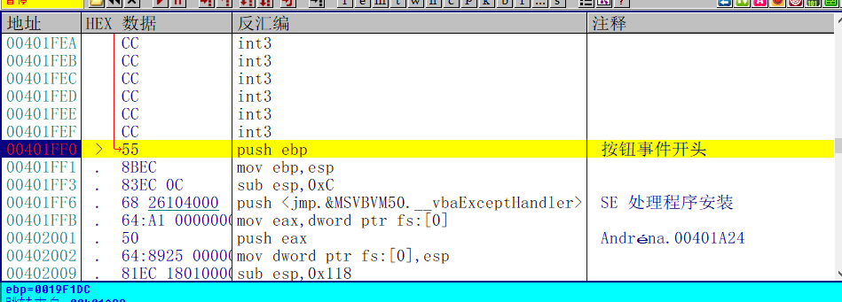

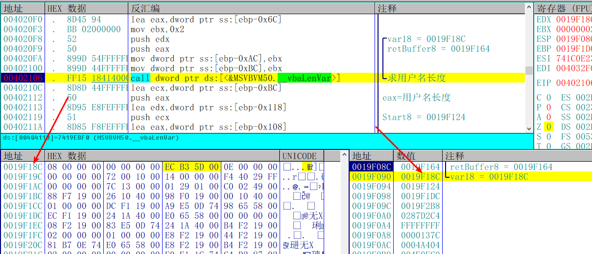

首先函数会求出用户名的长度，怎么知道是求的用户名的长度呢？首先看堆栈找到参数的地址 数据窗口跟随，然后首地址+0x8的地方 也就是我内存窗口选中的地址再次数据窗口跟随。


就找到了真正的参数，这个就是VB变量的存放规则，几乎无时无刻不在用。

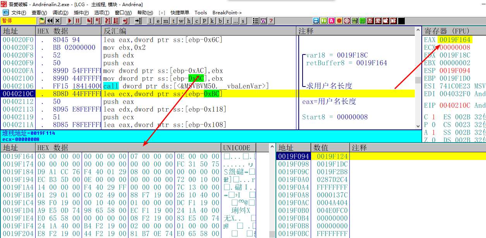

接着步过这个函数，eax返回地址+0x8的位置就是用户名的长度。

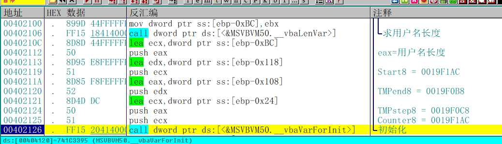

接着以字符串的长度为循环次开始循环。

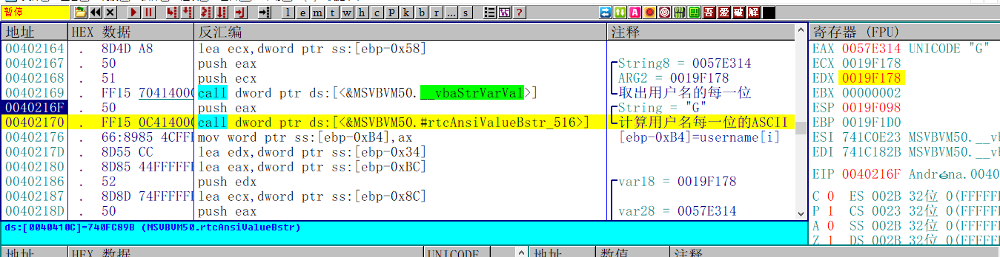

首先取出用户名的每一位，然后计算每一位的ASCII值，

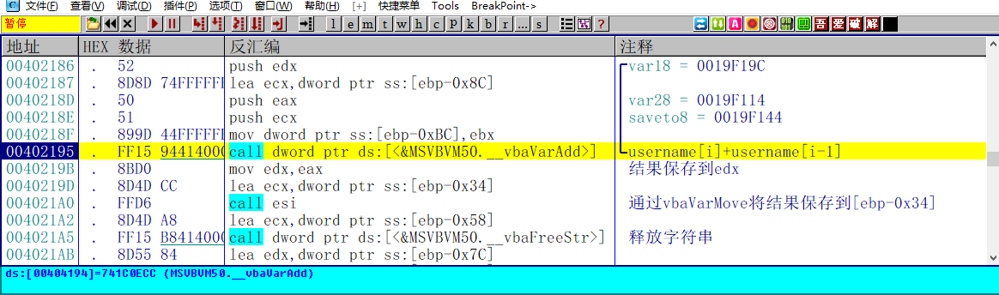

然后将用户名的ASCII值和前一位的ASCII值相加得出结果，再用vbaVarMove这个函数将结果保存到[ebp-0x34]这个地址。想要动态的看到所有的过程可以用上面的方法观察堆栈参数，找到首地址+0x8的位置详细分析。

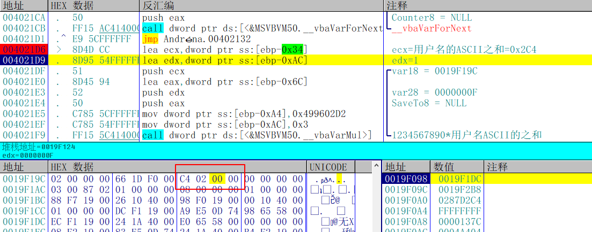

直接跳过这轮循环在[ebp-0x34]的地址处查看最后的结果为0x2C4。

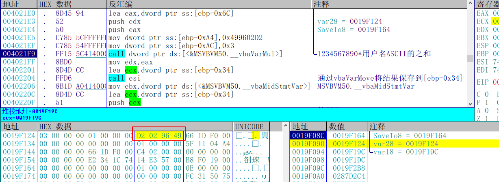

接着用vbaVarMul将用户名ASCII的结果和0x499602D2相乘，也就是十进制的1234567890，然后再次通过vbaVarMove将计算结果保存到[ebp-0x34]。

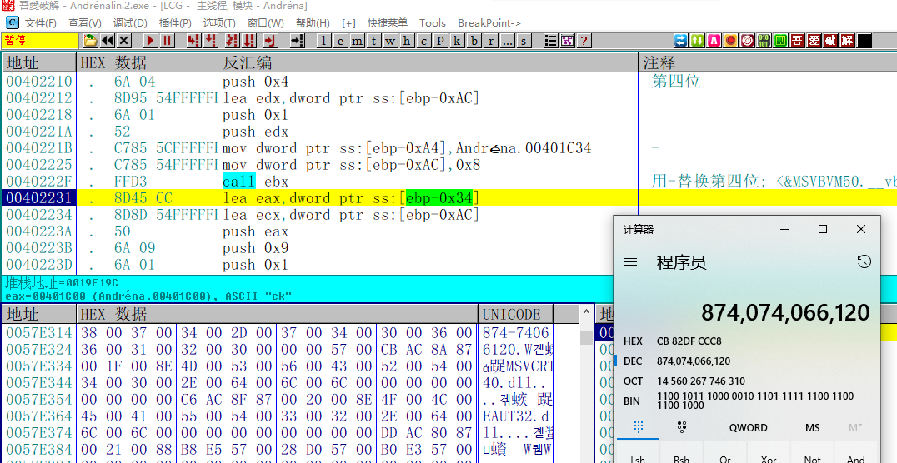

然后用-替换掉计算结果的第4位

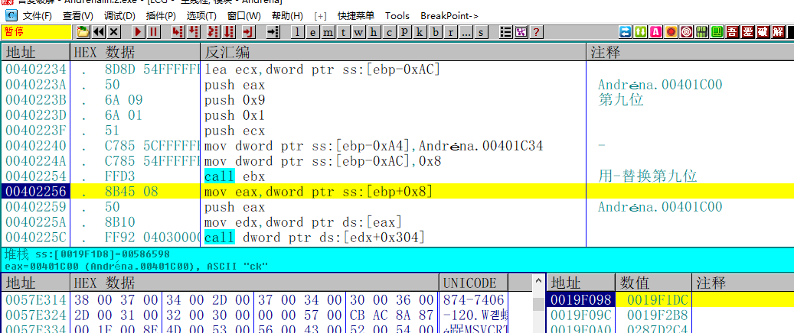

和结果的第9位

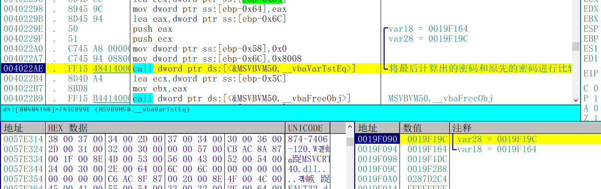

接着将最后计算的结果和原先输入的密码做比较，用堆栈的参数和VB的数据结构特点可以看到正确的注册码和原先输入的密码。

到这里，这个注册算法就分析完成了

## 写出注册机

```C++
int CalcKey()
{
	char szUserName[20] = { 0 };	
	__int64 result = 0;
	char key[50] = { 0 };
	printf("请输入用户名:");
	scanf_s("%s", szUserName, 20);

	int iUserNameLen = strlen(szUserName);
	//求出每一位用户名的和
	for (int i = 0; i < iUserNameLen; i++)
	{
		result += szUserName[i];
	}

	result *= 1234567890;
	//转为字符串
	sprintf(key, "%I64d", result);
	//替换第4位和第9位
	key[3] = '-';
	key[8] = '-';

	printf("%s\n", key);
	return 0;
}
```

## 验证结果

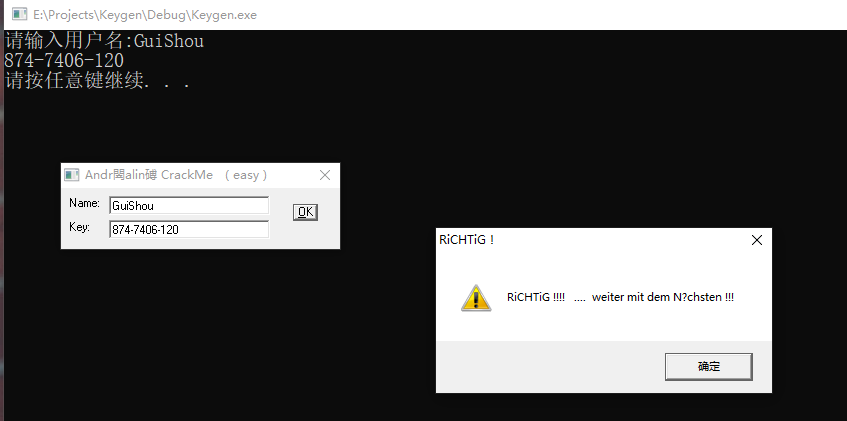

输入用户名，将计算的序列号填入。OK显示正常，这个Crackme也就完成了。

需要相关文件的可以到我的Github下载：https://github.com/TonyChen56/160-Crackme