[TOC]

## 查壳

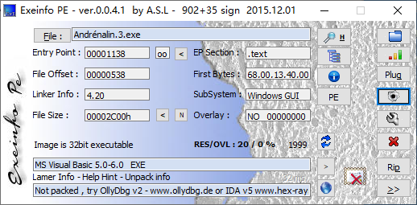

跟008和009这两个crackme一样是同一个作者，还是用VB写的。

## 分析程序

这个程序的保护方式也很简单，只有一个序列号

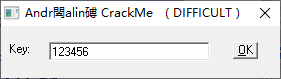

直接搜索字符串，

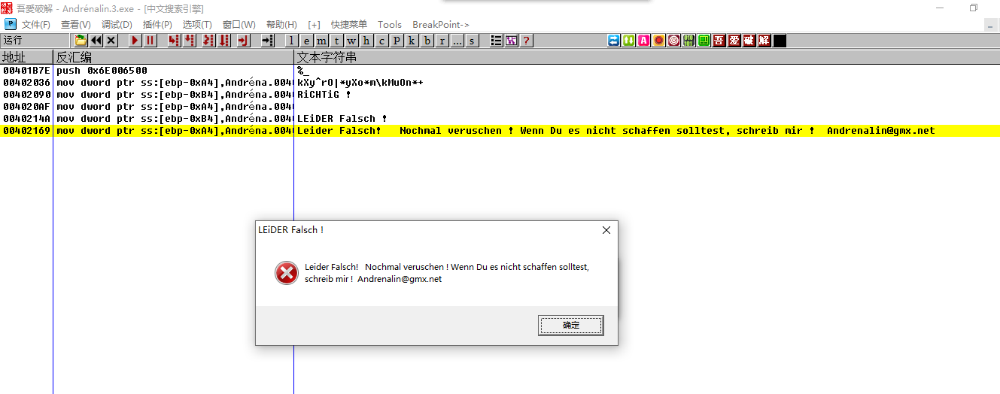

根据错误提示来到关键代码处，接着一直往上找，

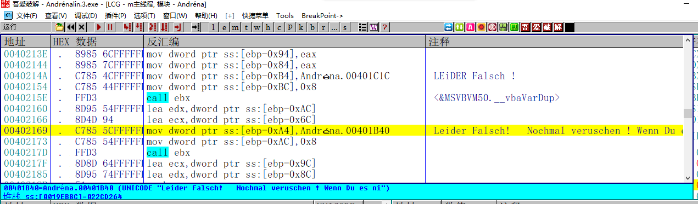

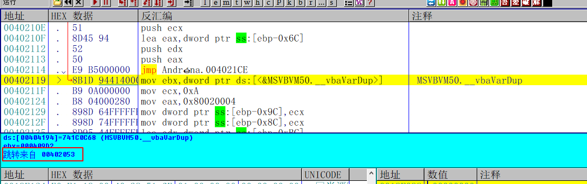

接着就看到了这个地方的跳转来自0x402053这个位置，跟过去看看

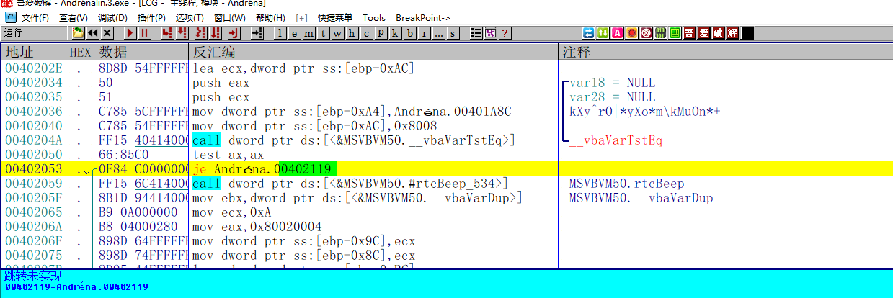这里有一个关键的比较，根据ax的值来提示是否正确。
`kXy^rO|*yXo*m\kMuOn*+ `我一开始以为上面这个字符串就是序列号，结果发现我想多了，看来是有算法，没办法，单步跟吧。

## 分析算法

大致的校验过程如下

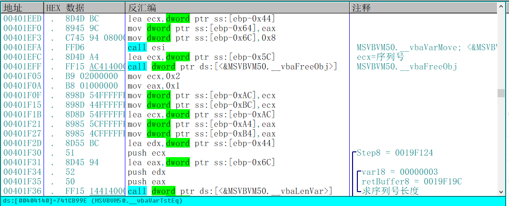

首先获取到序列号的长度

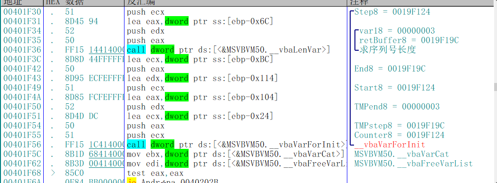

然后将序列号的长度作为循环的次数

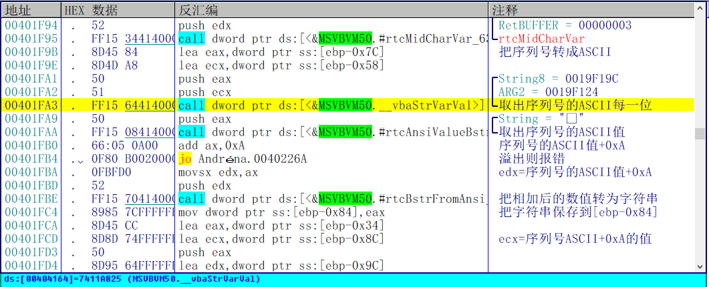

接着会取出序列号ASCII的每一位，然后将序列号的ASCII值+0xA之后，再将这个值转为字符串。

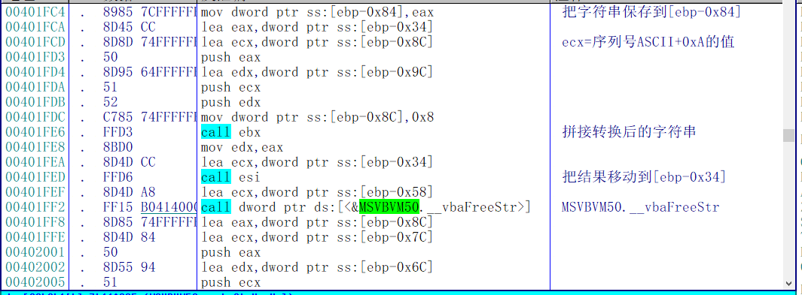

然后又是国际惯例了，会通过一个函数将结果保存到[ebp-0x34]这个位置。(VB的程序每次都是这样，这不是给逆向人员开绿色通道吗？)那么这个循环我们只要跟了一次，然后直接看[ebp-0x34]的结果就可以了。

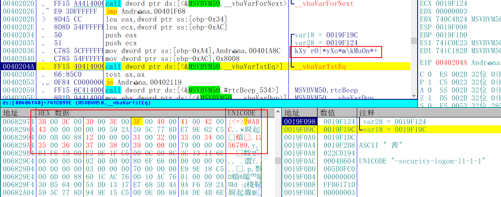

循环结束之后，会把最后的结果跟硬编码的一个字符串作比较，根据比较的结果提示正确或者错误。那么我们很容易就能写出这个crackme的注册机了

## 写出注册机

```C++
int CalcKey()
{
	char result[MAX_PATH] = { 0 };
	char key[MAX_PATH] = { "kXy^rO|*yXo*m\\kMuOn*+" };
	int keyLen = strlen(key);

	for (int i = 0; i < keyLen; i++)
	{
		result[i] = key[i] - 0xA;
	}

	printf("%s\n", result);

	return 0;
}
```

## 验证结果

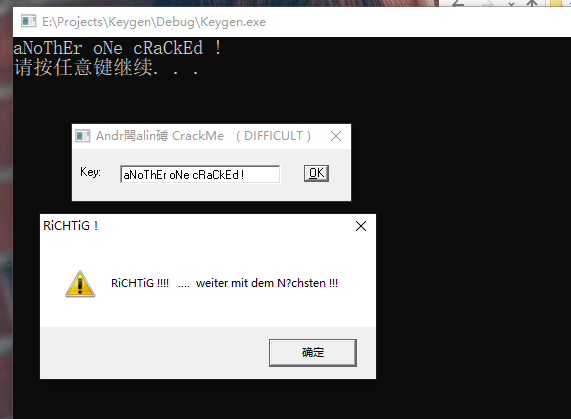

把注册机的结果全部复制下来，显示正确，那么这个crackme就完成了

需要相关文件的可以到我的Github下载：https://github.com/TonyChen56/160-Crackme