[TOC]

## 查壳

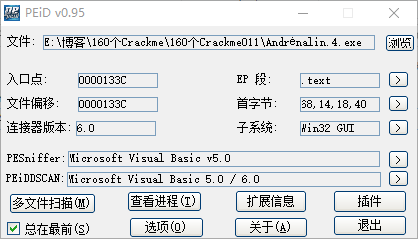

目标程序是使用VB写的，和前面三个crackme是同一个作者

## 分析思路寻找突破口

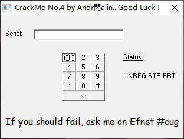

这个就是这次的目标程序，只提供了一排输入按键和右边的提示，没有确定按钮，那么猜测这个程序校验序列号的方式应该有两种，一种是通过Serial编辑框的变化事件来判断，一种是通过定时器来判断。

然后再用VB Decompiler来看一下有哪些事件。

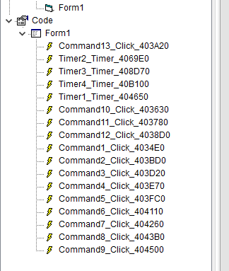

从事件的部分可以得出这个程序有四个定时器和12个按钮的点击事件，按钮的点击事件应该就是输入相应的字符没什么其他作用，重点就在定时器上面。

既然有定时器，那么不妨再确认一下

打开PC Hnuter，选中目标进程

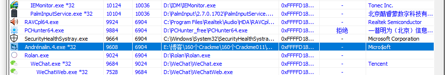

右键查看->查看进程定时器

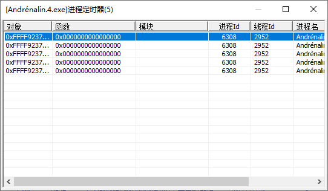

有五个定时器，比之前的多了一个。

那么突破口就出来了，

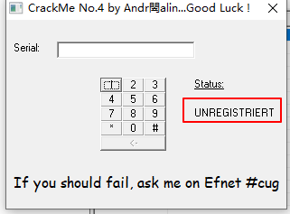

首先查找这个字符串，然后根据字符串找到函数头的位置，对比定时器的RVA，再进行分析

## OD分析程序

接着载入OD，F9运行，搜索字符串

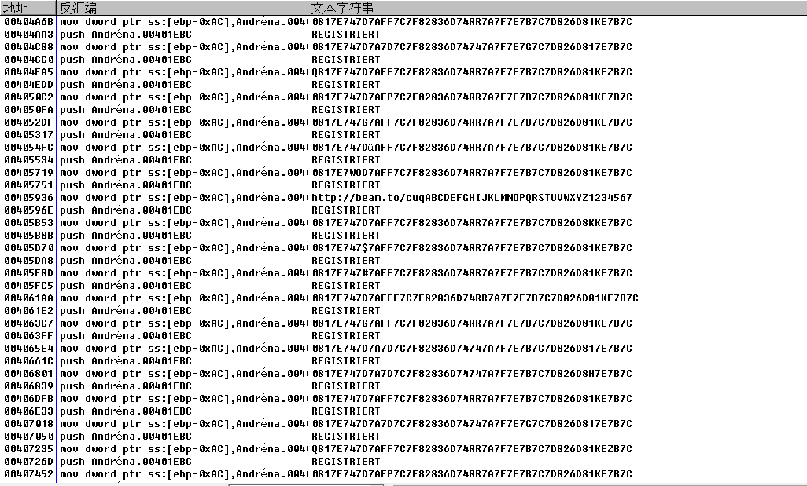

虽然没找到预期的 UNREGISTRIERT，但是找到了对应的REGISTRIERT，这个应该是注册成功的提示信息，看这样子这个源代码好像是复制粘贴了好几份，用来混淆的，随便点一个进去，拉到函数头的位置，

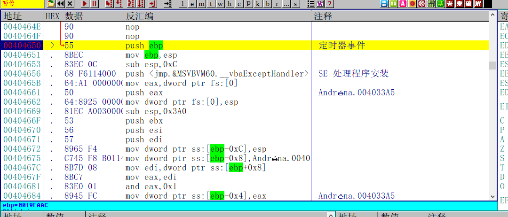

下断点之后马上就断下来了，然后对比一下VB Decomper的定时器事件

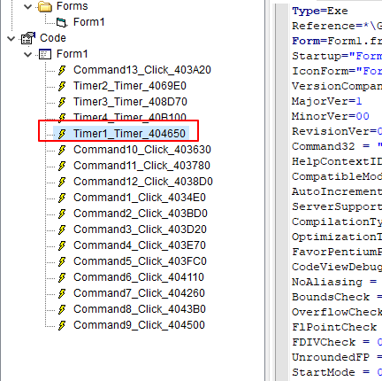

果然就是第一个定时器的回调函数，

## 分析核心算法

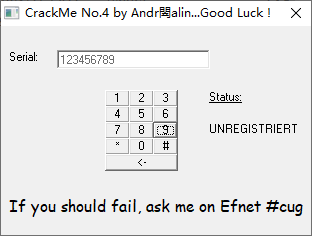

输入123456789，开始分析整个函数的核心算法

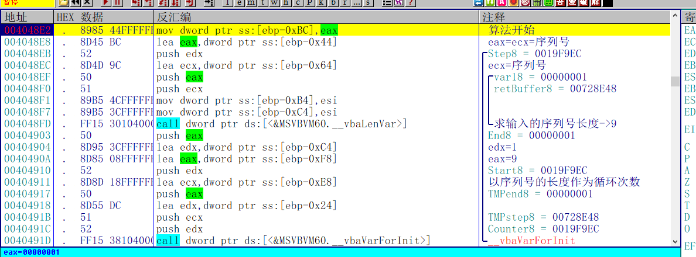

首先是获取序列号的长度，然后将序列号的长度作为循环的次数，开始算法的循环

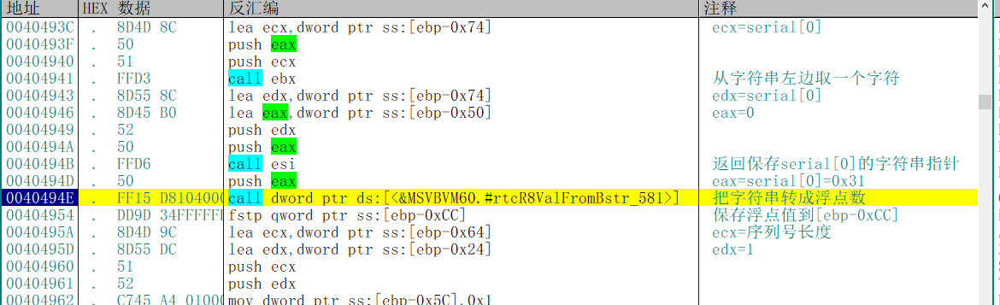

然后从序列号左边取一个字符，然后转成浮点数，保存到[ebp-0xCC]。

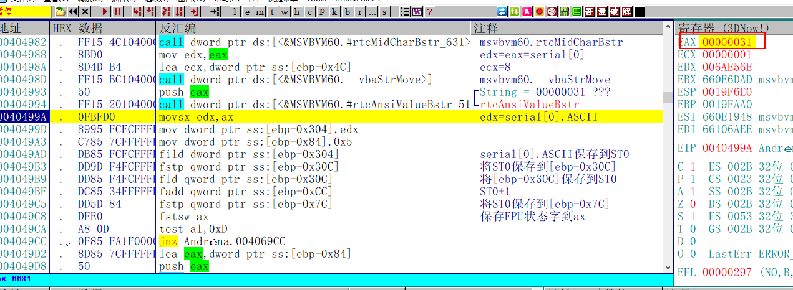

然后取出序列号第一位的ASCII值，转成浮点数，保存到ST0

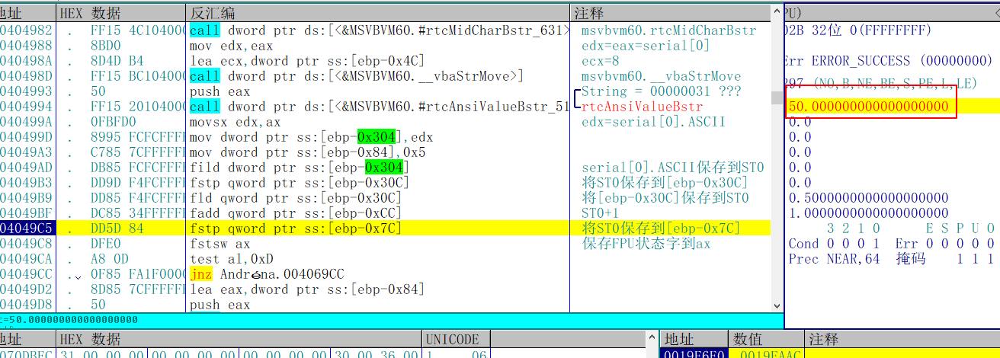

然后将ST0+1之后，保存到[ebp-0x7C]的位置，50=49(1的ASCII值)+1

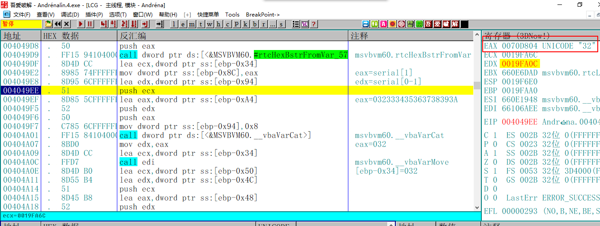

然后将结果的十六进制转成字符串——50(十进制)=32(十六进制)

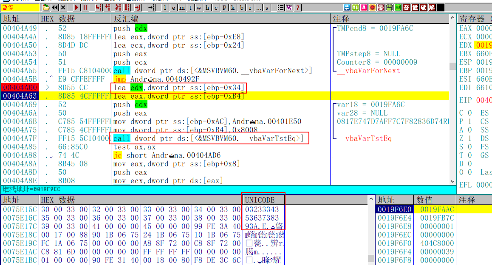

接着开始下一轮循环，循环结束之后，将最后的结果保存到[ebp-0x34]，然后用vbaVarTstEq把最终计算的字符串和硬编码的作比较。这个算法倒是异常的简单，很容易就能根据字符串逆推出序列号

再回到刚才的字符串的问题，这里为什么会有这么多相同的序列号

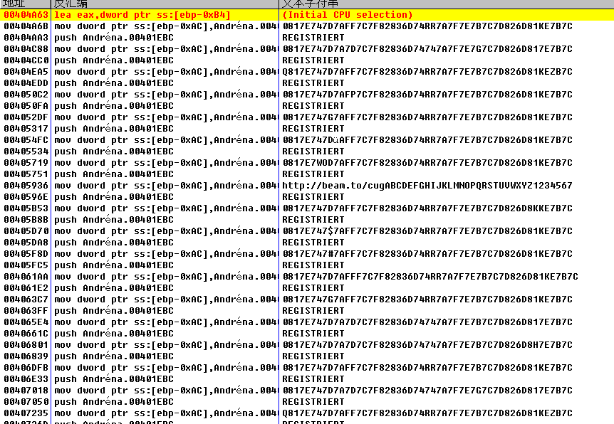

因为只有一个是真的，只有通过了那唯一一个真的字符串的验证才能验证成功，根据刚才的分析可以得出结论，序列号必须的0-9 A-F之间的十六进制数字，我们可以根据这个结论来找出正确的唯一解。

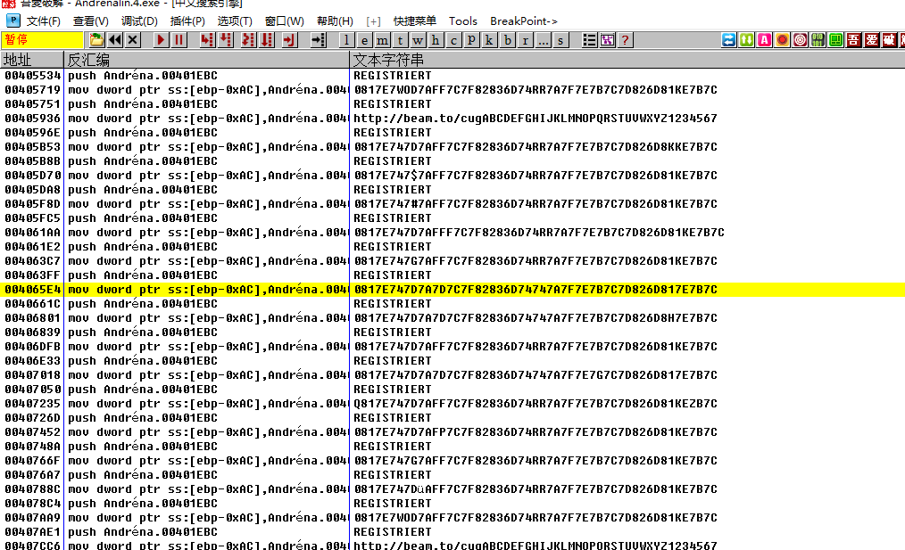

满足要求的就只有一个，

```C++
0 81 7E 74 7D 7A 7D 7C 7F 82 83 6D 74 74 7A 7F 7E 7B 7C 7D 82 6D 81 7E 7B 7C 
```

这个唯一解的算法和之前我分析的一模一样，接着根据硬编码的字符串逆推出正确的序列号

## 强行推序列号

到了这里我们有意思的事情就来了，我们已经知道了正确的唯一解字符串，我还还知道一个按键对应一个字符串，所以可以我们可以根据把程序自带的12个按钮逆推出对应的Key，即使你不知道前面的算法，也可以强行逆推，只要知道一个事实

- 按键的ASCII和字符串的数值成正比，ASCII值越大，结果越大

所以我们只要把上述的正确字符串从小到大排序，然后再将程序的十二个按键的ASCII值从小到大排序，就能让字符串和按键的值一一对应。然后再根据唯一正确的字符串，输入相应的按键，就能破解程序

| Key  | Code |
| ---- | ---- |
| 6D   | *    |
| 74   | #    |
| 7A   | 0    |
| 7B   | 1    |
| 7C   | 2    |
| 7D   | 3    |
| 7E   | 4    |
| 7F   | 5    |
| 80   | 6    |
| 81   | 7    |
| 82   | 8    |
| 83   | 9    |

所以字符串`0817E747D7A7D7C7F82836D74747A7F7E7B7C7D826D817E7B7C `对应的序列号就是`74*3032589#**0541238#7412`

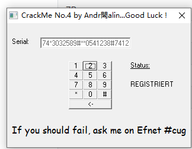

需要相关文件的可以到我的Github下载：https://github.com/TonyChen56/160-Crackme