[TOC]

## 前言

之所以直接跳过Crackme012是因为那个是个16位的程序，放到现在来说就算逆出来了意义也不大，想要追求完美的同学可以去看下逆向驿站公众号号主发的文章。

## 分析程序

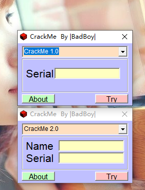

这个Crackme有两个，一个是单纯的序列号，另一个是用户名和序列号的保护方式。

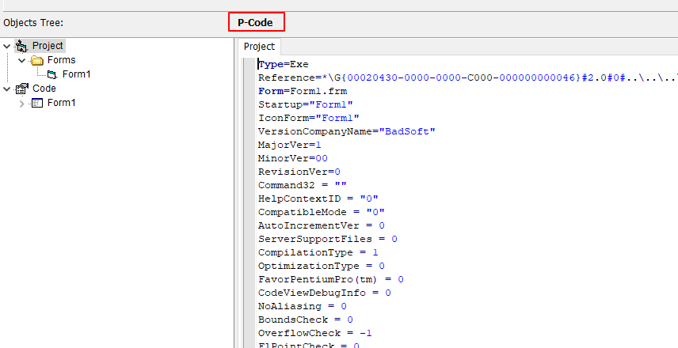

用VB反汇编工具来看下，是P-Code编译的，唉，头疼，直接用OD看吧

## OD调试程序

首先来看1.0

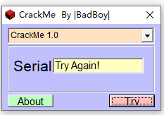

根据这个错误的提示，直接在SetWindowTextA/W上下断点，输入一个假序列号

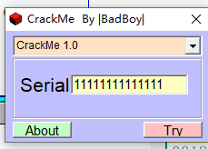

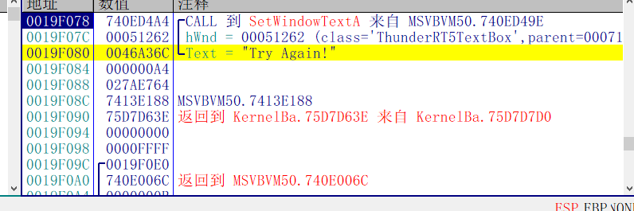

程序断下之后观察堆栈，往上拉，找到了一串字符串，

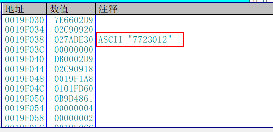

试试是不是这个，输入7723012

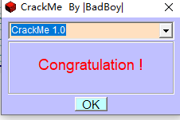

好 成功了，来看第二个，

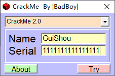

同样，输入用户名和密码

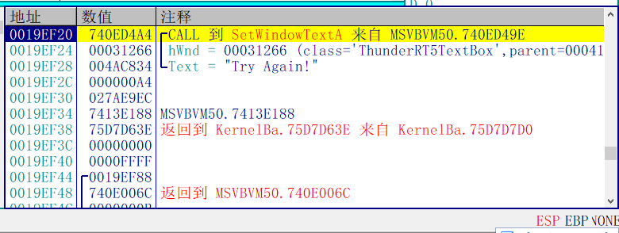

程序断下后，一直往下拉，找到了这么一串字符串，输入进去试试

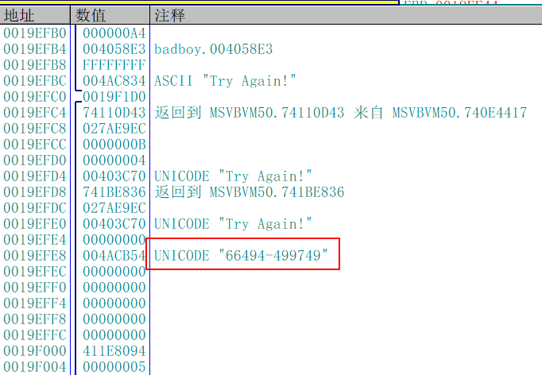

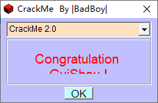

居然又成功了 哈哈。

到这里如果你的目的只是想破解这个程序，那么目的已经达成了，如果你是想分析算法或者了解P-Code的原理，那就需要深入分析了。由于微软对这一块的文档是保密的，到目前为止并没有系统的教程，只有在论坛上的几篇文章，我也就放弃了。

需要相关文件的可以到我的Github下载：https://github.com/TonyChen56/160-Crackme