[TOC]

## 查壳

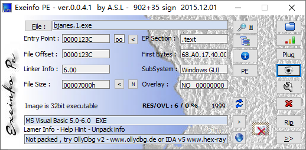

还是个VB写的程序，没有壳

## 分析程序

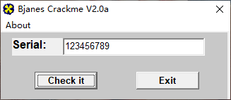

既然是单纯的一个序列号的保护方式 就没有必要分析算法了，直接追踪序列号就行

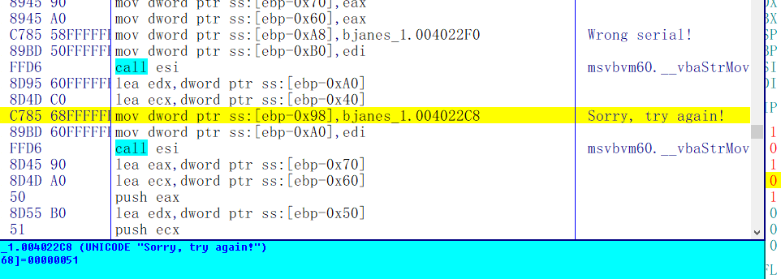

首先，根据错误的字符串提示向上找跳转

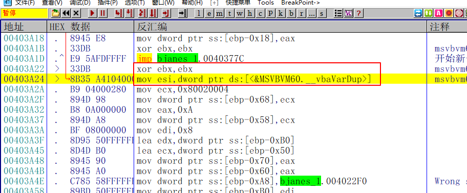

这两句一共有三个跳转，也就是说对序列号进行了三次判断

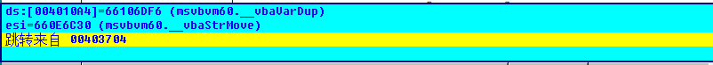

首先来到403704这个位置的跳转

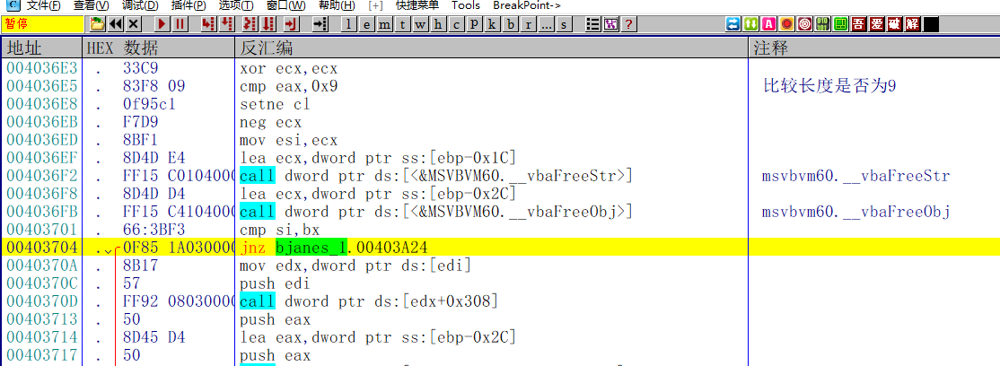

这里是比较字符串的长度是否为9，不是则报错

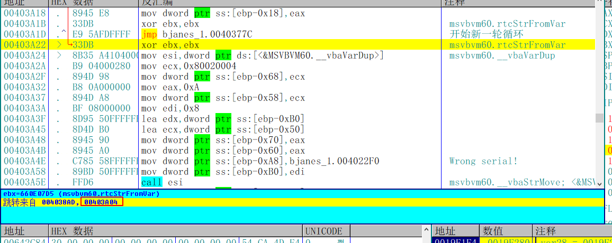

接着再来到403A04这个位置的跳转

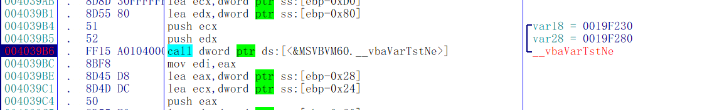

这里会根据vbaVarTstNe的比较结果来判断是否进行跳转，这个函数的VB常用的比较函数，可以肯定这里就是比较正确的序列号的地方了

等待程序断下后，来观察两个参数的内容，var18固定为0，var28是个字符串

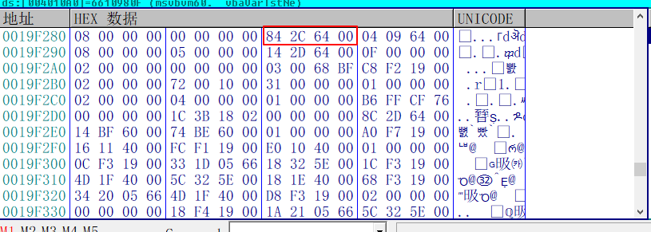

首地址+8才是真正的内容

是字符3，理论上来说这里应该是个序列号，但是只出现一个字符，也就是说这个软件比较序列号的方式是逐个字符的比较，

再来看一下判断的部分

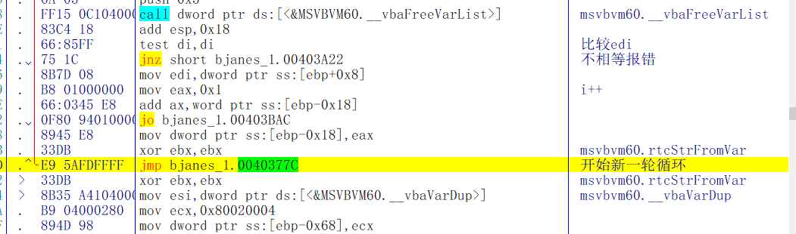

比较di之后，如果不相等则跳转到报错的地方，如果相等则继续往下走，后面两句相当于i++，然后跳转到循环开始处，

也就是说只要在vbaVarTstNe比较之后跳转之前修改ZF标志位，就能看到每个正确的序列号

正确的序列号是**301674501**

## 验证结果

输入得到的结果，提示正确

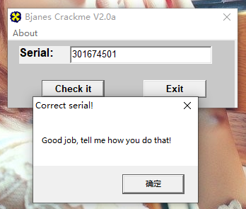

需要相关文件的可以到我的Github下载：https://github.com/TonyChen56/160-Crackme