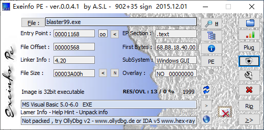
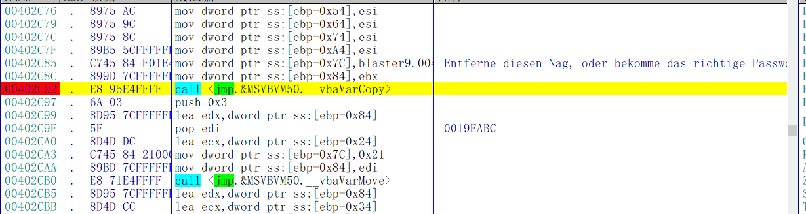
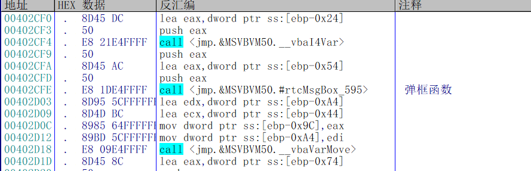
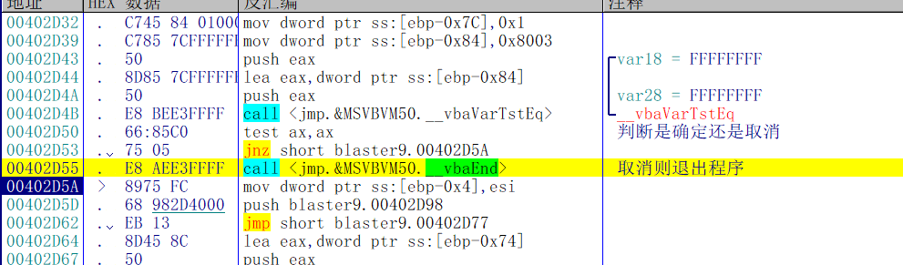
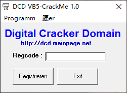
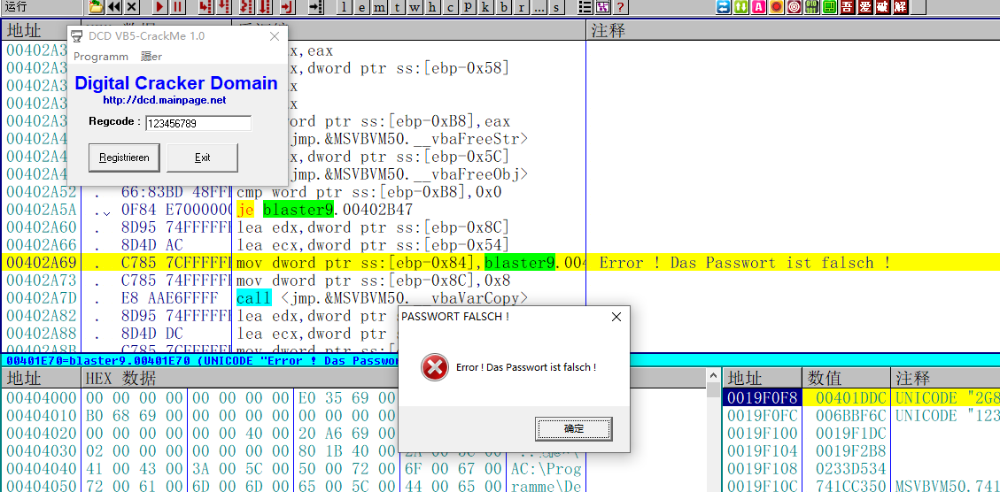
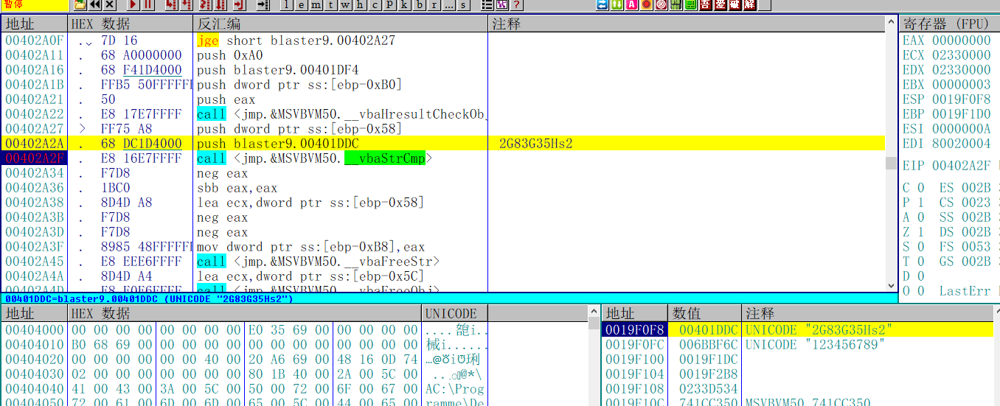
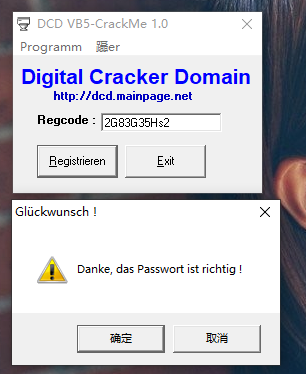

[TOC]

## 查壳

首先来查一下壳，又是个VB的程序，最近几个Crackme都是VB的，逆的我都想吐了，这个Crackme有两个任务，一个是去Neg，一个是找序列号，两个都比较简单

## 去Neg

首先要把这个弹框给去掉，直接搜索字符串，找到相应的位置，当然，也可以在rtcMsgBox函数下断点

找到字符串位置之后往下拉，就能看到这个弹框的函数

然后会判断返回值，点击确定则继续走程序流程，否则退出程序

那么去掉这个Neg就很简单了 在弹框之前直接让程序跳到0x402D5A这个位置，修改后如下

修改完成之后保存文件

弹框完美去除

## 破解序列号

接下来还是从字符串入手追踪序列号

往上拉，发现一个vbaStrCmp函数，将输入的序列号和一个字符串比较，那么这个应该就是正确的序列号了

## 校验结果

输入**2G83G35Hs2** ，提示成功，破解完成

需要相关文件的可以到我的Github下载：https://github.com/TonyChen56/160-Crackme