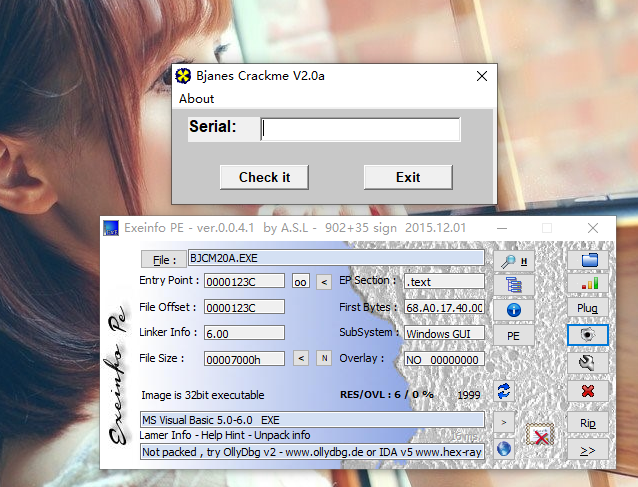
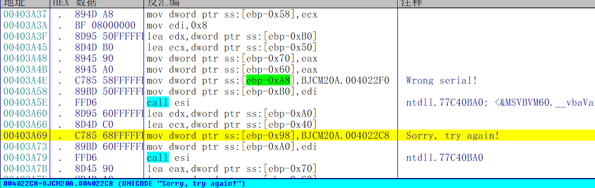
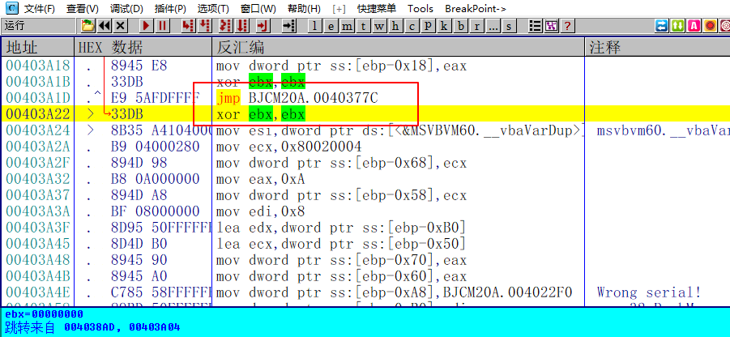
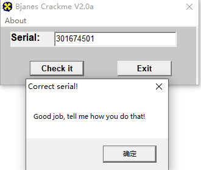

[TOC]

## 查壳

这个和014那个Crackme是同一个作者，连图标都没换，估计是同一个工程编译出来的，就换了下算法

## 分析程序

直接来到错误提示的地方，向上跟踪

一共有三个跳转会到这里，这怎么跟014一模一样，输入之前的序列号试试看

好吧 看来两个是重复的了。。。。。。PASS！

需要相关文件的可以到我的Github下载：https://github.com/TonyChen56/160-Crackme