[TOC]

## 查壳

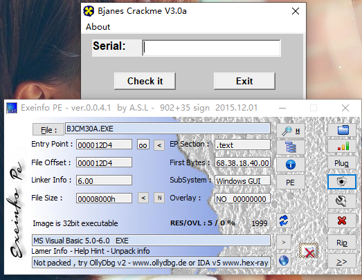

## 一样的014和017？

这个Crackme和014和016是同一个作者，不会又是重复的吧？输入014的序列号试试

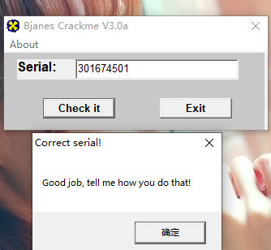

好吧，虽然是能蒙对，但其实里面的算法是完全不一样的，这到底是为什么？这个问题留到最后面

直接根据字符串的错误提示，来到函数头的位置，也就是按钮事件开头，来分析整个算法

## 破解反调试

这个Crackme跟其他的不一样的地方是有一个时间戳检查，

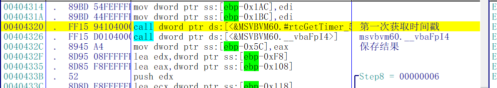

首先，获取当前事件，保存结果

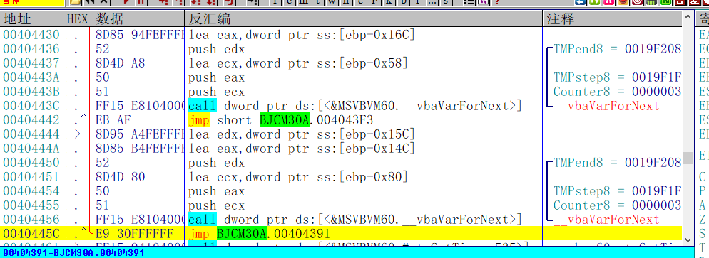

接着是一个两层的嵌套循环，具体什么作用不知道，大概是为了拖延调试者的时间，


两次循环过后，再次获取时间戳，计算两次获取的时间的差值，比较是否小于等于5，如果小于继续往下走，否则报错

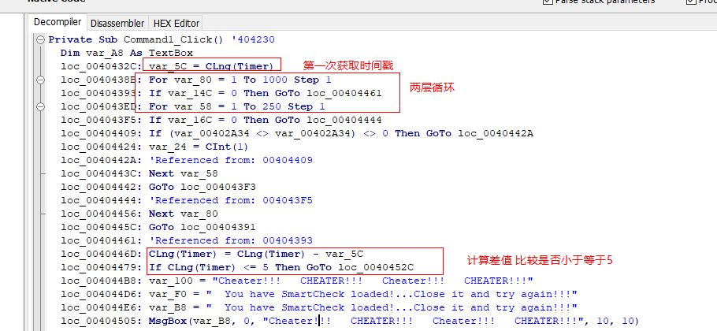

从VB Decomplier反汇编出的N-Code也可以直观的看出结果

知道反调试原理，破解其实就很简单了，只要在跳转的地址处下断点F9运行就可以了，或者修改ZF标志位

## 分析算法

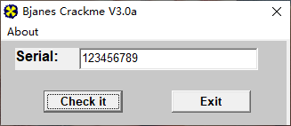

先随便输入一个序列号，开始分析算法

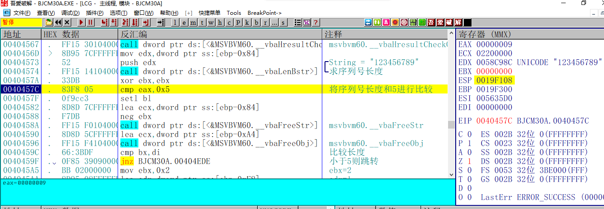

首先求序列号长度，将序列号长度和5进行比较，小于则跳转，即长度必须大于5

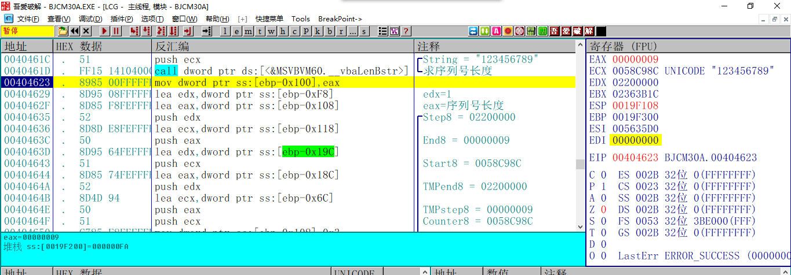

接着 再次求序列号长度，将长度作为循环的次数

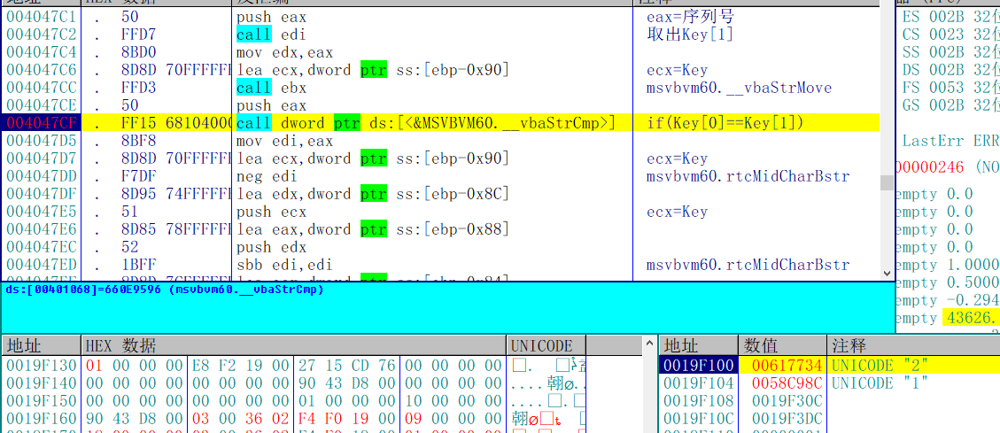

循环比较序列号两两之间是否相等

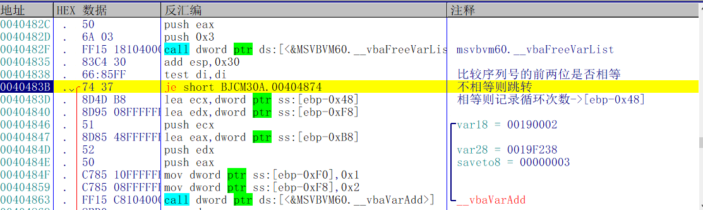

如果相等 则记录循环次数到[ebp-0x48]处，不相等则不记录

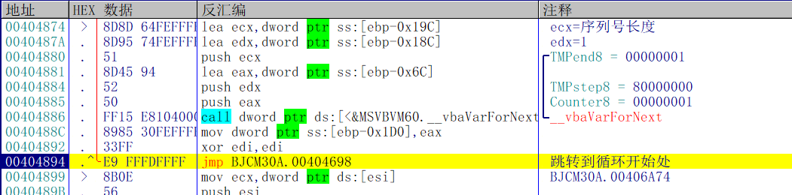

然后开始新一轮循环

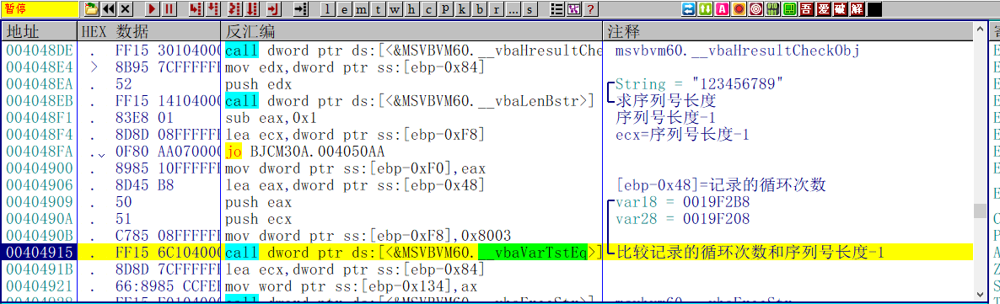

循环结束之后，将记录的循环次数和序列号长度-1进行比较，比较成功则报错，也就是说序列号的每一位不能为同一个数字

接下来才是真正的序列号算法，这个算法也是很有意思

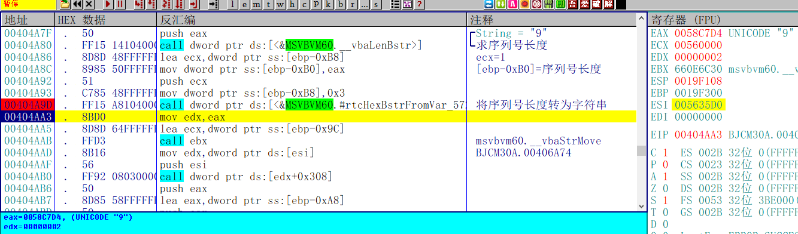

首先计算出序列号的长度，将长度转为字符串

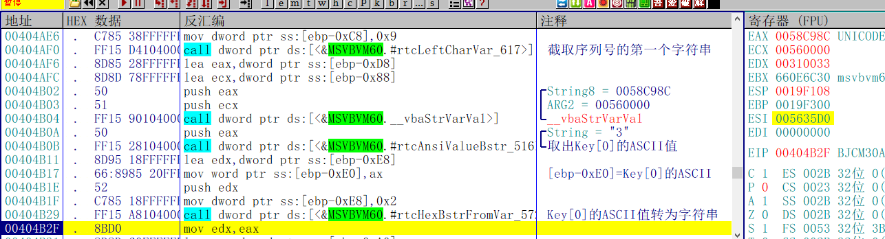

接着，再取出序列号的第一个字符，将ASCII值转成字符串。

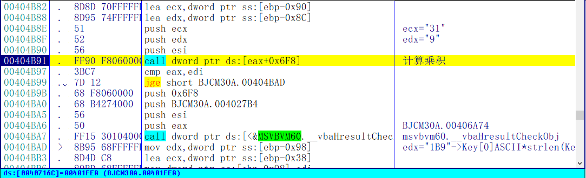

接着计算这两个的乘积，结果为0x1B9

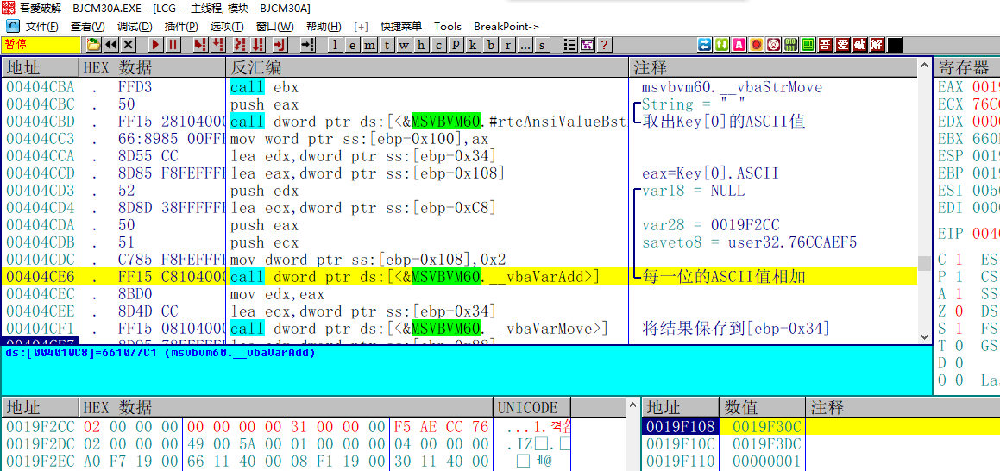

然后将计算序列号每一个为ASCII值相加的结果，将结果保存到[ebp-0x34]

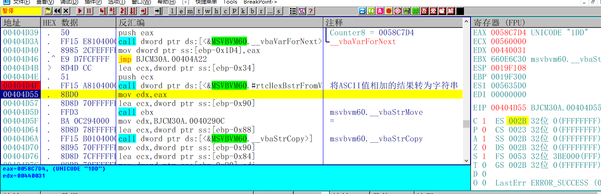

接着将序列号ASCII相加的结果转为字符串->"1DD"

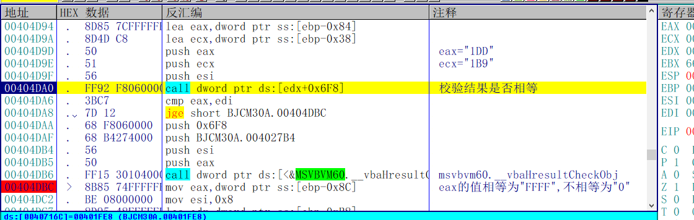

然后比较"1DD"和"1B9"是否相等，eax的值相等为"FFFF",不相等为"0"

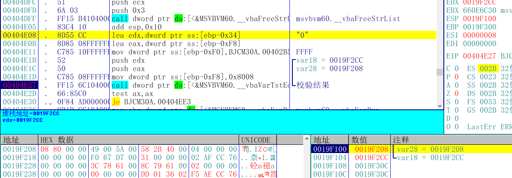

接着校验刚才的比较结果，根据结果提示正确或者失败

也就是说这个Crackme的序列号并不是只有唯一解，必须满足以下三个条件

1. 序列号每一位不能为同一个数字
2. 序列号长度必须大于5
3. 序列号第一个字符的ASCII值乘以序列号长度必须等于序列号每一位的ASCII和

## 014和017区别

那么再来回到一开始的问题，为什么算法不一样但是用014的序列号301674501依然可以通过校验

1. 301674501满足前两个条件 长度大于5 每一位不相同
2. 301674501的ASCII的和为0x1CB
3. 301674501第一位的ASCII值33*9(序列号长度)也是等于0x1CB

所以这个序列号才能通过校验，估计作者是先写的017这个Crackme，然后将017其中的一个解直接作为014的唯一解

## 写出注册机

接下来根据算法写出注册机，为了减少计算量，我把长度固定为5

```C++
int CalcKey()
{
	srand(time(NULL));
	byte key[6] = { 0 };

	while (true)
	{
		byte K0 = rand() % 123;
		byte K1 = rand() % 123;
		byte K2 = rand() % 123;
		byte K3 = rand() % 123;
		byte K4 = rand() % 123;

		//限制随机数不出现无意义字符
		if ((K0>=65&&K0>=90)|| (K0 >= 97 && K0 >= 122)||( K0 >= 49 && K0 >= 57))
		{
			if ((K1 >= 65 && K1 >= 90) || (K1 >= 97 && K1 >= 122 )|| (K1 >= 49 && K1 >= 57))
			{
				if ((K2 >= 65 && K2 >= 90 )|| (K2 >= 97 && K2 >= 122) || (K2 >= 49 && K2 >= 57))
				{
					if ((K3 >= 65 && K3 >= 90) || (K3 >= 97 && K3 >= 122) || (K3 >= 49 && K3 >= 57))
					{
						if ((K4 >= 65 && K4 >= 90) ||( K4 >= 97 && K4 >= 122) || (K4 >= 49 && K4 >= 57))
						{
							//满足限制条件
							if (K0 + K1 + K2 + K3 + K4 == K0 * 5)
							{
								key[0] = K0;
								key[1] = K1;
								key[2] = K2;
								key[3] = K3;
								key[4] = K4;
								key[5] = 0;
								break;
							}
						}
					}
				}
			}
		}

		
	}

	printf("%s\n", key);

	return 0;
}
```

输入注册机的结果，提示成功，这个Crackme就完成了

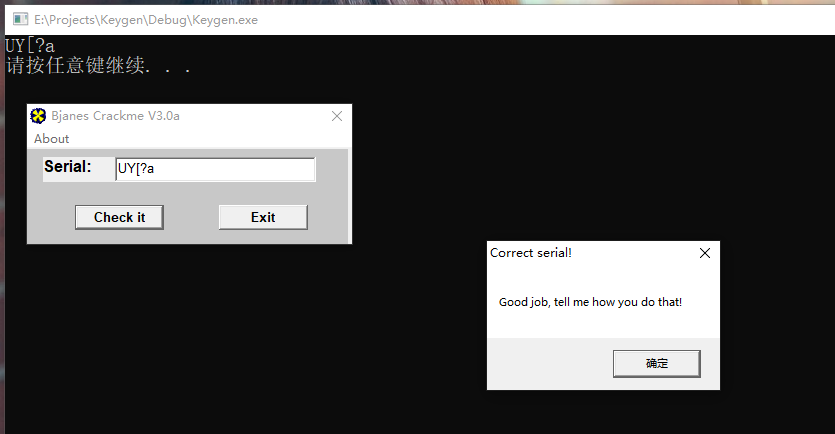

需要相关文件的可以到我的Github下载：https://github.com/TonyChen56/160-Crackme


