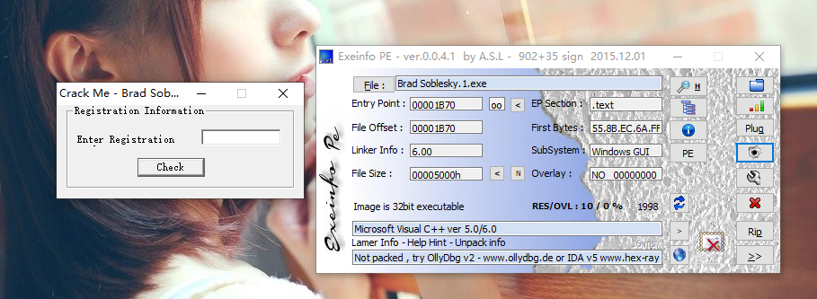
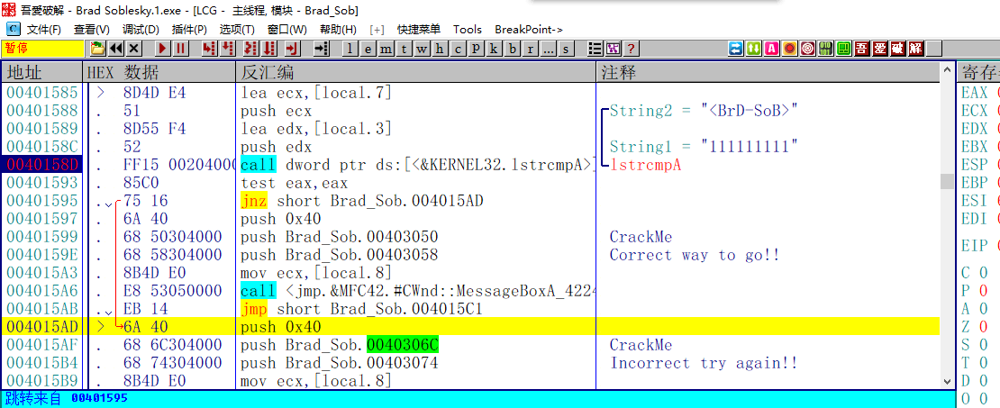
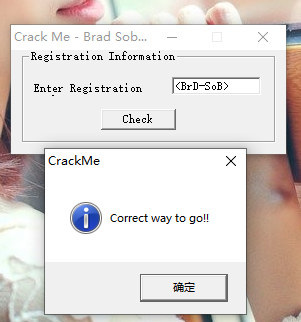

[TOC]

## 查壳

这个Crackme是用VC6写的 难度只有一颗星，相当简单了

## OD分析程序

根据字符串的错误提示找到对应的位置，往上发现一个字符串比较函数，接着根据比较的结果进行跳转，那么可以断定<BrD-SoB>就是正确的Key了

## 校验结果

输入程序中出现的字符串，提示成功，破解完成

需要相关文件的可以到我的Github下载：https://github.com/TonyChen56/160-Crackme