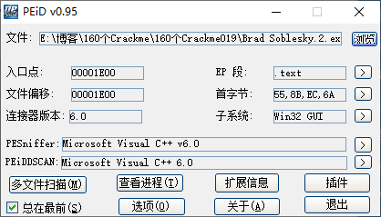
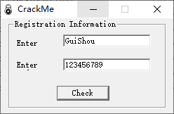
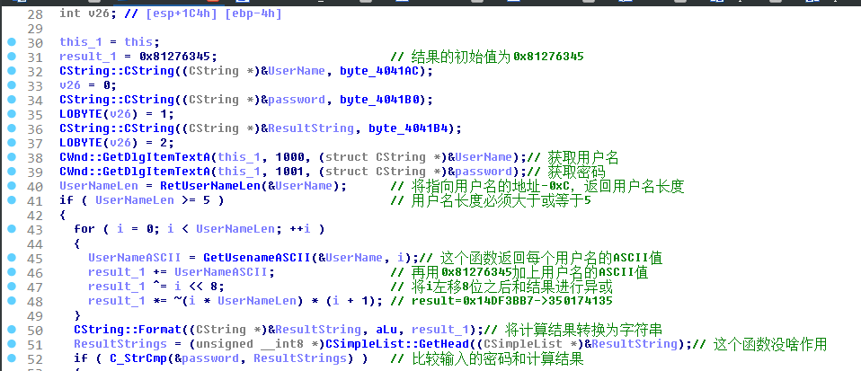
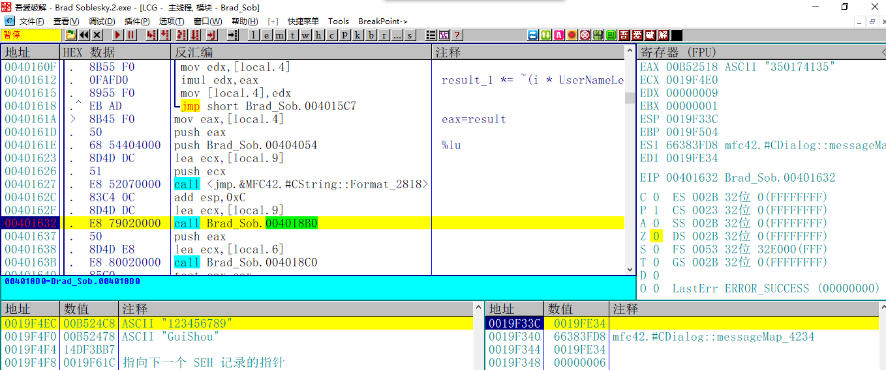
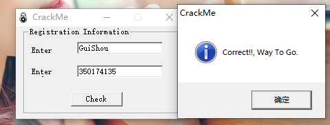
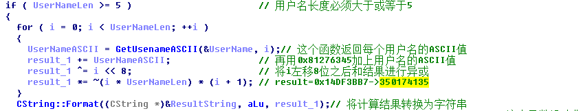
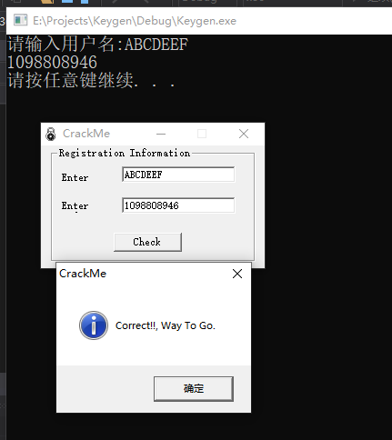

[TOC]

## 查壳



目标程序难度一颗星，没有壳，VC6写的，终于不再是VB的程序了。VC6的好处就是可以用IDA配合OD调试了

## 分析程序



随便输入一个账号密码，根据字符串提示来到按钮事件

这个算法本身并不难，我就直接贴IDA的分析图了，大家可以根据我提供的.idb文件动态调试



程序验证过程如下

1. 设定一个int变量，值为0x81276345，这个变量会用于密码校验，保存最后的结果
2. 获取用户名和密码
3. 检测用户名长度是否小于5
4. 根据用户名长度设置循环次数，用算法算出结果
5. 比较得出的结果和输入的密码是否一致

到这里整个程序的校验就完成了，确实的一颗星的难度

## 校验结果

首先来检查一下结果是否正确，根据刚才的分析，直接在比较函数下断点，拿到正确的密码



如图，eax就是正确的密码，而内存窗口是我们输入的错误的序列号和密码，输入结果



提示正确，校验完成

## 写出注册机

这个程序的注册机也是可以轻松完成的



这一段直接拷下来就是现成的注册机了，哈哈，有IDA就是快，能省很多事，如果这个程序的VB写的，那注册机得自己慢慢逆推了，代码如下：

```C++
int CalcKey()
{
	int result = 0x81276345;
	char username[20] = { 0 };
	printf("请输入用户名:");
	scanf_s("%s", username, 20);

	int UserNameLen = strlen(username);

	if (UserNameLen <5)
	{
		printf("用户名长度最少为五位");
		return 0;
	}
	
	for (int i = 0; i < UserNameLen; i++)
	{
		result += username[i];
		result ^= i << 8;
		result *= ~(i * UserNameLen) * (i + 1);
	}
	printf("%d\n", result);
	return 0;
}
```

随便输入一个用户名，校验通过，破解完成



需要相关文件的可以到我的Github下载：https://github.com/TonyChen56/160-Crackme