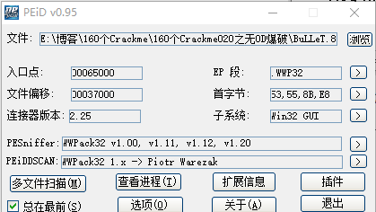
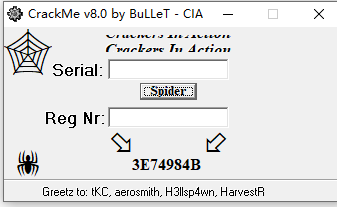
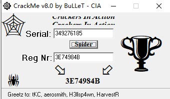

[TOC]

## 查壳

链接器是2.25说明是Delphi写的，加了个不知道什么鬼的壳

## 分析程序

这个程序也是特别有意思，单纯的序列号保护方式。完全没有必要逆向分析，有个小学数学就能直接爆破

这个程序想表达的意思已经很明显了，让你输入一个序列号，然后根据序列号会生成一串注册码，当这个注册码为3E74984B的时候就成功了

## 寻找规律 

拿到程序后我的一个反应是找找看算法是否有规律，能不用OD尽量不用，根据输入的值，规律如下

| Serial | Reg Nr |
| ------ | ------ |
| 1      | 3      |
| 2      | 6      |
| 3      | 9      |
| 4      | C      |
| 11     | 21     |

结果已经出来了，序列号就是注册码除以三之后的十进制数

3E74984B/3=349276185

## 验证结果

输入349276185，出现一个大奖杯，说明我们注册成功了 哈哈

需要相关文件的可以到我的Github下载：https://github.com/TonyChen56/160-Crackme