[TOC]

## 查壳

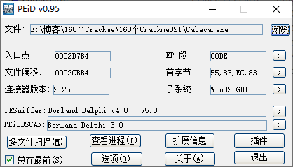

是Delphi写的，没有壳

## 导出符号

直接拖到IDA里，添加所有的Delphi签名

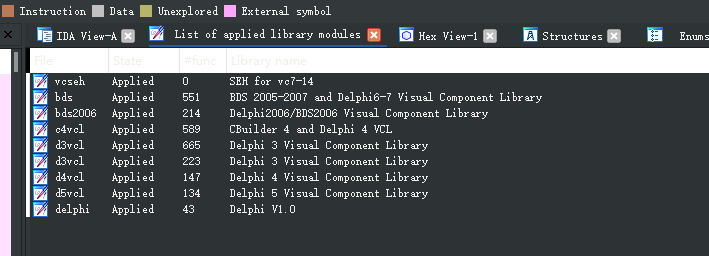

然后导出为map文件，再导入到OD，能加快分析速度

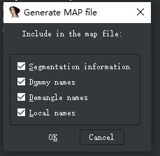

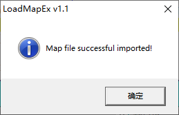

## 分析程序

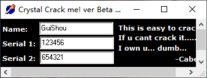

这个程序有两个序列号，

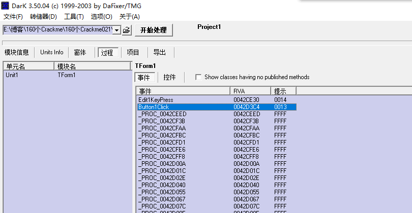

直接通过DarkDe，找到按钮事件，开始分析算法，管他有几个序列号呢~

## 关键算法分析

整个校验过程如下

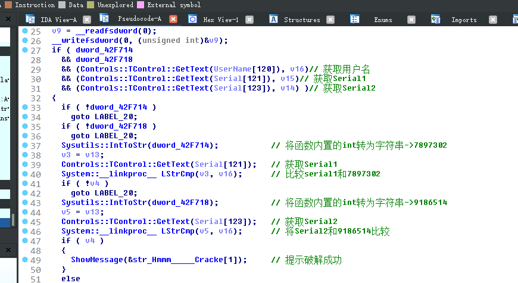

1. 获取用户名 序列号1 序列号2 

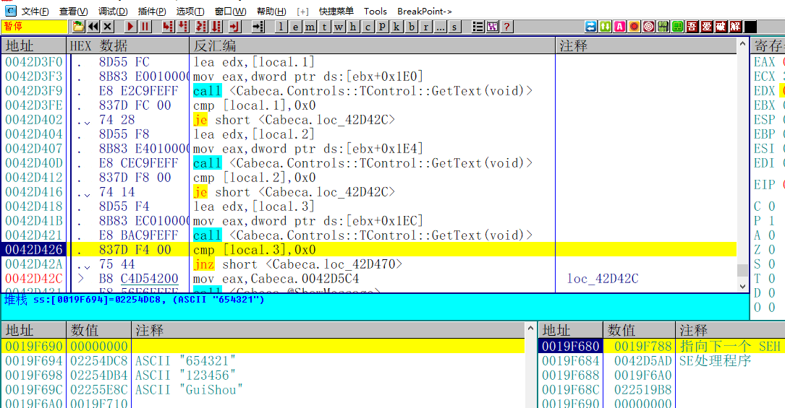

2. 将函数内置的int变量转成字符串和序列号1比较

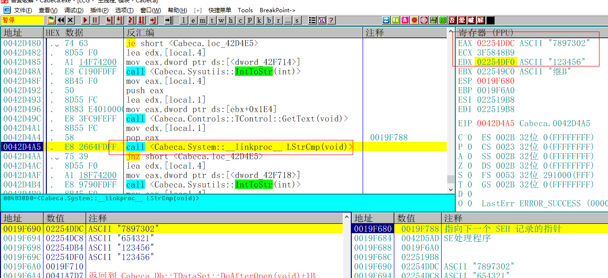

3. 将函数内置的int变量转成字符串和序列号2比较

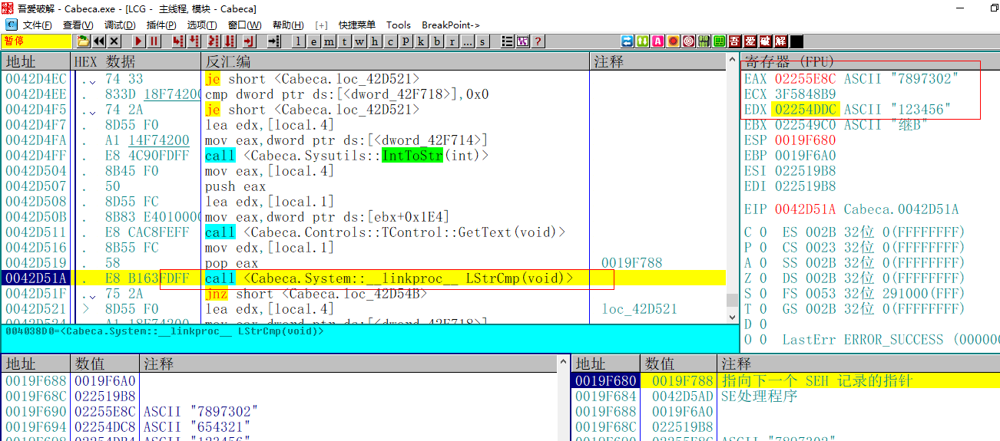

比较成功则提示正确

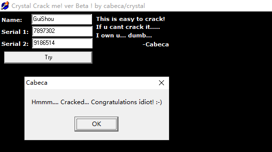

## 结论

- Name为任意值 无校验
- Serial1等于7897302
- Serial2等于9186514

需要相关文件的可以到我的Github下载：https://github.com/TonyChen56/160-Crackme