[TOC]

## 查壳

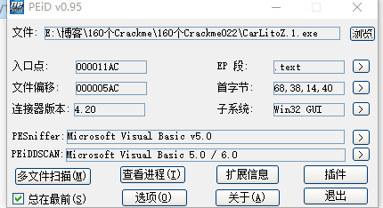

这个Crackme是用VB写的，没有加壳，也不是P-Code，那就直接上OD吧

## 分析程序

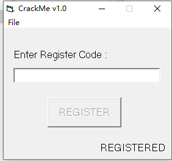

这个Crackme只有一个序列号保护，一般来说序列号的保护程序大多数只需要追踪正确的Key就能达到目的，少部分是通过算法校验的

## 追踪序列号

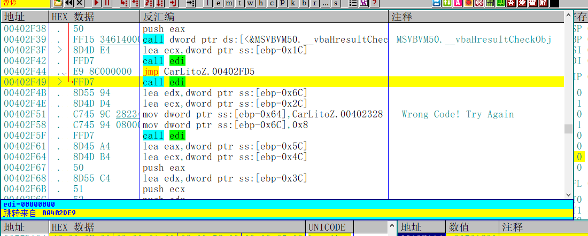

首先根据错误的字符串提示，找到跳转到这个位置的地方，直接转到402DE9的位置

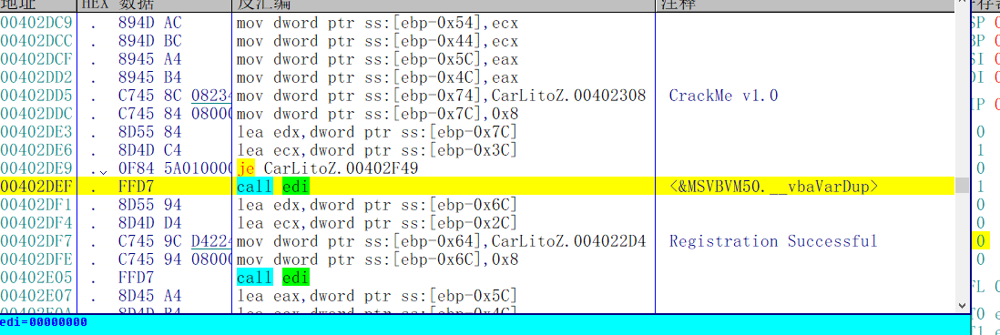

下面就是注册成功的提示，我们直接往上翻

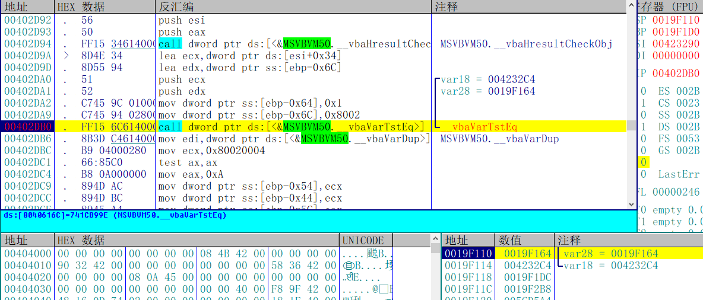

找到了一个关键的比较函数，下断点，观察两个变量

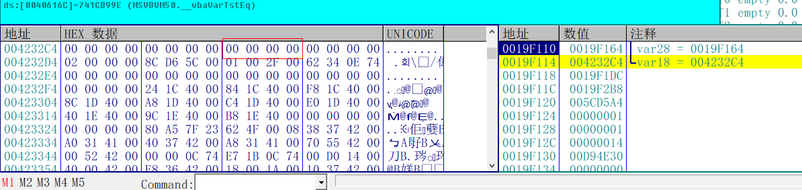

其中var28的值为1，var18的值为0，说明在这个比较函数之前已经有过一次校验，继续往上追

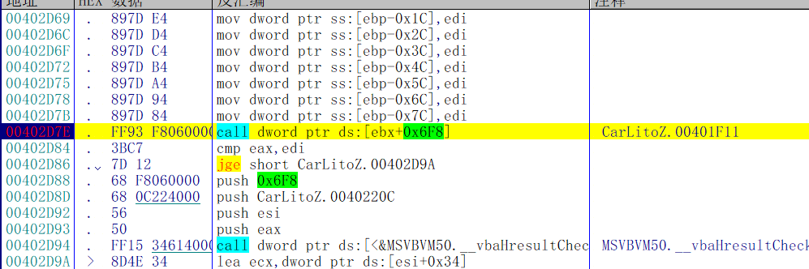

这里有一个来历不明的call，既没有函数名，也没有注释，很可能就是在这个函数里面对序列号进行比较，回车跟进去

进去之后有一个远跳，

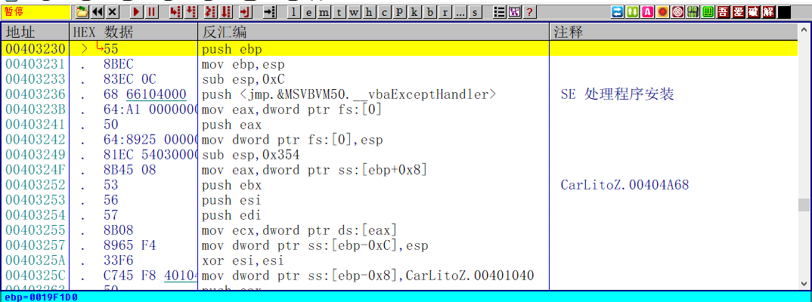

跳到这个函数，这个才是真正的校验序列号的函数

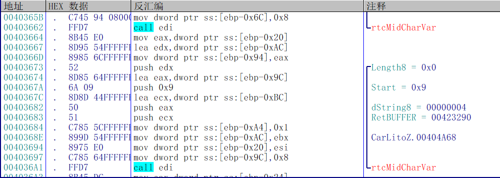

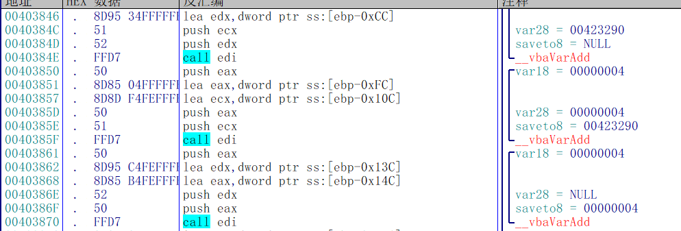

这个函数一直往下拉，你会看到有很多函数，没有必要从函数头开始一步一步分析，因为序列号是硬编码的

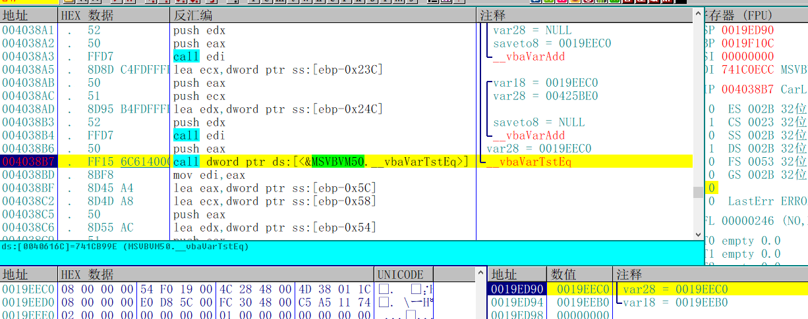

找到这个比较的函数，下断点，查看参数

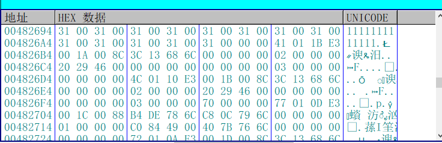

var18是我随便输入的序列号11111111

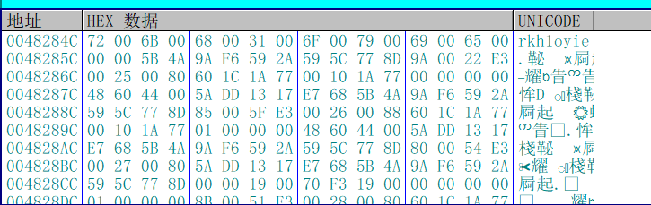

var28就是正确的序列号rkh1oyie

## 验证结果

输入序列号，显示注册成功，破解完成

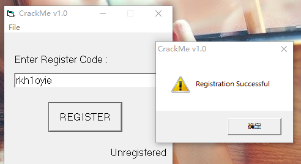

需要相关文件的可以到我的Github下载：https://github.com/TonyChen56/160-Crackme