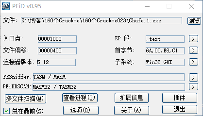
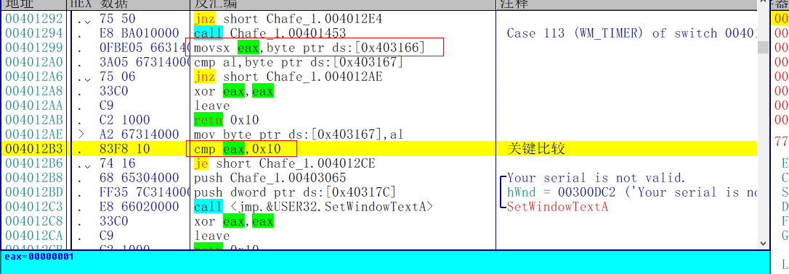
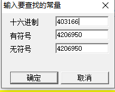
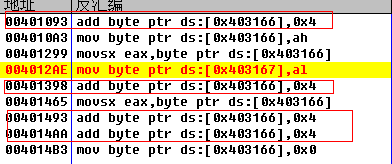
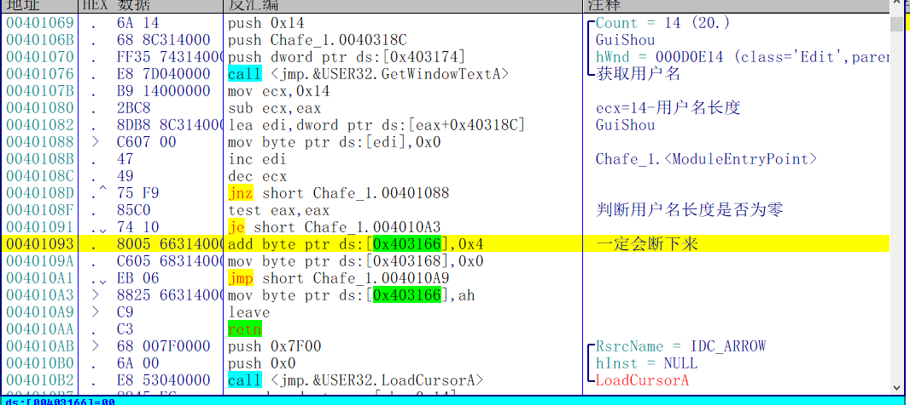
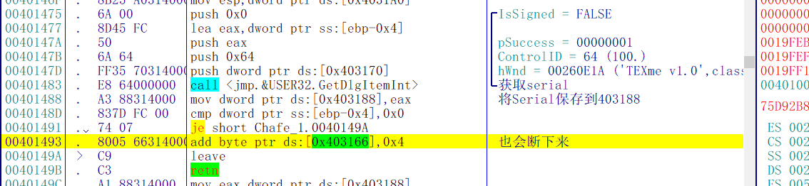
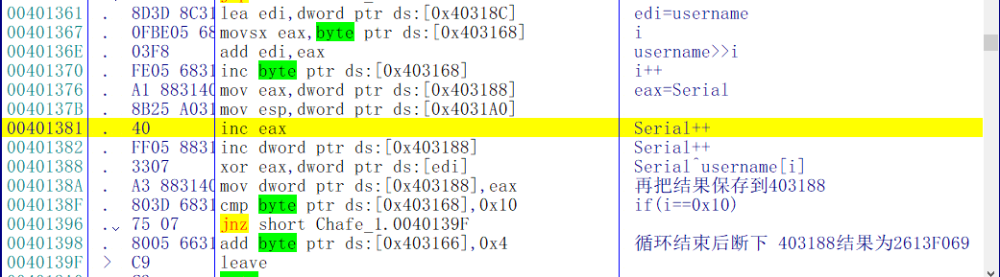
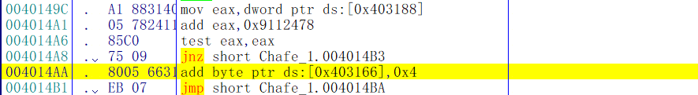
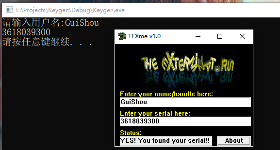

[TOC]

## 查壳



目标程序是一个用汇编写的带图形界面的程序，没有壳

## 分析程序

直接查找错误的字符串，来到错误的提示处，可以看到这个cmp就是关键比较了



这里会比较eax是否等于0x10，而eax来自于0x403166，所以必须让0x这个地址的值为0x10才能注册成功

直接右键->查找所有常量





这里有四个地址分别对0x403166进行了+4的操作，只要同时满足四个条件，就能注册成功了

### 分析条件一

首先来分析第一个地址的401093处的代码



这里首先获取用户名，然后判断用户名长度是否为零，不为零则对0x403166这个地址执行+4操作，所以这个地方一定会断下来

### 分析条件三

为什么先看条件三，因为我之前已经分析完了，这四个位置有一个先后顺序的问题，按照顺序再来到00401493这个地址 



这里会获取输入的序列号，然后将序列号保存到0x403188这个地址，这个地址很重要，这个地址也是一定会断下来的

### 分析条件二

再来看条件二，这里就是这个程序校验的算法了，校验过程如下



1. 获取用户名
2. 设置循环次数，初始值i=0
3. 用户名右移i位
4. i++
5. Serial++
6. Serial和username[i]进行异或(username[i])指的是用户名左移i位后前四个字母的ASCII值)
7. 保存结果到403188处
8. 循环0x10次

### 分析条件四



这里首先会取出0x403188的结果，然后加上0x9112478，接着比较eax是否为零，为零则403166这个位置加上4，从这里可以得出条件三的算法结果必须为0-0x9112478=0xf6eedb88

## 写出注册机

根据条件三的结果，我们可以直接逆推出注册机

```c++
int CalcKey()
{
	char* name;
	unsigned long serial = 0xF6EEDB88;
	unsigned long *p;
	name = new char[20]{0};

	cout << "请输入用户名:";
	gets_s(name, strlen(name) - 1);
	for (int i= 0x10 - 1; i >= 0; i--)
	{
		p = (unsigned long *)&name[i];
		serial ^= *p;
		serial--;
	}
	cout <<serial << endl;
	return 0;
}
```

输入用户名和计算的序列号，注册成功，破解完成



需要相关文件的可以到我的Github下载：https://github.com/TonyChen56/160-Crackme