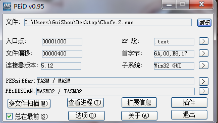
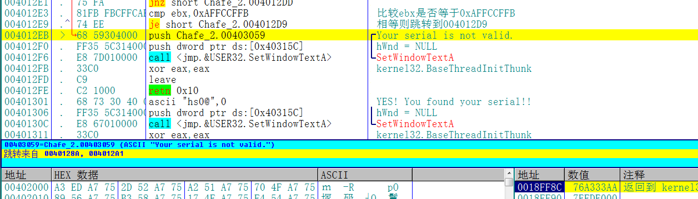
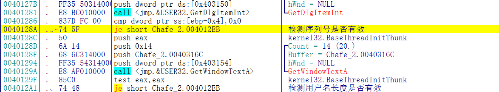
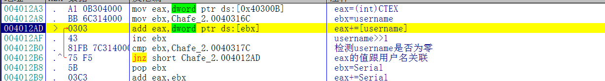
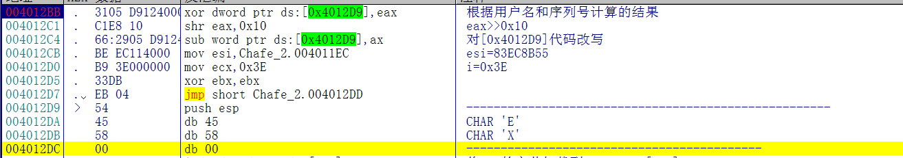
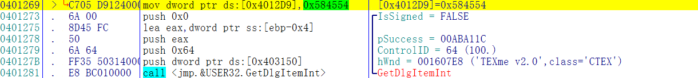
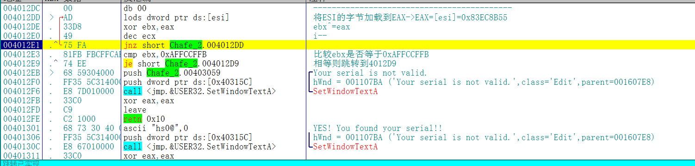
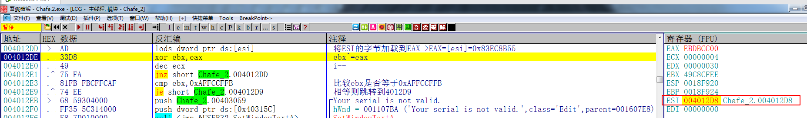
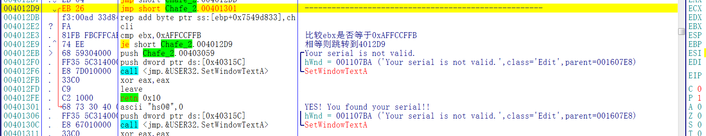
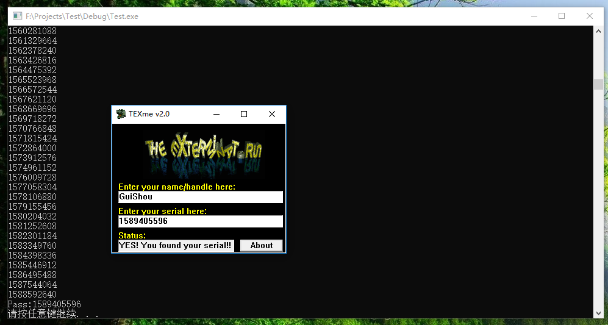

[TOC]

## 查壳



024这个Crackme跟023是同一个作者，难度两颗星，程序设计的很巧妙，非常有意思

## 分析程序



首先根据字符串的错误提示找到错误跳转到这个地址的位置，总共有两处，两处校验的地方，地址相差不远，随便找一个跟过去



两处校验分别是校验序列号和用户名是否有效，校验完了之后就是程序的核心算法

## 分析算法

这个程序的算法分为三个部分，每个部分之间都相互关联，环环相扣，首先来看第一部分

### 第一部分 计算用户名和序列号


先输入用户名和序列号，然后下断点，这个程序的校验算法部分检测的是键盘事件，而不是定时器，所以打完断点之后随便按一个键程序就能断下来



这个就是第一部分的算法，过程如下：

1. eax的值第一次固定为CTEX的ASCII值
2. ebx为指向用户名的指针
3. 将eax和ebx的内容相加 结果保存在eax
4. 然后用户名左移1位
5. 检测用户名是否到了结尾，即循环次数为用户名的长度
6. 用户名的结果计算完毕之后再加上序列号

### 第二部分 根据用户名和序列号的结果改写Opcode



首先将eax的值，也就是第一部分计算出的结果跟[0x4012D9]这个地址进行异或，



[0x4012D9]这个地址的值在算法一开始就被赋值了，所以这个值是固定的。

然后将eax右移0x10位，然后用[0x4012D9]的值减去ax，这两部分的操作都会改变[0x4012D9]处的代码，那么这么做到底是为了什么呢？现在还不知道，需要接着往下看

### 第三部分 关键校验



从内存地址[4011EC]开始，读入四个字节与EBX异或，结果保存在ebx，一直至内存地址[4012E4]，这段正好是关键算法部分，循环结束之后比较ebx是否等于0xAFFCCFFB，如果不相等则报错，如果相等的话就跳转0x4012D9处。

这里有一个坑，就算不能在这个校验的范围内下F2断点，如果下了的话会改变最后的值



### 揣摩作者意图

按照正常情况下来说，有一个提示错误的分支，另外一个就一定是提示正确的分支，而这个提示正确的分支却是指向一段动态改变的代码，那就是说，我们只能通过0x4012D9处的代码让程序提示注册成功，否则这个程序就会陷入无限的死循环或者是直接奔溃。

也就是说，0x4012D9这个位置必须带我们到正确的提示，也就是说这个地址的OpCode必须为EB 26



### 程序算法总结

1. 首先对用户名和注册码进行一系列的计算，得出Result
2. 通过Result改变0x4012D9处的代码
3. 循环0x3E次，校验最后的结果

## 写出注册机

过程分析清楚了，但是想写出注册机的话还是得费点劲的，这种逆推算法的事情我不太擅长，看见就脑阔疼，索性直接从看雪上面拷了一个，代码如下:

虽然这个注册机效率有点慢，但好歹能编译通过，而且计算正确，之前找了好几个要么编译不过，要么算的不对，我也是服了

```c++
#include <iostream>
#include <windows.h>
using namespace std;

int main(void)
{
	CHAR szName[20] = { 0 };
	cout << "Name:";
	cin >> szName;
	DWORD dwNum = 0x58455443;//程序实现填入的全局变量
	for (int i = 0; i < strlen(szName); i++)//用户名循环相加DWORD
	{
		void *p = &szName[i];
		_asm
		{
			mov edi, p;
			mov eax, dword ptr[edi];
			add dwNum, eax;
		}
	}
	//////////////////////////////////////////////////////////////////////////
	DWORD dwPass = 0;
	while (1)
	{
		DWORD temp = (dwNum + dwPass) ^ 0x584554;
		temp -= (WORD)((dwNum + dwPass) >> 0x10);
		if (dwPass % 0x100000 == 0)  //这里if语句可以不要只是用来看看它在跑密码还是死机了
			cout << dwPass << endl;
		if (temp == 0x585426EB)//这就是上一个算法得到的正确的opcode
			break;
		dwPass++;
	}
	cout << "Pass:" << dwPass << endl;
	system("pause");
}
```

## 校验结果

输入用户名和计算出来的序列号，提示成功 破解完成



需要相关文件的可以到我的Github下载：https://github.com/TonyChen56/160-Crackme