[TOC]

## 查壳

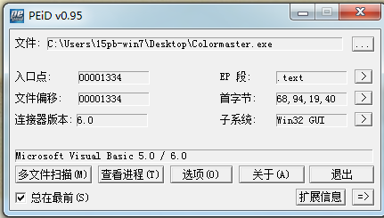

这个Crackme也是用VB写的，难度是问号，自我感觉应该值三颗星

## 分析程序

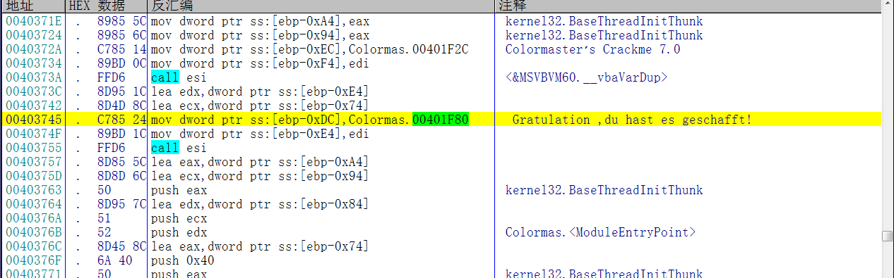

首先根据字符串提示，来到按钮点击事件的开头

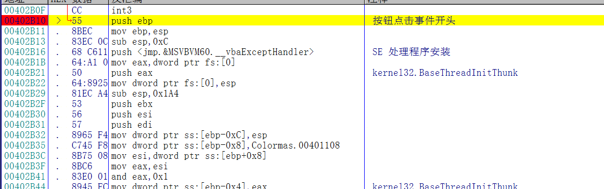

下断点，随便输入一个用户名和序列号，开始分析程序

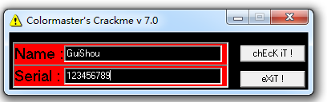

## 算法分析

这个程序的算法分成六个部分，下面依次对每个部分的算法进行详细的讲解

### 基础校验

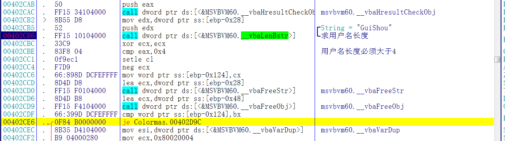

首先获取输入的用户名的长度，必须大于4，如果不大于则提示错误

### 第一部分

最难也是最麻烦的就是第一部分了，如果解决了这个部分，那么后面剩余的四个部分就不成问题

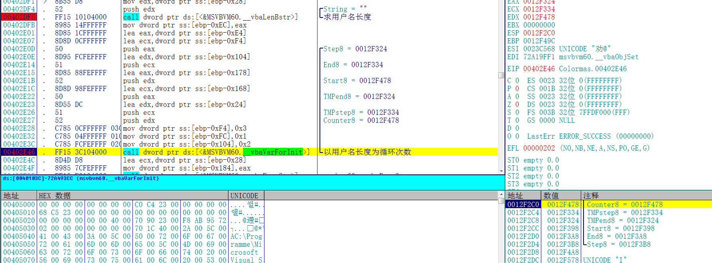

1-1 首先获取用户名长度，然后以用户名长度作为循环的次数，开始一轮循环，即i=strlen(username)

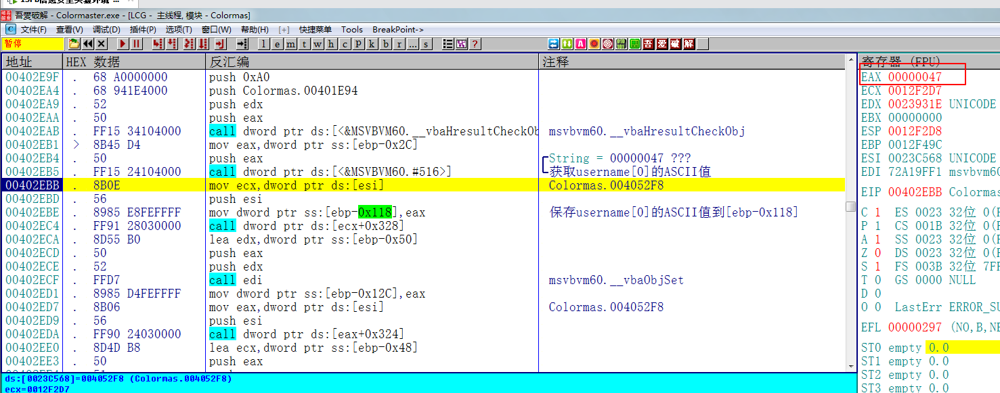

1-2 获取用户名第一位的ASCII值->username[0]

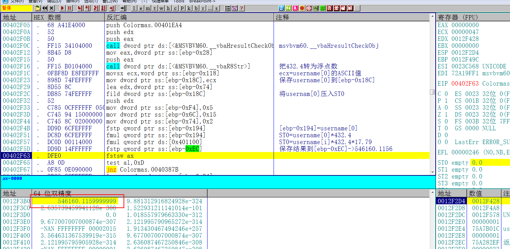

1-3 用户名的第一位的ASCII值乘以432.4再乘以17.79，->`username[0]*432.4*17.79`

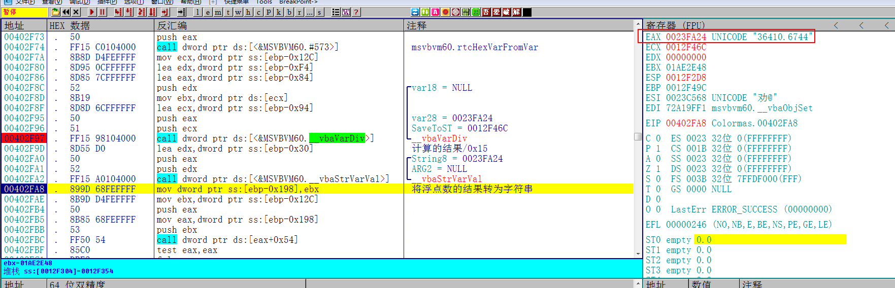

1-4 将1-3-result除以0x15，然后把浮点数值转为字符串->`username[0]*432.4*17.79/0x15`

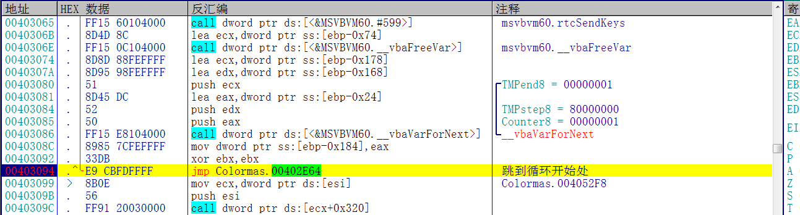

1-5 跳到循环开始处，开始新一轮循环

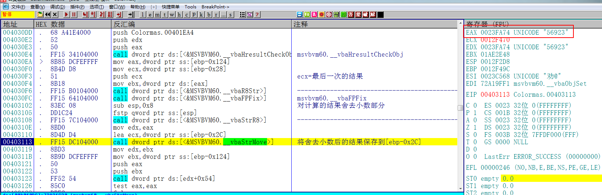

1-6 取最后一次循环的计算结果，然后舍去小数部分->`username[usernameLength-1]*432.4*17.79/x0x15`

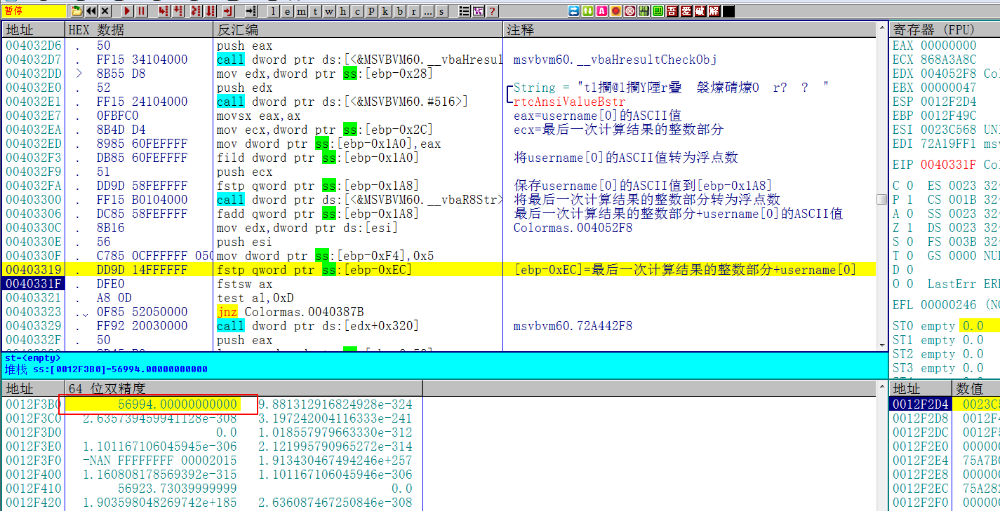

1-7 将1-6的结果转为浮点数后加上用户名的第一个字节的ASCII值 这个就是完整的第一部分的算法了

用代码表示这部分的算法结果如下：

`(username[usernameLength - 1] * 432.4*17.79 / 15 + username[0])`

剩下的几部分算法也都是基于这个部分的结果

### 第二部分


2-1 首先将用户名的第一位的ASCII值乘以0x19->username[0]*0x19

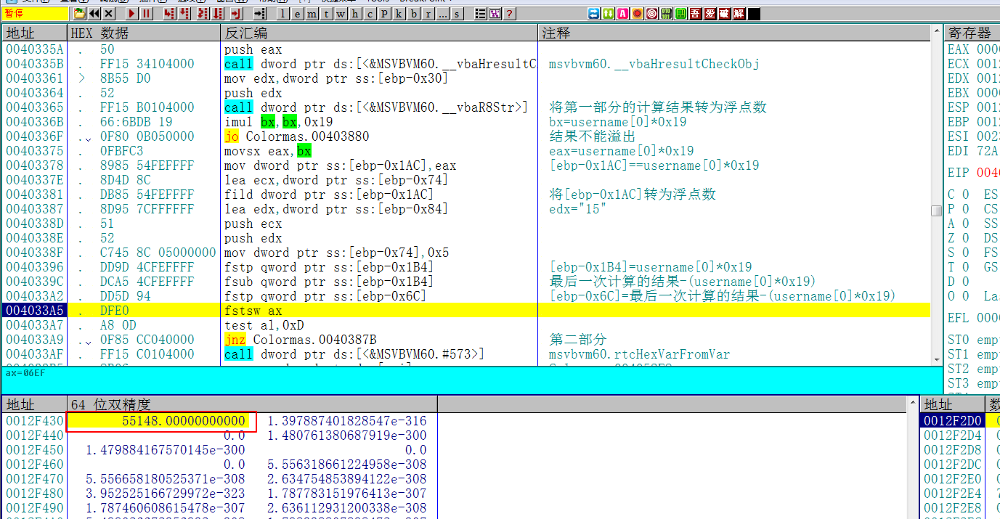

2-2 用1-4的结果减去2-1的结果，->(username[usernameLength - 1] * 432.4*17.79 / 15 - username[0] * 0x19)

### 第三部分

第三部分直接就是第一部分以十六进制形式转成字串的结果->username[usernameLength - 1] * 432.4*17.79 / 15

### 第四部分

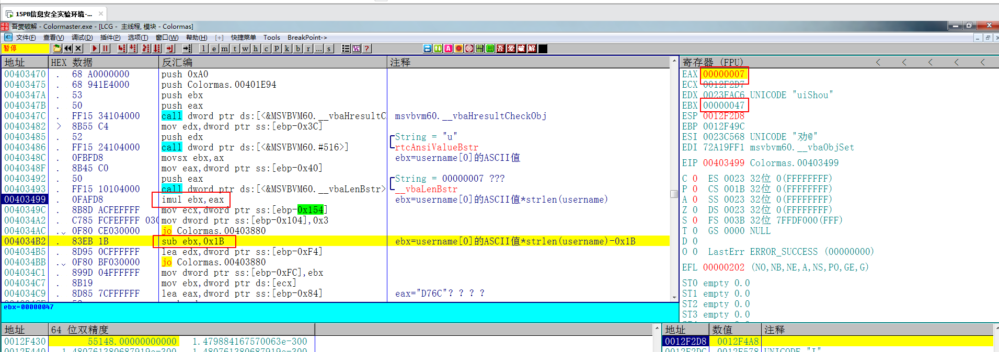

第四部分就是用username[0]*用户名的长度再减去0x1B->username[0] * usernameLength - 0x1b

### 第五部分

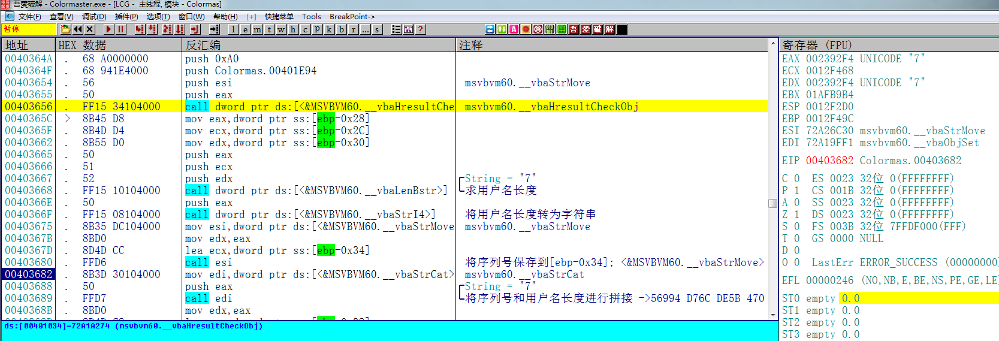

第五部分就是用户名的长度

### 第六部分

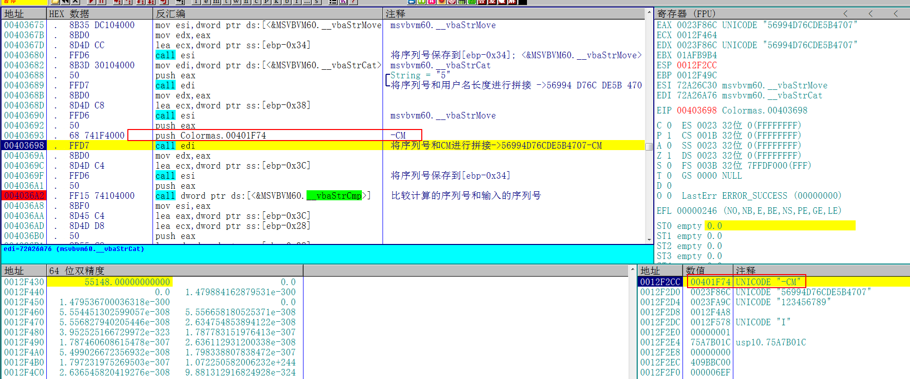

第六部分是固定的字符串"-CM"，拼接完第六部分之后就算关键的比较函数了。

以上就是这个程序的完整的算法，另外这个作者好像还有点皮，会用SendKey来模拟键盘按键给你捣乱，但对调试程序影响不大。

## 写出注册机

根据每一部分的算法 我们可以写出这个程序的注册机 代码如下：

```c++
#include <iostream>
#include <windows.h>

using namespace std;

int main()
{
	char username[20] = { 0 };
	printf("请输入用户名:");

	scanf_s("%s", username, 20);
	int usernameLength = strlen(username);
	if (usernameLength < 5)
	{
		printf("用户名长度必须大于5");
	}
	char key[50];
	char key1[10], key2[10], key3[10], key4[10], key5[10];
	sprintf(key1, "%d", (int)(username[usernameLength - 1] * 432.4*17.79 / 15 + username[0]));
	sprintf(key2, "%X", (int)(username[usernameLength - 1] * 432.4*17.79 / 15 - username[0] * 0x19));
	sprintf(key3, "%X", (int)(username[usernameLength - 1] * 432.4*17.79 / 15));
	sprintf(key4, "%d", (int)(username[0] * usernameLength - 0x1b));
	sprintf(key5, "%d", usernameLength);
	memset(key, 0, sizeof(key));
	strcat(key, key1);
	strcat(key, key2);
	strcat(key, key3);
	strcat(key, key4);
	strcat(key, key5);
	strcat(key, "-CM");
	printf("%s\n", key);
	system("pause");
	return 0;
}
```

## 验证结果

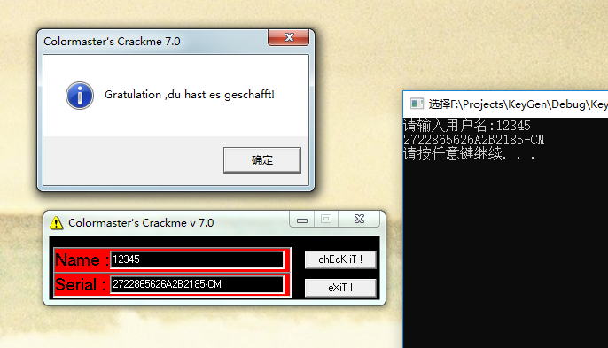

输入注册机算出的序列号，提示成功 破解完成

最后，需要udd相关文件的可以到我的Github下载：https://github.com/TonyChen56/160-Crackme


