[TOC]

## 查壳

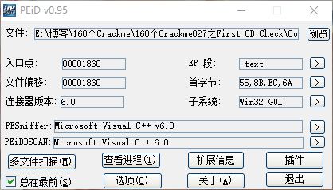

程序是使用VC6写的 没有壳

## 分析程序

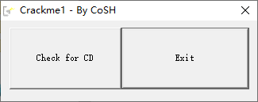

这个程序跟之前的Crackme不一样，采取的保护方式是光盘检测，如果检测通过，点击Check for CD，会提示检测通过，但是现在是失败的

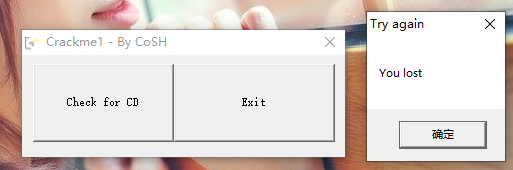

我也是第一次分析这种程序，所以需要一点相关的前置知识

## 前置知识

以下内容出自《加密与解密4》

### 什么是光盘检测

一些采用光盘形式发行的应用软件和游戏，在使用时需要检查光盘是否插在光驱中，如果没有则拒绝运行。这是为了防止用户将软件或游戏的一份正版拷贝安装在多台机器上且同时使用，其思路与DOS时代的钥匙盘保护类似，虽然能在一定程度上防止非法拷贝，但也给正版用户带来了一些麻烦——一旦光盘被划伤，用户就无法使用软件了

### 检测原理

最简单也最常见的光盘检测就是程序在启动时判断光驱中的光盘里是否存在特定的文件。如果不存在，则认为用户没有使用正版光盘，拒绝运行。在程序运行过程中，一般不再检查光盘是否在光驱中。在Windows下的具体实现一般是：先用GetLogicalDriveStrings0或GetLogicalDrives0函数得到系统中安装的所有驱动器的列表，然后用GetDriveType0函数检查每个驱动器，如果是光驱，则用CreateFile0或FindFirstFile0函数检查特定的文件是否存在，甚至可能进一步检查文件的属性、大小、内容等。

上述保护的一种增强类型就是把程序运行时需要的关键数据放在光盘中。这样，即使解密者能够强行跳过程序启动时的检查，但由于没有使用正版光盘，也就没有程序运行时所需要的关键数据，程序自然会崩溃，从而在一定程度上起到了防破解的作用

### 拆解光盘保护

第一种光盘检测方式是比较容易被破解的。解密者只要利用上述函数设置断点，找到程序启动时检查光驱的地方，然后修改判断指令，就可以跳过光盘检测

第二种增强型光盘保护还是有办法的，可以简单地利用刻录和复制工具将光盘复制多份，也可以采用虚拟光驱程序来模拟正版光盘。常用的虚拟光驱程序有Virtual CD、Virtual Drive、DaemonTools等。值得一提的是Daemon Tools，它不仅是免费的，而且能够模拟一些加密光盘。这些光盘加密工具一般都会在光轨上做文章，例如做暗记等。有的加密光盘可用工作在原始模式（Raw mode）的光盘拷贝程序原样复制，例如Padus公司的DiscJuggler和Elaborate Bytes公司的CloneCD等。对光盘加密感兴趣的读者可以查阅ISO9660标准协议

## CD-Check分析

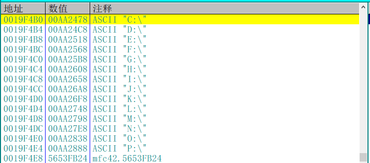

首先程序初始化了C-P的字符串

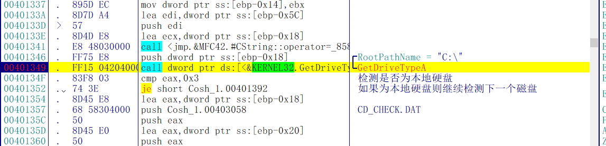

然后检测这些盘符的类型是否为本地硬盘，如果是本地硬盘就继续检测下一个磁盘

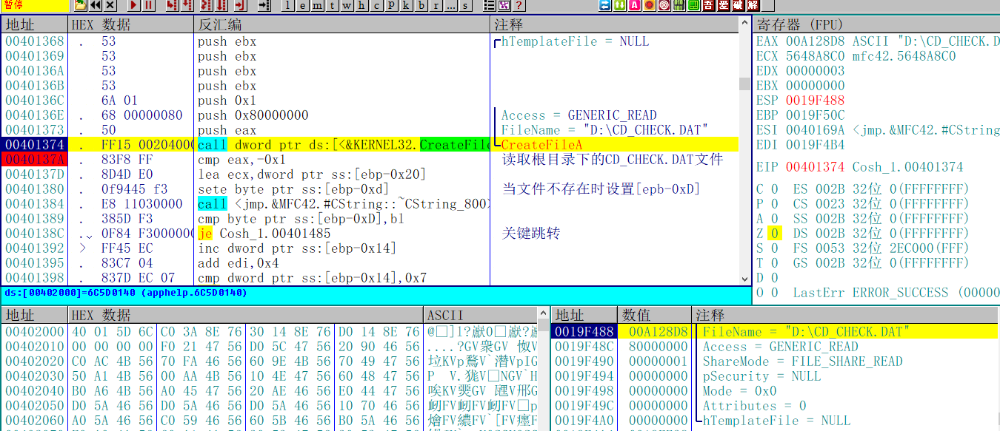

检测完磁盘类型之后会读取根目录下是否存在`CD_CHECK.DAT`文件，如果文件存在则提示正确

所以，正确的不修改程序的Crack方式应该是插一个U盘，然后再根目录下新建一个文件名为`CD_CHECK.DAT`的文件。

## 作者低级的错误

但是！当我在U盘下新建了文件之后居然发现还是通过不了检测，原因居然是这个CreateFileA的参数写错了！！！

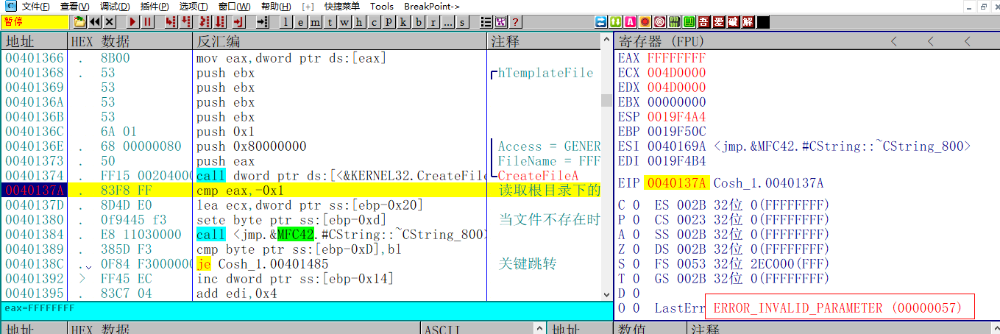

所以就算根目录下存在这样一个文件也通过不了检测，一开始我还以为自己看错了，于是又验证了一番

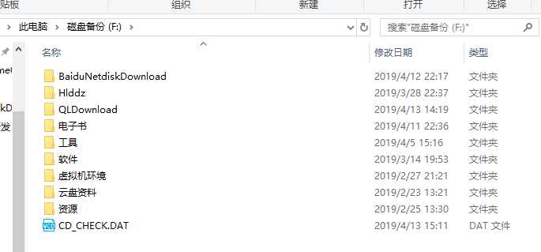

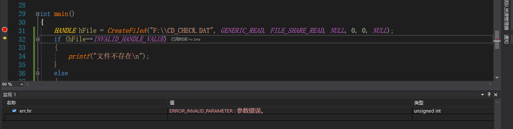

好吧 那就不能怪我了，是你自己写错的，只能暴力破解了

## 暴力破解CD-Check

修改如下两处指令，保存文件

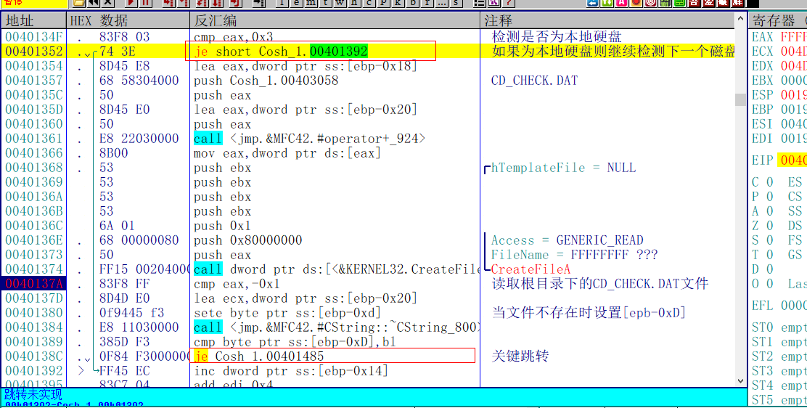

修改后如下

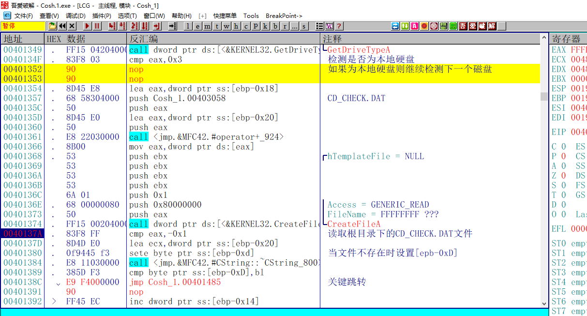

## 校验结果

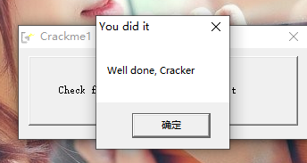

修改完成之后，点击Check，破解成功

需要相关文件的可以到我的Github下载：https://github.com/TonyChen56/160-Crackme

