[TOC]

## 查壳

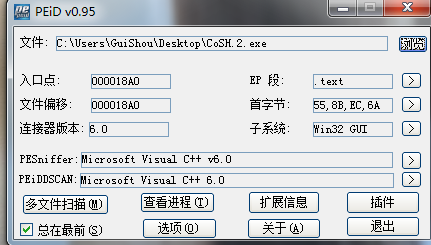

目标程序是用VC6写的，没有加壳，跟027是同一个作者，难度为一颗星

## 分析程序

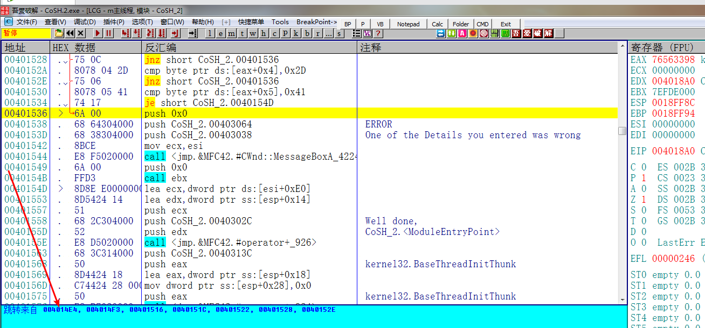

首先根据错误提示可以看到跳转到这个地址的地方有很多，我们直接选择最前面那个地址，开始分析整个算法

先随便输入一个序列号

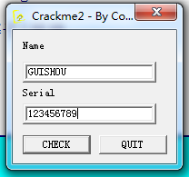

另外，这个程序如果有IDA的帮助会分析的更快

## 分析算法

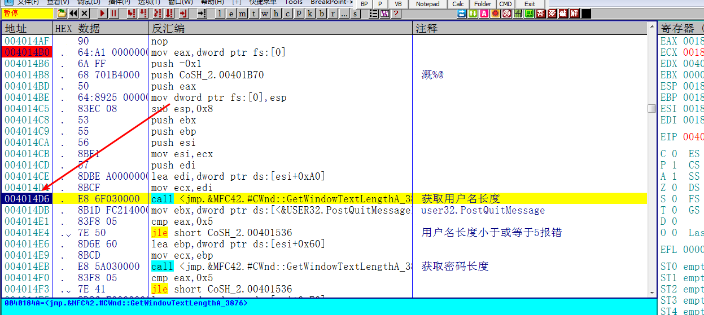

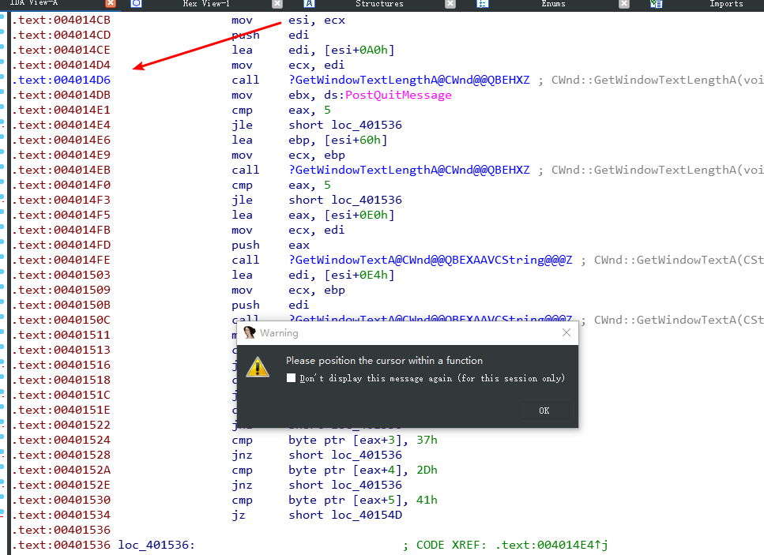

我们找到算法开始处的地址，对应到IDA中，F5查看一下伪C代码，但是你会发现有个提示，让我们把光标选择在一个函数，这表示IDA的反编译失败了!这是为什么呢?

## 对抗花指令

上一个Crackme作者犯了一个低级错误，写错了一个参数，这一次他玩了一个小把戏，用花指令干扰我们静态分析。现在来破解一个小把戏

OD直接拉到函数开头的部分，你会看到有一堆nop指令

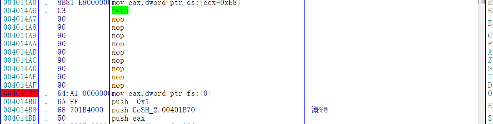

在IDA同样地址处这里却不是nop，而是被解释成了align10，IDA的反汇编器在这里出现了错误，把数据解释成了代码

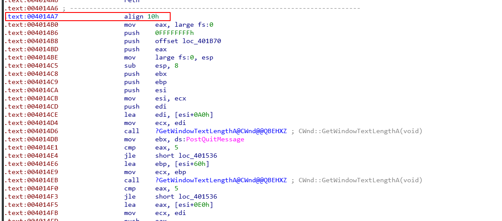

那么解决办法就是在这一行按字母D键，将代码强行解释为数据，修改后如下：

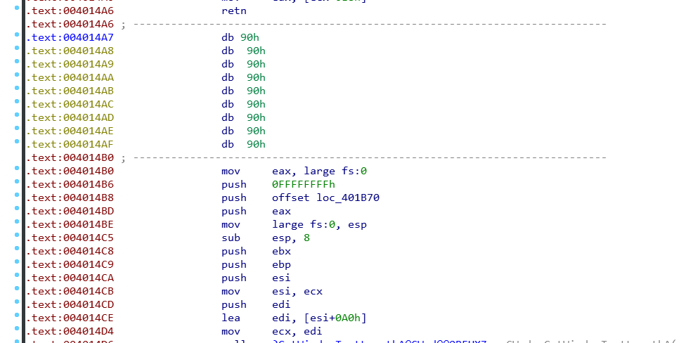

然后选中整个函数，按P键组合成一个函数

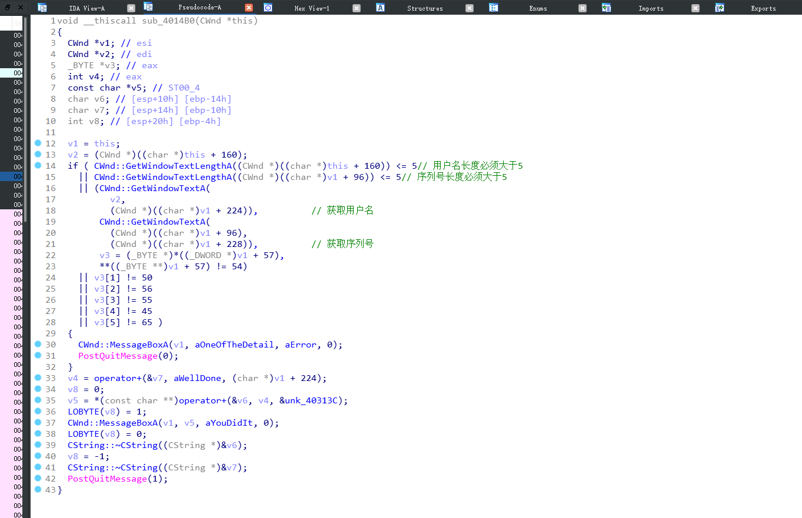

这个时候你再按F5，就能显示整个函数的伪代码了

## 校验过程

这个程序的校验过程相对来说比较简单，过程如下

1. 获取用户名长度，比较是否小于等于5

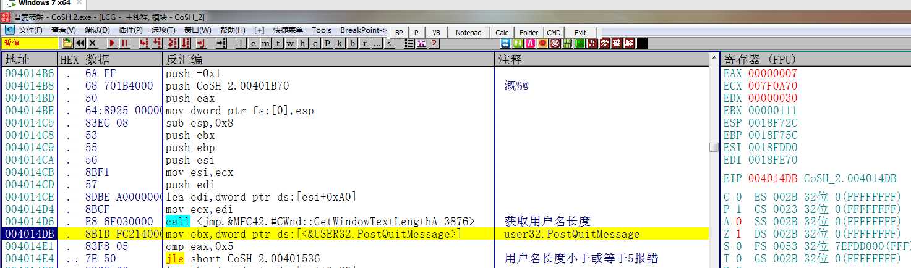

2. 获取密码长度 比较是否小于等于5

3. 获取序列号 开始校验序列号

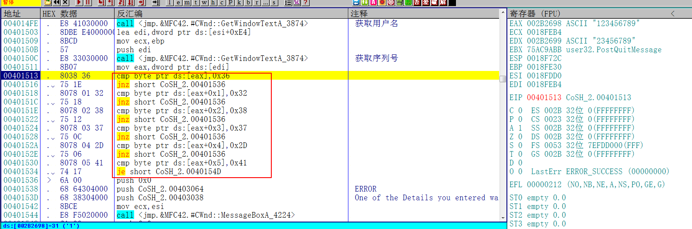

可以看到校验的部分就是6个cmp和jcc指令了，直接看IDA

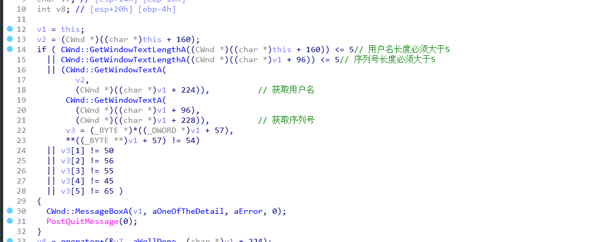

这里显示的是一堆十进制的数字，这个对我们来说没有意义，按R键，可以把数字转为字符串，转换后如下

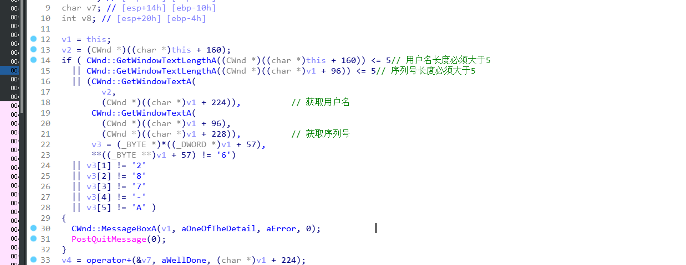

可以很直观的看到序列号就是6287-A

## 校验结果

随便输入一个用户名，但是长度必须大于5，然后输入刚才的序号，提示正确 破解完成

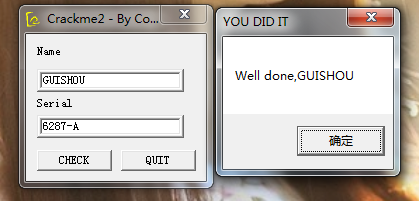

最后，需要相关文件可以到我的Github下载:

<https://github.com/TonyChen56/160-Crackme>

