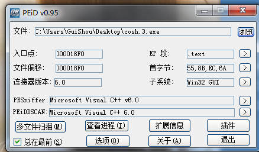
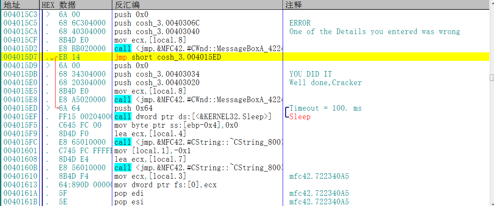
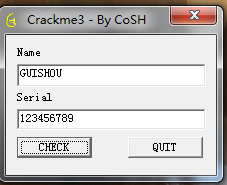
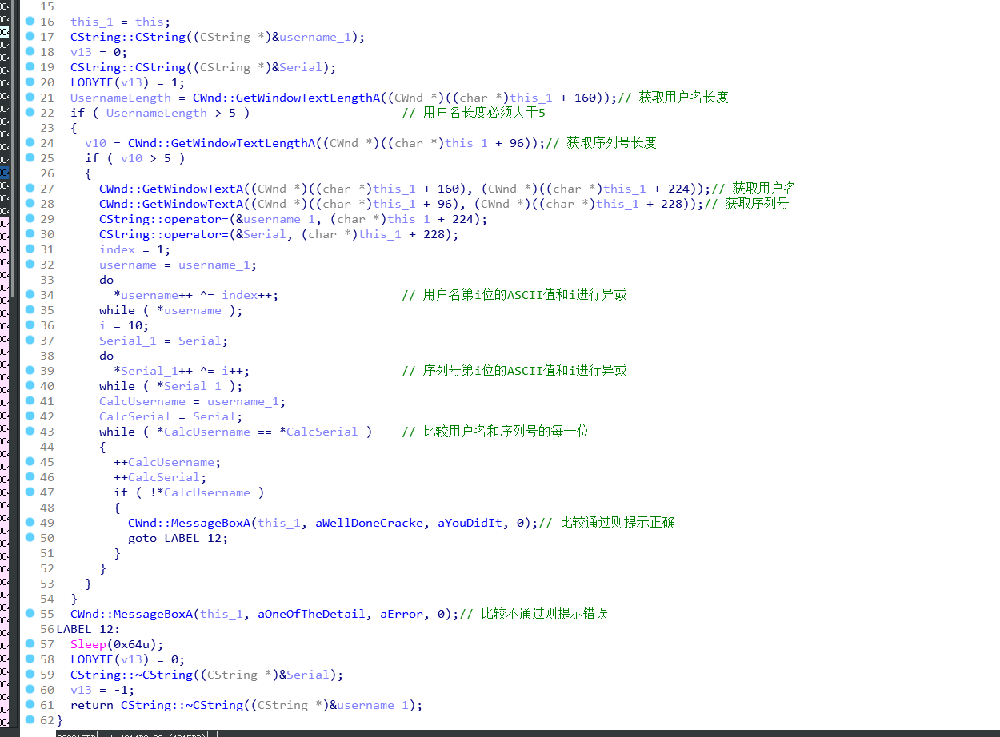
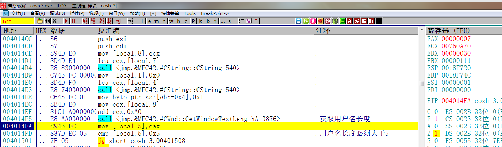
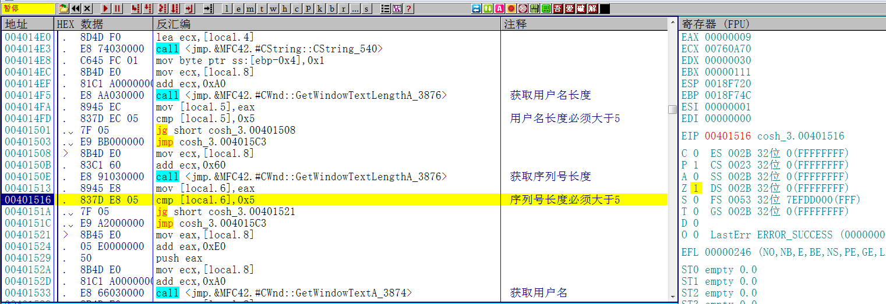
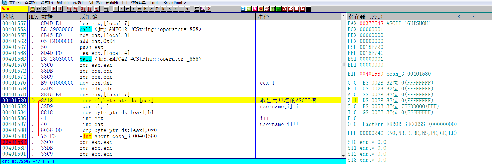
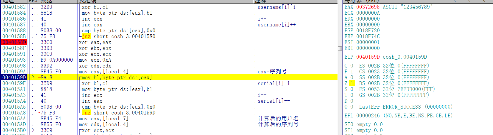
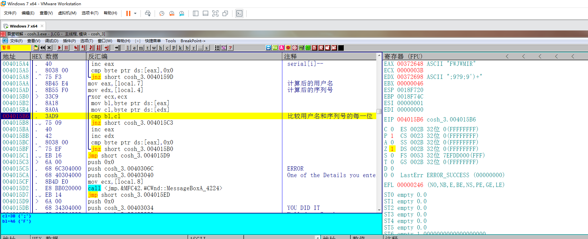
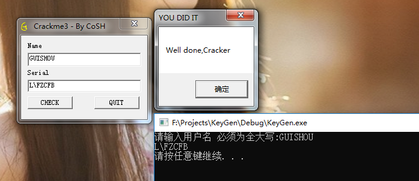

[TOC]

## 查壳



这个Crackme跟027和028是同一个作者，VC6写的，难度为一颗星

## 分析程序



同样，根据字符串的错误提示，来到函数头的位置，配合IDA的伪代码分析整个算法，

## 分析算法



随便输入一个用户名和序列号，算法的校验过程如下。这个Crackme跟028一样有花指令的干扰，如果想在IDA中看到F5的伪代码，需要手动去除花指令，去除的方法请参考我的Crackme027的分析



1. 获取用户名长度 比较是否大于5



2. 获取序列号长度 比较是否大于5



3. 根据用户名计算，得出结果，算法转换为C++代码如下：



```c++
do
	*username++ ^= index++;                 
while ( *username );
```

4. 根据序列号计算，得出结果，算法转换为C++代码如下：



```c++
i = 10;
do
	*Serial_1++ ^= i++;                   
while ( *Serial_1 );
```

对 没错 两个算法都是直接从IDA的伪代码中拷出来的 直接就能用

5. 循环比较用户名的计算结果和序列号的计算结果是否相等，根据比较的结果提示跳转与否



也就是说用户名和序列号必须要满足程序中的等式才能注册成功

## 写出注册机

这个程序的注册机也比较好写，首先根据用户名计算出中间结果，然后再根据结果反向逆推出注册码，代码如下:

```c++
#include <iostream>
#include <windows.h>

using namespace std;

int main()
{
	char username[20] = { 0 };
	char result[20] = { 0 };
	char key[20] = { 0 };
	printf("请输入用户名 必须为全大写:");

	scanf_s("%s", username, 20);
	int usernameLength = strlen(username);
	if (usernameLength <= 5)
	{
		printf("用户名长度必须大于5");
	}
	//计算中间结果
	for (int i=0;i<usernameLength;i++)
	{
		username[i] ^= i+1;
		result[i] = username[i];
	}

	//根据结果逆推注册码

	for (int i = 10; i < usernameLength+10; i++)
	{
		result[i-10] ^= i;
		key[i-10] = result[i-10];
	}

	printf("%s\n", key);
	system("pause");
	return 0;
}
```

## 校验结果

输入用户名和计算出来的序列号



提示正确 破解成功

需要相关文件可以到我的Github下载:<https://github.com/TonyChen56/160-Crackme>