[TOC]

## 查壳

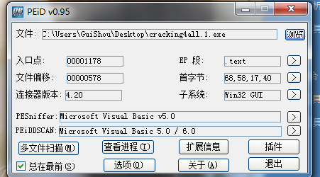

目标程序是VB写的，序列号保护方式，难度为一颗星

## 分析程序


随便输入一个序列号，来到字符串的错误提示处

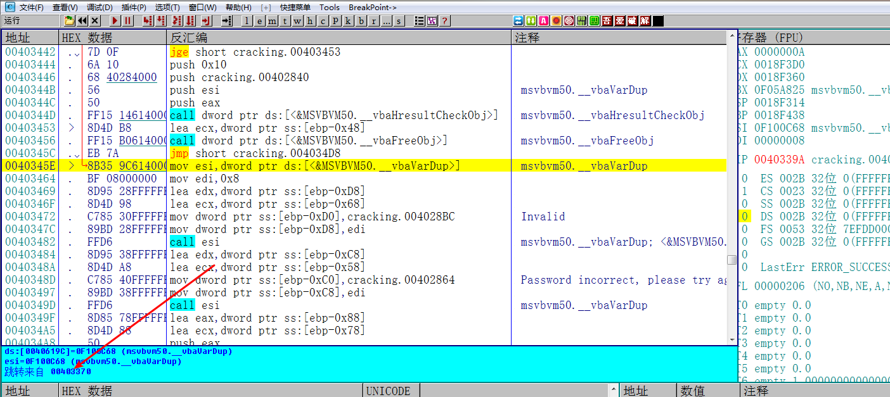

找到跳转到错误提示的地方 跟过去

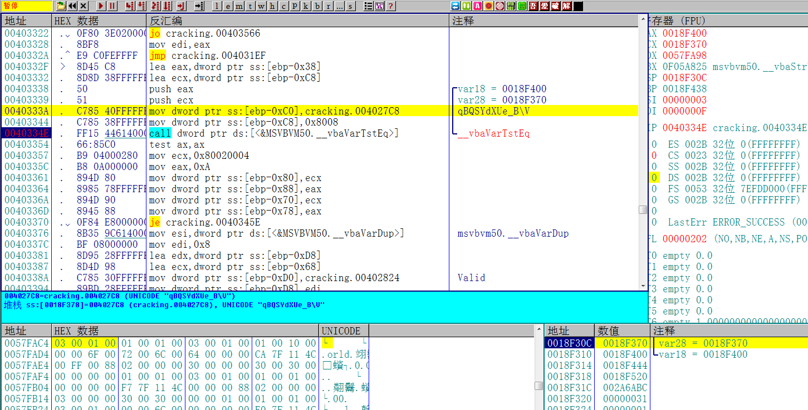

接着发现了一个VB的比较函数，下断点，观察一下堆栈，参数一和参数二如下：

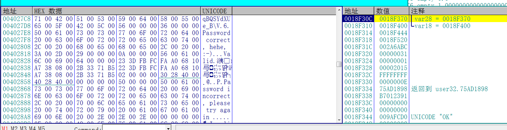

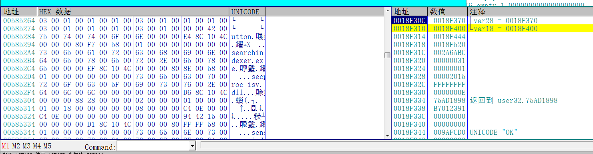

并不是我们之前看到的正确注册码和错误注册码的形式，也不是0和1的比较，看来这个程序是有算法的，最终比较的是算法算出来之后的结果，那么我们就要从函数头的位置开始分析算法了

## 算法分析

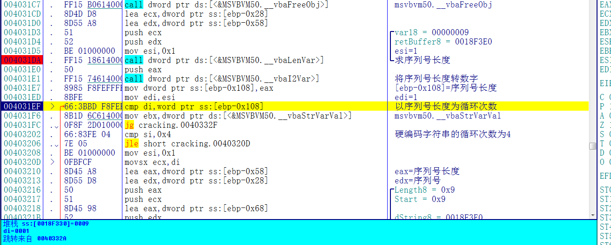

首先获取序列号长度，以序列号长度为大循环的循环次数，然后还有一个小循环的循环次数为4


然后从序列号第一位开始取1个字符，取字符的位置每次+1，取字符的最大起始位置为序列号的长度，即大循环的循环次数

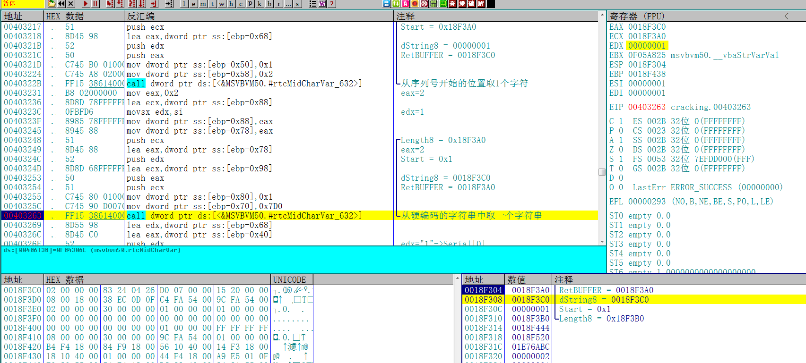

然后从硬编码的字符串02 00 00 00第一位取一个字符，开始的位置每次+1，取字符的最大起始位置为4，即上面的小循环的循环次数，超过4则重新回到1

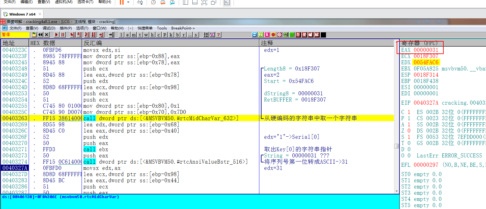

然后将取出的那一位序列号转成ASCII值

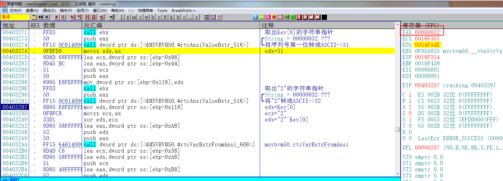

再将取出的硬编码字符串转成ASCII值

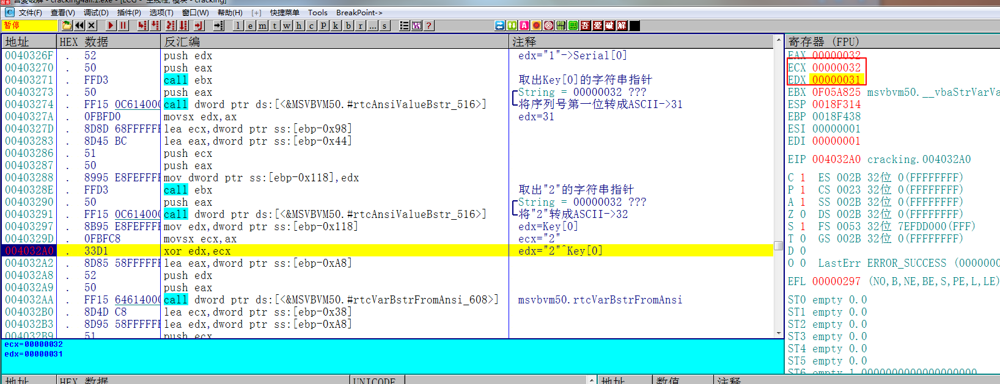

最后将取出的序列号的ASCII值和取出的硬编码的ASCII值进行异或

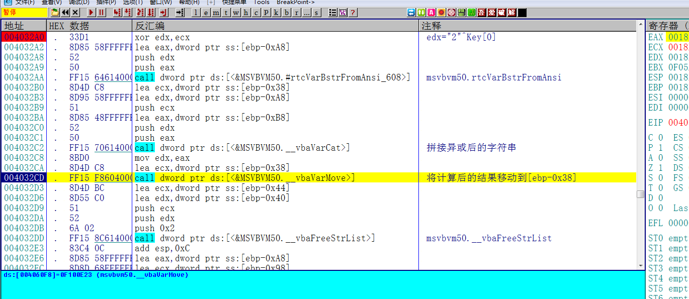

拼接字符串，将异或后的结果保存到[ebp-0x38]这个位置，

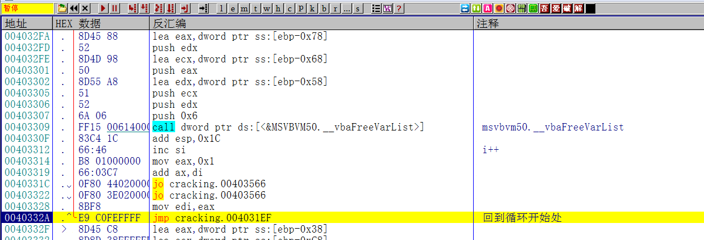

然后回到循环开始处开始新一轮循环，所以只要观察[ebp-0x38]，就能看到最后的结果

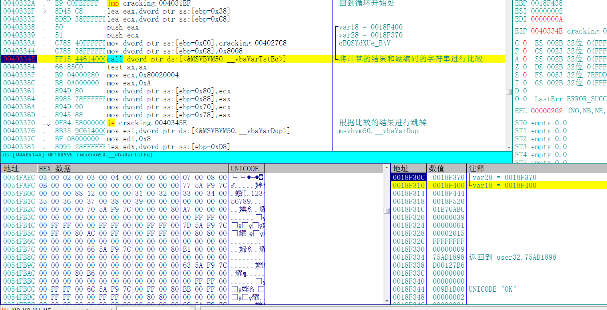

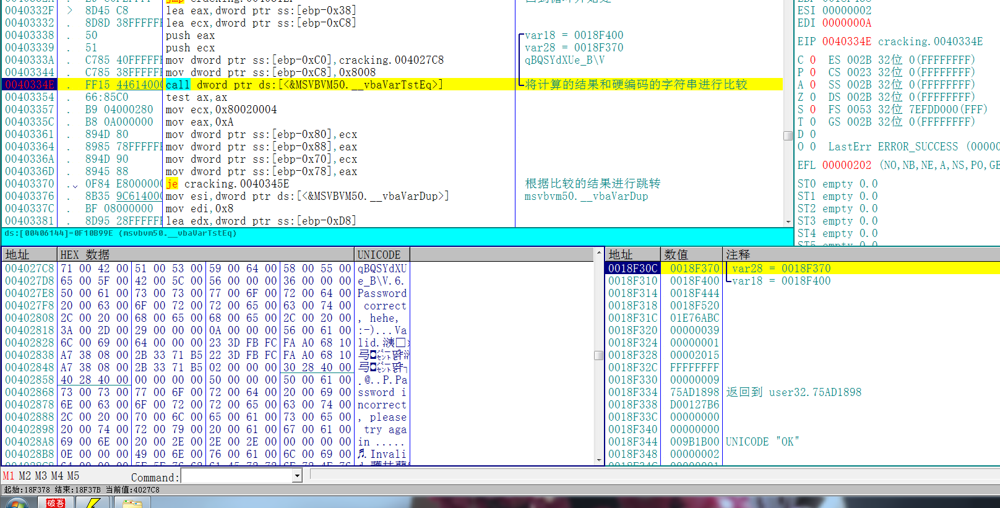

最后将用户名异或得出的计算结果和硬编码的字符串进行比较，根据比较的结果提示正确与否

## 写出注册机

整理一下这个程序的算法，这个程序的算法其实就是一元一次方程，即`Serial^02 00 00 00(Key)=qBQSYdXUe_B\V(result)`

Serial是未知的，我们可以根据已知的result去异或已知Key得到正确的序列号，这个可以手动计算，也可以写个循环计算，代码如下:

```c++
#include <iostream>
using namespace std;

int main()
{
	char serial[13] = { 0 };
	char result[14] = { "qBQSYdXUe_B\\V" };
	char key[17] = { "2000200020002000" };

	for (int i = 0; i < 14; i++)
	{
		serial[i] = result[i] ^ key[i];
	}
	serial[13] = 0;
	printf("%s\n", serial);
	system("pause");
	return 0;
}
```

## 校验结果

输入计算出来的序列号，提示正确，破解完成

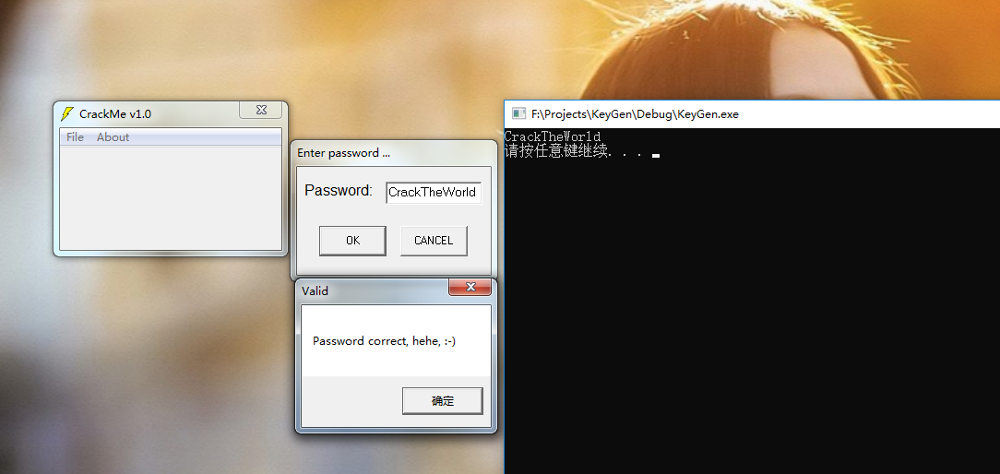

需要相关文件可以到我的Github下载:<https://github.com/TonyChen56/160-Crackme>