[TOC]

## 查壳


这个Crackme和030是同一个作者，也是VB程序。虽然难度显示是问号，充其量也就一星

## 设计思路

这个Crackme和上一个算法几乎一样，作者又故技重施了一次。所以我们先来捋一遍Crackme30的校验过程，再看这个会相对轻松。

作者首先准备了一个正确的序列号和一个密钥，然后用密钥去加密这个正确的序列号，得到密文，也就是结果；然后用同样的密钥去加密用户输入的序列号，得到结果。最后去比较正确的序列号加密的结果和用户输入的序列号加密的结果。如图：

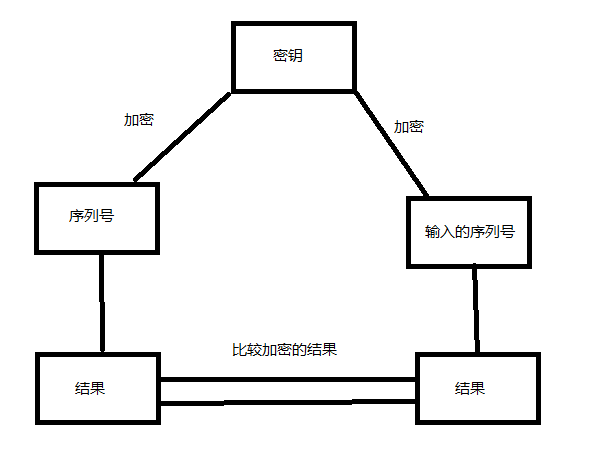

根据异或的特性，直接用正确结果去异或密钥，就能得到正确的序列号，相当于解一个一元一次方程。那么这一次的Crackme有两个密钥，作者对序列号进行了两次加密，这就相当于解一个一元二次方程了。直接来看这个程序的算法

## 算法分析

这个序列号被加密了两次，所以分为两个部分，先来看第一个部分,先随便输入一个序列号123456789

### 第一部分


获取序列号长度，转成int之后将序列号长度作为循环次数

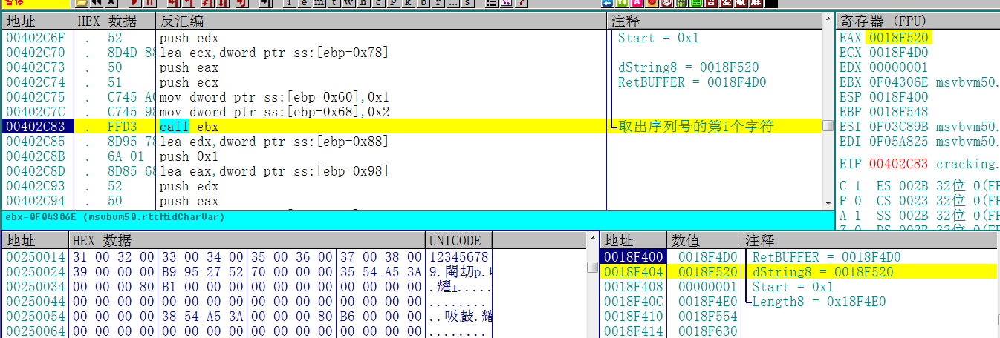

然后开始逐个取出序列号的每一个字符

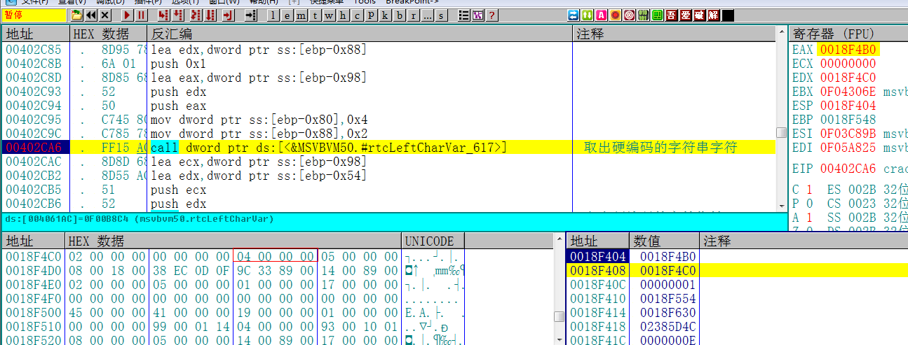

然后取出硬编码字符串的字符，也就是前面说的密钥，这是第一个密钥，数字4


然后再将序列号的ASCII值和密钥的ASCII值进行异或

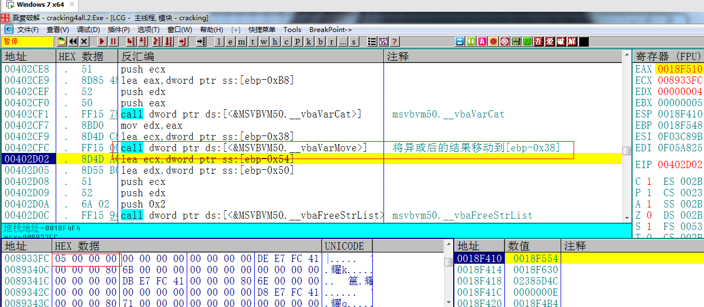

然后将异或后的结果保存到[epb-0x38]

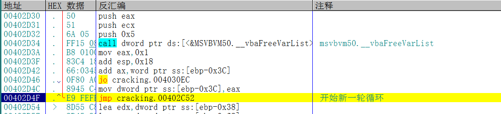

然后开始新一轮循环

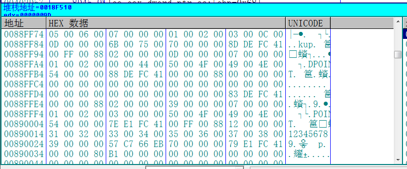

我们直接在[ebp-0x38]就能看到这部分的计算结果，这个部分的计算结果还要用于跟第二个密钥进行异或

### 第二部分

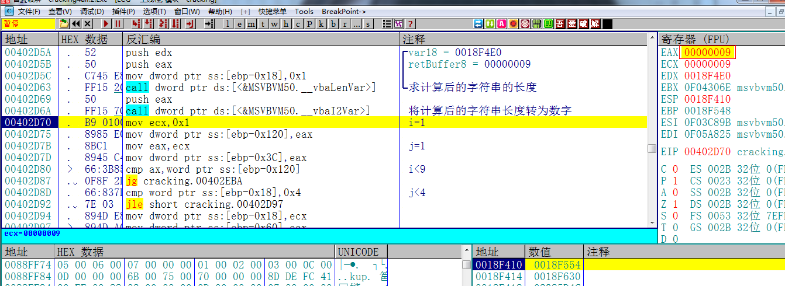

首先还是获取第一部分的结果的长度，作为循环次数，然后你会看到[402D8D]这个地址有一个cmp [ebp-0x8],4，这个4其实是密钥长度

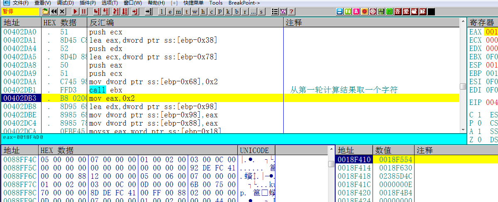

然后从第一部分的计算结果中开始逐个取字符

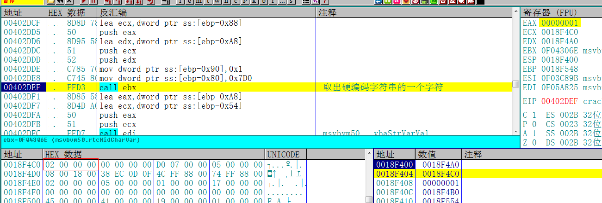

然后从硬编码的字符串中取一个字符，也就是这部分的密钥，密钥就是数据窗口的02 00 00 00，长度为4

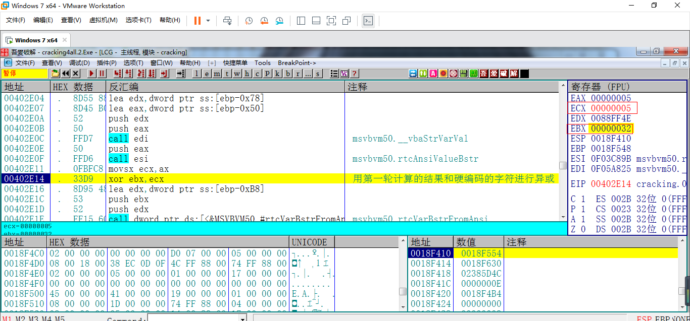

然后用第一部分计算的结果和密钥进行异或，5是我们第一部分的计算结果的第一位，32是2的ASCII值

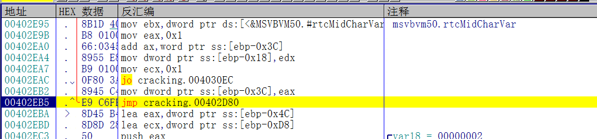

异或完成之后开始下一轮循环，循环结束之后会得到最终结果

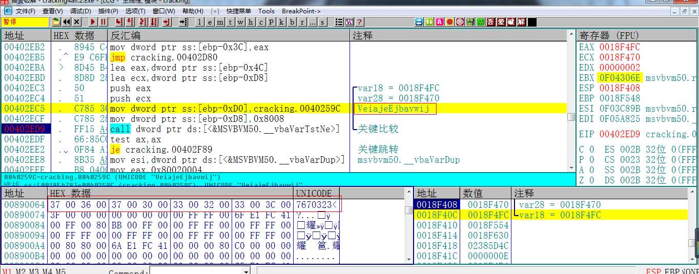

最后用最终结果和硬编码的字符串进行比较，根据比较的结果提示注册成功与否

## 写出注册机

来总结一下刚才的分析过程，用输入的序列号和密钥1进行异或，得到结果。然后再将结果和密钥2进行异或，得到最终结果。然后将最终结果和字符串进行比对。

那么我们就能利用字符串和两个密钥，进行两次异或操作，就能拿到正确的序列号了。这个可以手工计算也可以写个注册机实现。最后，贴上代码：

```c++
#include <iostream>
#include <windows.h>
using namespace std;

int main()
{
	char serial[16] = { 0 };
	char result[15] = { "VeiajeEjbavwij" };
	char key1[16] = { "200020002000200" };
	char key2 = '4';

	for (int i = 0; i < 14; i++)
	{
		serial[i] = result[i] ^ key2;
	}
	for (int i = 0; i < 14; i++)
	{
		serial[i] = serial[i] ^ key1[i];
	}

	printf("%s\n", serial);
	system("pause");
	return 0;
}
```

## 校验结果

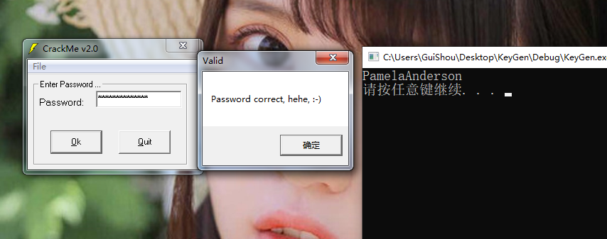

填入计算出来的序列号，提示密码正确 破解完成。

需要相关文件的可以到我的Github下载：https://github.com/TonyChen56/160-Crackme


