[TOC]

这个Crackme有两种保护方式 一种是KeyFile，一种是Name/Serial。这个是160个Crackme里面第一个文件校验的保护方式了。难度系数为问号，自我感觉就值一颗星吧。

## 查壳

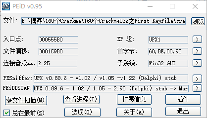

加了个UPX壳，直接用通用脱壳工具秒脱，另外链接器版本是2.25，说明是Delphi写的程序，Delphi写的程序有一个特点，调用约定是fastcall，而字符串大多是以一个指针的方式存放。

## 添加签名 导入符号

脱壳完成之后，把程序拖入到IDA，添加上所有的Delphi签名

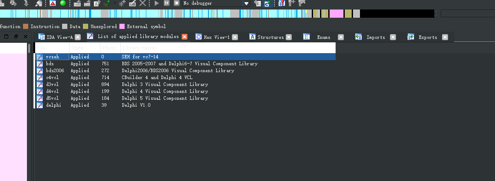

然后导出为map文件

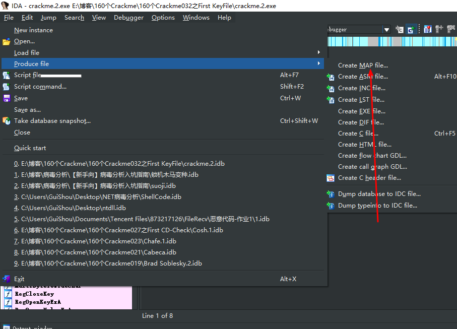

再导入到OD

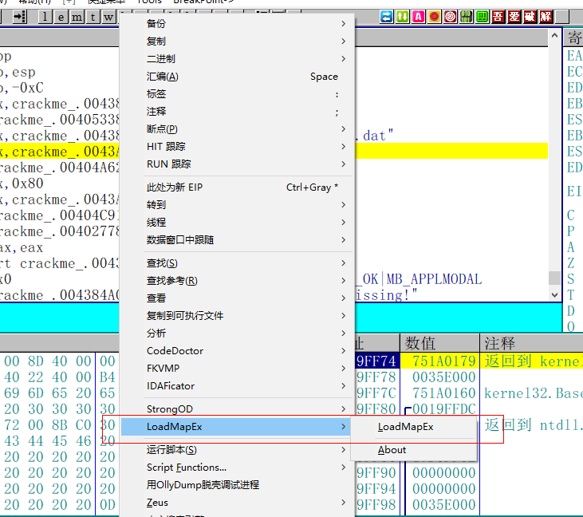

把IDA的符号导入到OD，方便后面的调试

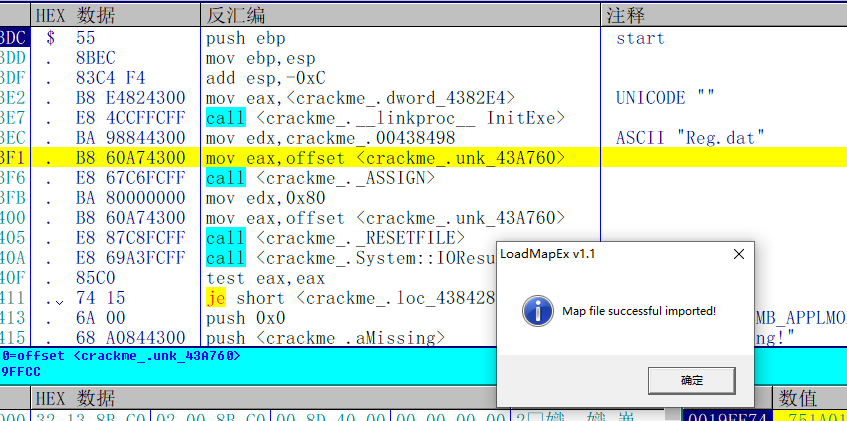

## KeyFile前置知识

在破解这个KeyFile保护之前，先来了解一下相关的前置知识，出自《加密解密4》

### 原理

KeyFile是一种利用文件来注册软件的保护方式。KeyFile一般是一个小文件，可以是纯文本文件，也可以是包含不可显示字符的二进制文件。其内容是一些加密或未加密的数据，其中可能有用户名、注册码等信息，文件格式则由软件作者自己定义。试用版软件没有注册文件。当用户向作者付费注册之后，会收到作者提供的注册文件，其中可能包含用户的个人信息。用户只要将该文件放人指定的目录，就可以让软件成为正式版了。该文件一般放在软件的安装目录或系统目录下。软件每次启动时，从该文件中读取数据，然后利用某种算法进行处理，根据处理的结果判断是否为正确的注册文件。如果正确，则以注册版模式运行。

### 如何防止被破解

在实现这种保护的时候，建议软件作者采用稍大一些的文件作为KeyFile（一般在几KB左右），其中可以加入一些垃圾信息以干扰解密者。对注册文件的合法性检查可以分成几部分，分散在软件的不同模块中进行判断。注册文件内的数据处理也要尽可能采用复杂的运算，而不要使用简单的异或运算。这些措施都可以增加解密的难度。和注册码一样，也可以让注册文件中的部分数据和软件中的关键代码或数据发生关系，使软件无法被暴力破解。

### 相关API函数

```c++
FindFirstFileA                               //确定注册文件是否存在
CreateFileA、_lopen                            //确定文件是否存在；打开文件以获得其句柄
GetFileSize、GetFileSizeEx                    //获得注册文件的大小
GetFileAttributesA、GetFileAtributesExA        //获得注册文件的属性
SetFilePointer、SetFilePointerEx                //移动文件指针
ReadFile                                     //读取文件内容
```

### 拆解KeyFile保护

1. 用Process Monitor等工具监视软件对文件的操作，以找到KeyFile的文件名
2. 伪造一个KeyFile文件。用十六进制工具编辑和修改KeyFile（普通的文本编辑工具可能无法完成这项任务）
3. ③在调试器里用CreateFileA函数设断，查看其打开的文件名指针，并记下返回的句柄。
4. ④用ReadFile 函数设断，分析传递给ReadFile函数的文件句柄和缓冲区地址。文件句柄一般和第③步返回的相同（若不同，则说明读取的不是该KeyFile。在这里也可以使用条件断点）。缓冲区地址是非常重要的，因为读取的重要数据就放在这里。对缓冲区中存放的字节设内存断点，监视读取的KeyFile的内容。

当然，上述只是大致步骤，有的程序在判断KeyFile时会先判断文件大小和属性、移动文件指针等。总之，对KeyFile的分析深入与否，取决于分析者对Win32File I/OAPI的熟悉程度，也就是API编程的水平。

### 实战破解KeyFile

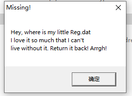

在程序运行之后会弹出这么一个对话框，大致意思是说缺少了一个叫Reg.dat的文件。

实际上这个KeyFile的破解思路有两种，第一就是在MessageBox下断点，分析附近代码。另外一种就是直接用Process Monitor等工具监视软件对文件的操作，以找到KeyFile的文件名。

我们直接用第二种方式，打开ProcessMonitor,过滤一下进程名，开始监控

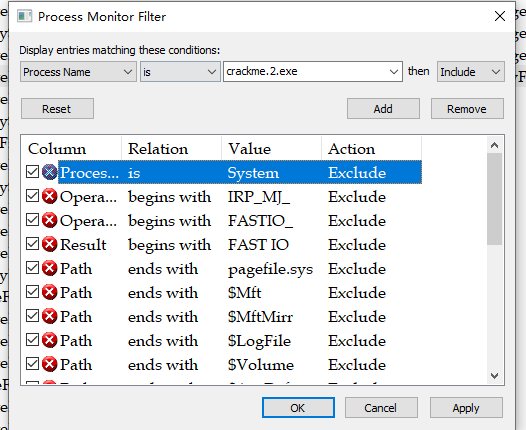

监控结果如下：

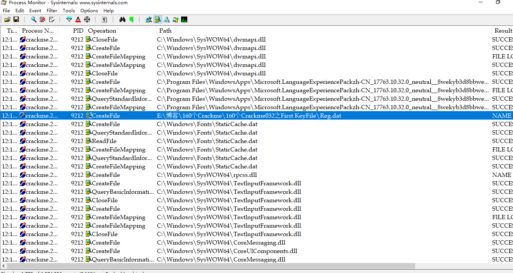

除了常规的加载模块的操作之外，还有这样一个行为，它打开了一个叫Reg.dat的文件，前面的路径名是我放这个程序的完整路径名。

那么可以知道，这个KeyFile的校验的必须在同名路径下有一个叫Reg.dat的文件才能够校验成功。

## 校验结果

新建一个Reg.dat文件在同名路径下

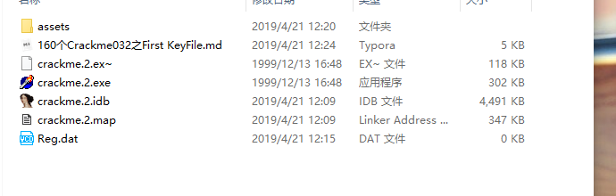

打开目标程序

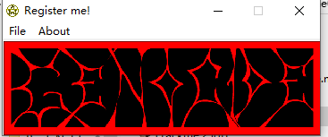

弹框消失，证明KeyFile破解完成。这是一个最简单的没有要求文件内容的KeyFile。

## 破解Name/Serial

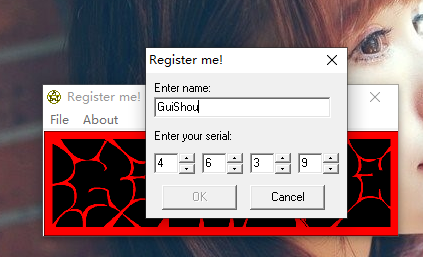

接下来再来到验证的部分，可以看到这个是由用户名和序列号组成，但是不管序列号怎么输，那个OK按钮始终是灰色了。这种情况在之前的Crackme里也遇到过很多次，要么是用定时器校验，要么是通过键盘击键事件，这个程序有可能通过是序列号的Edit框的change事件来校验的。

### 用Darkde4确定响应事件

首先用Darkde4来确定这个程序的响应事件，打开窗体对话框

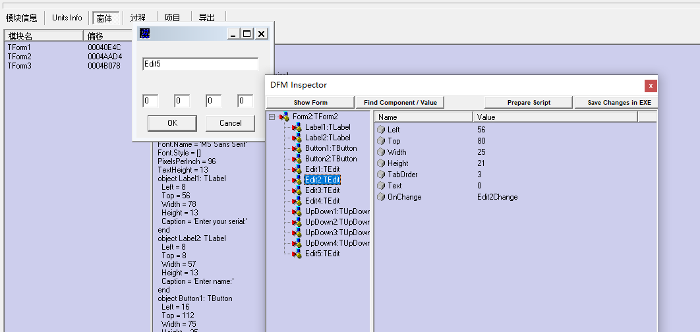

可以看到右边有四个Edit编辑框，对应四个输入序号的部分，再来到过程窗口

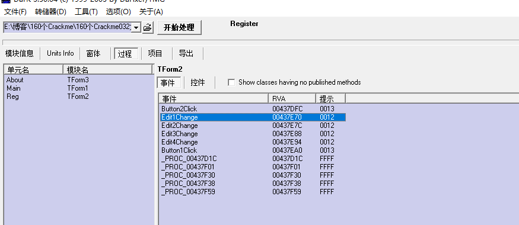

这里正好有四个EditChange事件，以及对应的RVA，我们直接复制下Edit4的RVA，去到OD响应的位置

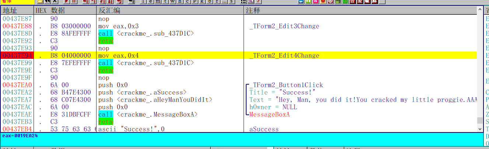

可以看到成功的提示就在下面，旁边的注释显示这是Button1的Click，说明只有当序列号输入正确的时候，OK按钮才会被启用

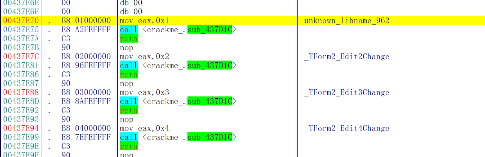

在往上看，发现四个Edit编辑框的响应事件都是同一个函数sub_437D1C，那么接下来就开始分析这个函数的算法了

### 算法分析

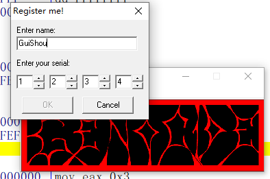

随便输入一个用户名和序列号，下断点，分析sub_437D1C这个函数，整个函数逻辑如下：

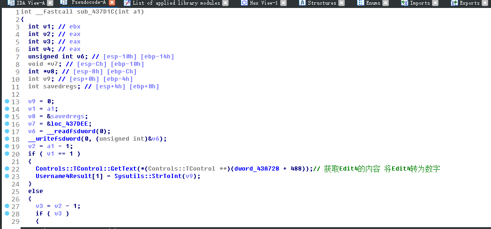

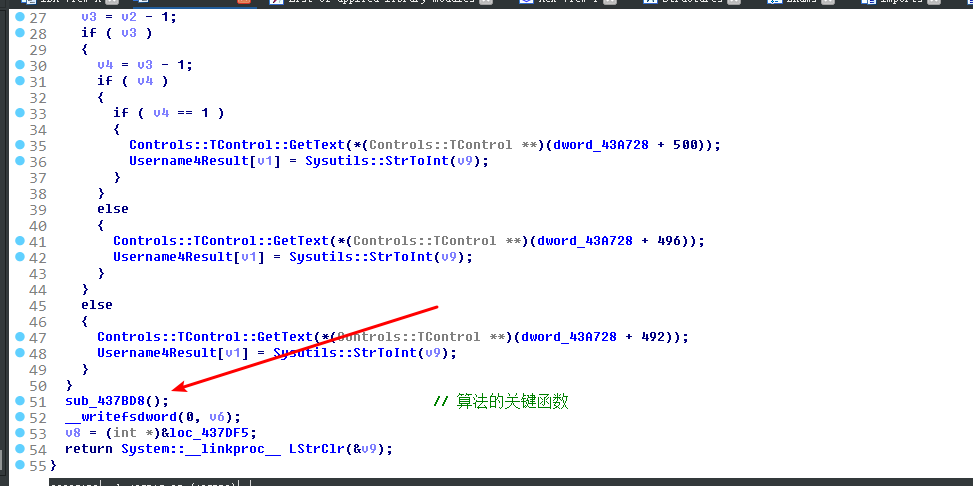

不要看这么长就慌了，真正有用的是 sub_437BD8这个函数，继续跟进去

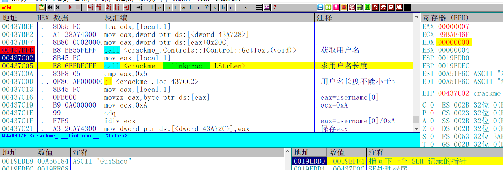

首先获取用户名长度，跟5进行比较，小于则跳转

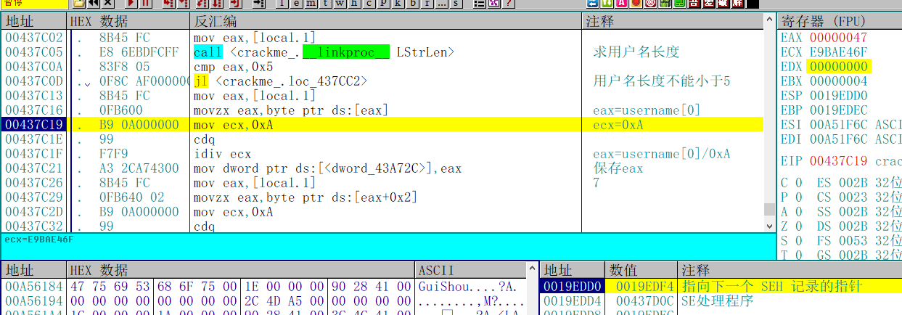

然后会取出用户名第零位的ASCII值，除以0xA之后保存结果

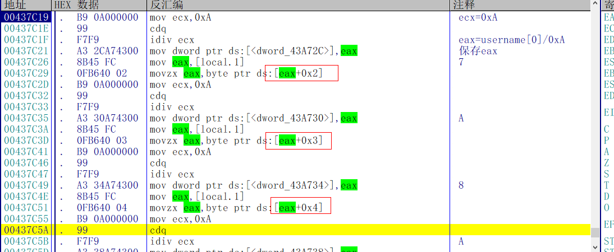

之后分别取第二位，第三位，第四位，除以0xA之后保存结果

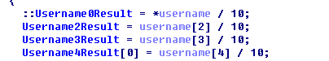

这个过程在IDA中一目了然

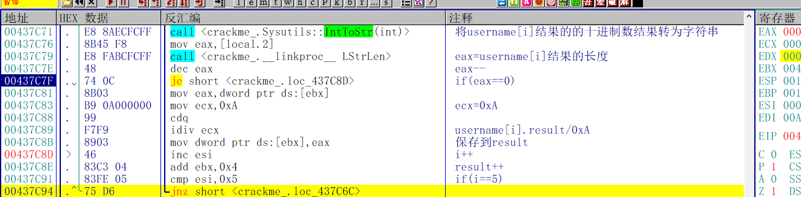

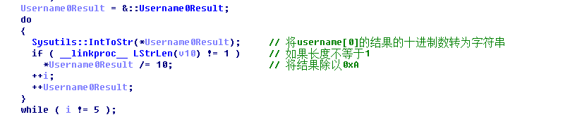

然后开始循环四次，首先把用户名的ASCII值除以10之后的结果的十进制数转为字符串，如果长度大于1的话就再除以10，保存这个结果，如果长度为1，则结果不变。为什么要再除一次10,因为四个序列号最大只能是9


最后，开始循环比较计算出的结果和输入的序列号，7181是用户名ASCII两轮除以10之后计算后的结果，1234是我输入的序列号

### 算法总结

这个程序的校验算法总结如下：

1. 判断用户名长度是否小于5
2. 取用户名的第0位 第2位 第3位 第4位，分别除以10 保留结果
3. 第二步计算的结果不能大于9，如果大于9，则再次除以10，替换掉原先的结果 因为四个序列号最大只能是9
4. 将计算的结果和输入的序列号进行比较

## 写出注册机

算法出来了，序列号还会远吗？这个算法口算也能算出序列号，但是我们还是写出注册机，代码如下：

```c++
int CalcKey()
{
	char username[20] = { 0 };
	char result[20] = { 0 };
	char serial[5] = { 0 };
	printf("请输入用户名:");
	scanf_s("%s", username, 20);
	if (strlen(username)<5)
	{
		printf("用户名长度不能小于5\n");
		return 0;
	}

	for (int i = 0; i < strlen(username); i++)
	{
		result[i] = username[i] / 0xA;
		if (result[i]>9)
		{
			result[i] /= 0xA;
		}
	}

	serial[0] = result[0];
	serial[1] = result[2];
	serial[2] = result[3];
	serial[3] = result[4];
	serial[4] = 0;

	for (int i = 0; i < 4; i++)
	{
		printf("%d", serial[i]);
	}
	printf("\n");
	return 0;
}
```

## 校验结果

输入用户名和计算的序列号 破解完成

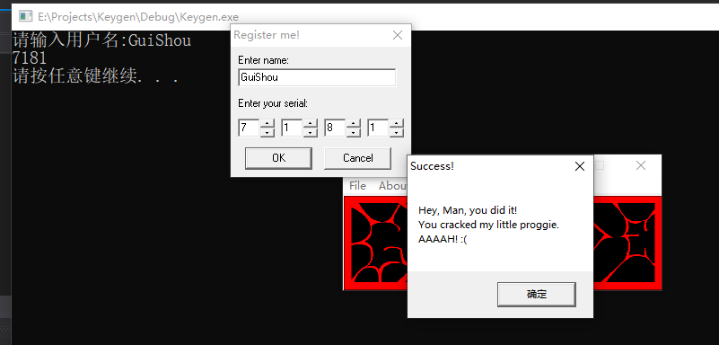

需要相关文件的可以到我的Github下载：https://github.com/TonyChen56/160-Crackme