[TOC]

这个Crackme的作者是《使用OllyDbg从零开始Cracking》那部教程的作者在教程中使用的配套教程，当初也是看的这篇教程入门的，没想到会在这里遇见。

## 查壳

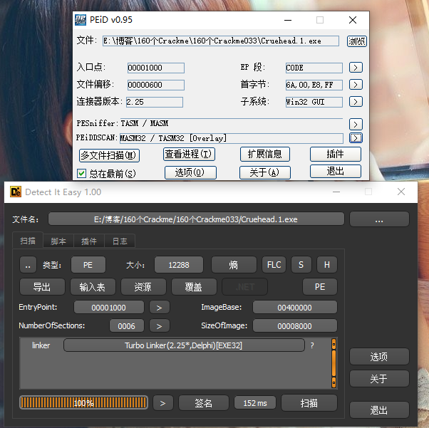

这个程序看着有点像Delphi写的，但其实是汇编写的。作者在OEP处故意制造了一个和Delphi一模一样的入口特征来迷惑查壳器。

## 分析程序

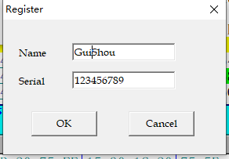

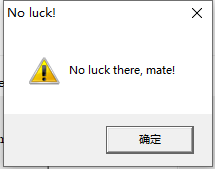

随便输入一个序列号和密码，根据错误提示，来到附近代码，开始分析算法。这个程序的算法在我跟踪完了之后发现是由两个部分组成

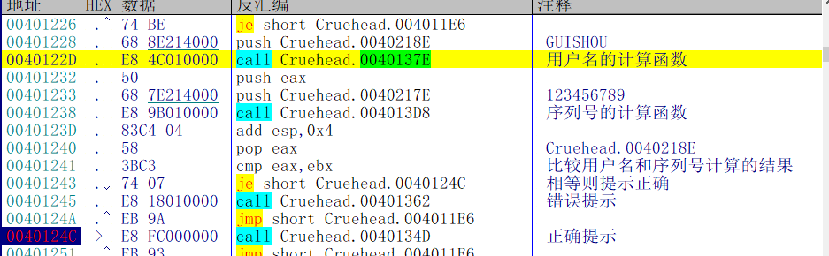

首先是一个用户名的计算函数，然后是一个序列号的计算函数，接着比较两个函数计算的结果是否相等，相等则提示正确。

## 用户名算法分析


首先取出用户名，然后比较依次取出每一位的ASCII值，比较是否小于0x41，是否大于0x5A，41和5A这两个ASCII值其实就是大写的A-Z，如果不在这个区间就会进入sub4013D2这个函数

这个函数的作用也相当简单

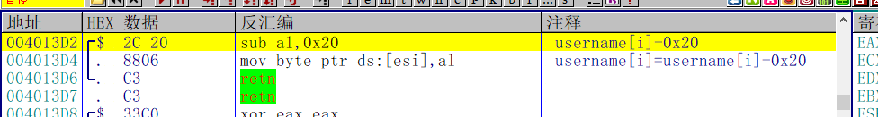

就是把ASCII值减去0x20，也就是转成大写字母

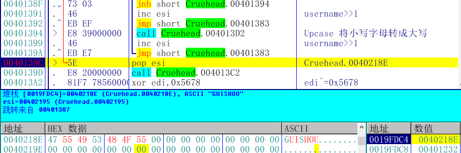

整个循环的作用其实就是把用户名转为全部大写，然后就进入4013C2这个函数了

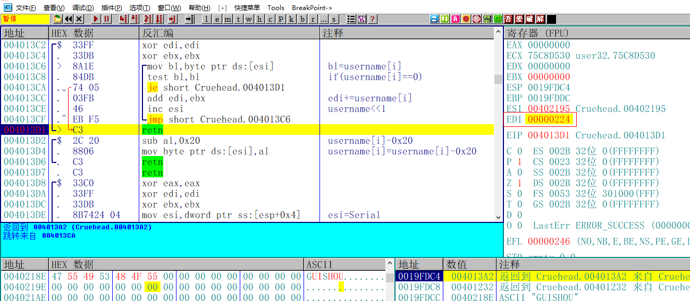

这个函数的作用也很简单，就是将用户名每一位的ASCII值进行相加，

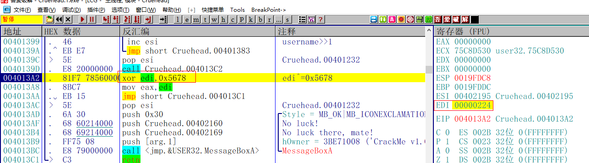

之后将用户名的ASCII值之和0x5678进行异或。这个就是完整的用户名的算法了。接下来分析序列号部分

## 序列号算法分析

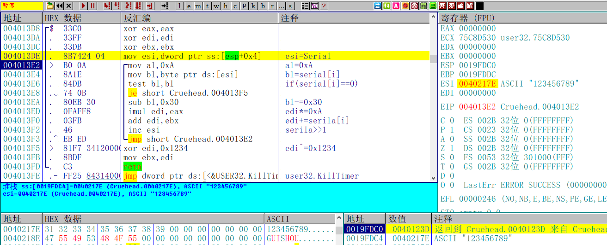

序列号的计算部分也很简单，首先取出每一位的ASCII值，然后减去0x30，减去0x30也就意味着将字母转成数字。

接着用edi乘以0xA，然后用edi再加上序列号，总结为下面的等式：

edi = serial + 0x10 * edi;

看着好像挺复杂的，实际上就是把字符串形式的序列号转成了十进制形式的序列号

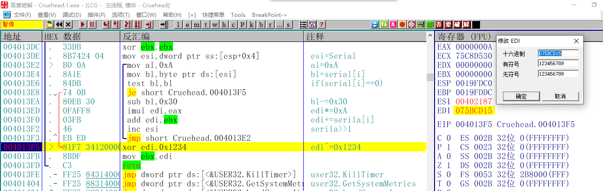

接着再将edi和0x1234进行异或。到此序列号的算法部分就完成了

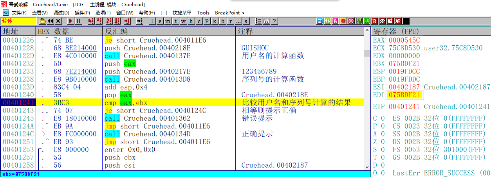

接着比较两个部分的结果是否相等

## 写出注册机

这种需要在用户名和序列号直接通过两种不同的算法需要等于同一个结果这种模式很像Crackme029。那么这个Crackme的注册机编写思路也是一样，首先根据用户名计算出中间结果，然后再根据结果反向逆推出注册码，代码如下:

```c++
int CalcKey()
{
	char username[20] = { 0 };
	int result = 0;
	char serial[20] = { 0 };
	printf("请输入用户名:");
	scanf_s("%s", username, 20);
	
	//计算用户名的结果
	for (int i = 0; i < strlen(username); i++)
	{
		if (username[i] < 0x41 || username[i]>0x5A)
		{
			username[i] -= 0x20;
		}
		result += username[i];
	}
	result ^= 0x5678;

	result ^= 0x1234;
	printf("%d\n", result);
	return 0;
}
```

## 校验结果

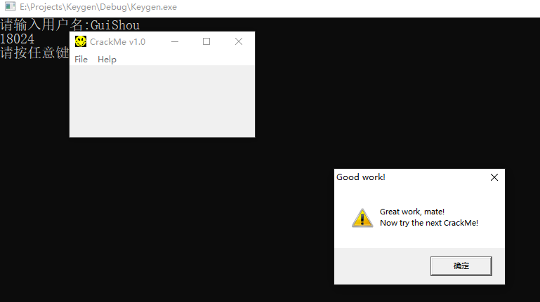

输入用户名和计算的结果，提示正确，破解完成。

需要相关文件的可以到我的Github下载：https://github.com/TonyChen56/160-Crackme


