[TOC]

这个Crackme和上一个是同一个作者，保护方式是KeyFile。难度两颗星

## 查壳

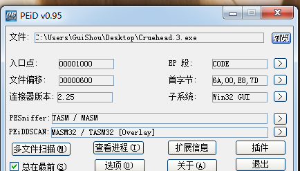

同样是汇编写的，作者伪造了一个Delphi的OEP。

## 分析程序

这个软件的KeyFile保护没有必要用监控工具了。验证直接就在入口处，直接单步往下跟就可以了

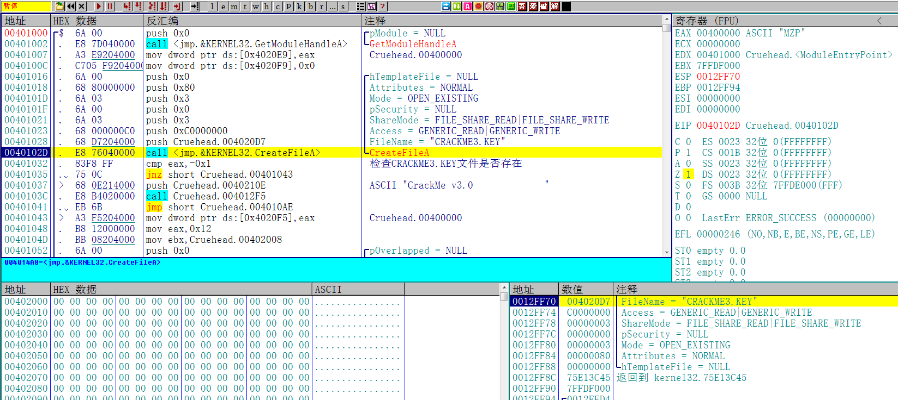

首先检测CRACKME3.KEY这个文件是否存在

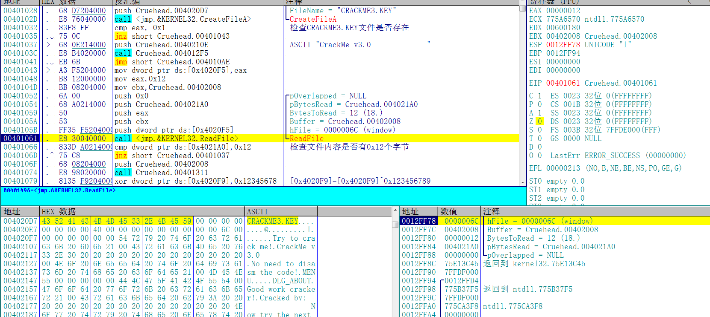

然后从文件中读取0x12个字节，并检测文件内容是否少于0x12个字节，

那么我们就伪造一个CRACKME3.KEY文件，并且再里面随便输18个字母


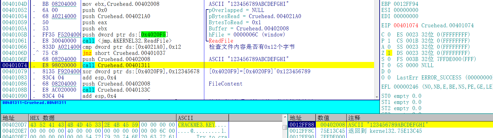

然后将文件内容放入堆栈，开始计算前14个字节。

这个文件总共需要18个字节，前14个字节为用户名，后4个字节为序列号。每一部分都有一个算法，下面分析用户名算法部分

## 用户名算法分析(前14位)

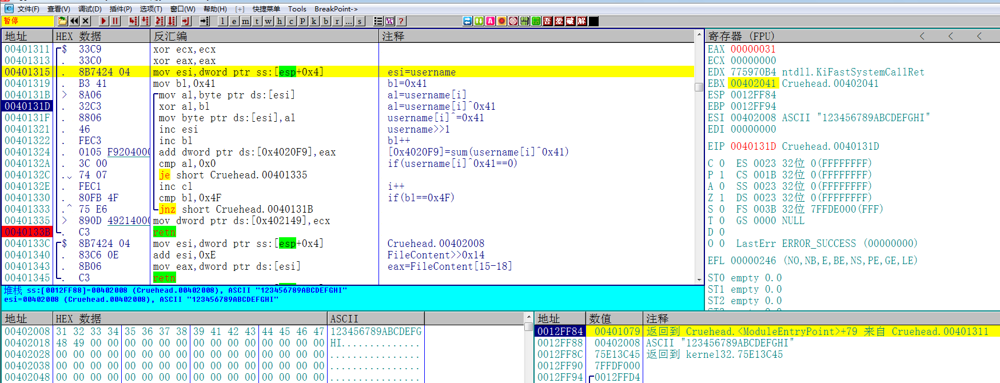

用户名算法的校验过程如下：

1. bl初始值为0x41
2. 然后取出用户名第i位的ASCII值，
3. 将用户名第i位的ASCII值和bl进行异或
4. 用户名右移一位
5. bl++
6. 然后将每一轮用户名第i位和bl异或的结果相加保存到[0x4020F9]这个地址，这个地址保存的值就是用户名计算的结果
7. i++ 
8. 整个过程循环0xE次
9. 将用户名计算的结果和0x12345678进行异或，如下图

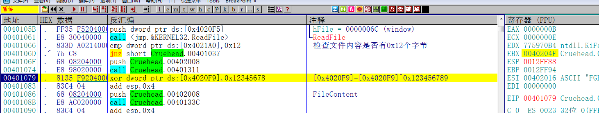

## 序列号算法分析(后4位)

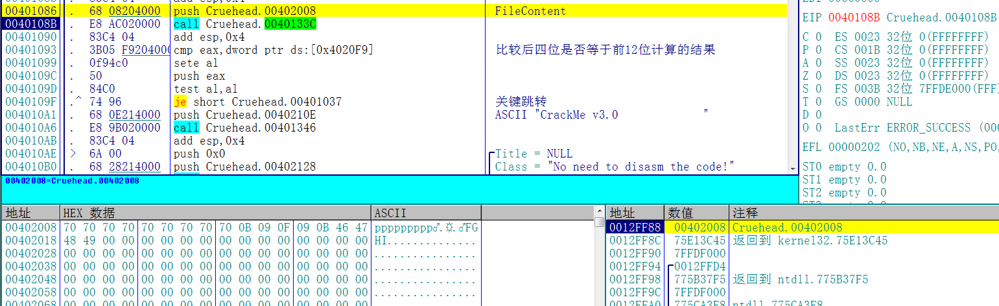

接下来将0x14个字节的文件内容压入堆栈，然后执行0040133C这个函数

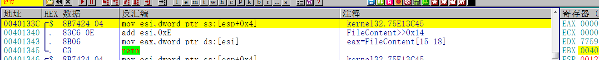

这个函数的作用就算将文件内容右移14位，也就是去掉前14位用户名的部分，然后将最后四位赋值给eax

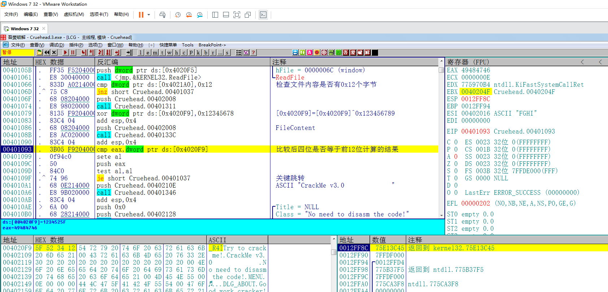

最后比较后四位是否等于[0x4020F9]，也就是前12位用户名计算的结果，根据比较的结果提示是否破解成功

## 算法总结

总结一下前面的分析，文件内容必须是18个字符，前14位是用户名，后4位是序列号。序列号必须等于用户名计算的结果。

## 注册机探索

接下来写出注册机，代码如下：

```c++
#include <iostream>
#include <windows.h>
using namespace std;

int main()
{
	
	char username[15] = { 0 };
	char serial[5] = { 0 };
	int temp = 0x41;
	int result = 0;
	printf("请输入用户名，长度必须为14:");
	scanf_s("%s", username, 15);
	

	for (int i = 0; i < 14; i++)
	{
		username[i] ^= temp;
		result += username[i];
		temp++;
	}
	result ^= 0x12345678;


	char* p = (char*)&result;
	for (int i = 0; i < 4; i++)
	{
		printf("%c", p[i]);
	}
	printf("\n");
	system("pause");
	return 0;
}
```

## 验证结果

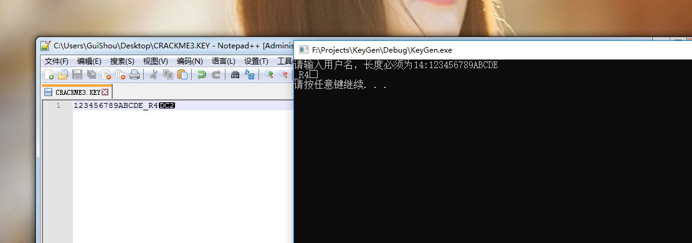

随便输入一个12位的用户名，然后把计算出来的序列号复制过去替换后四位，乱码不需要管，再打开目标程序

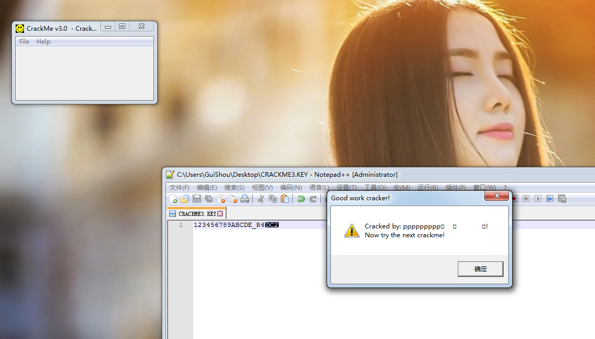

破解完成，最后需要相关文件可以到我的Github下载:

<https://github.com/TonyChen56/160-Crackme>


