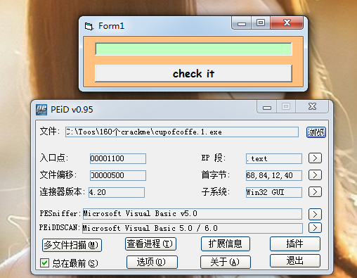
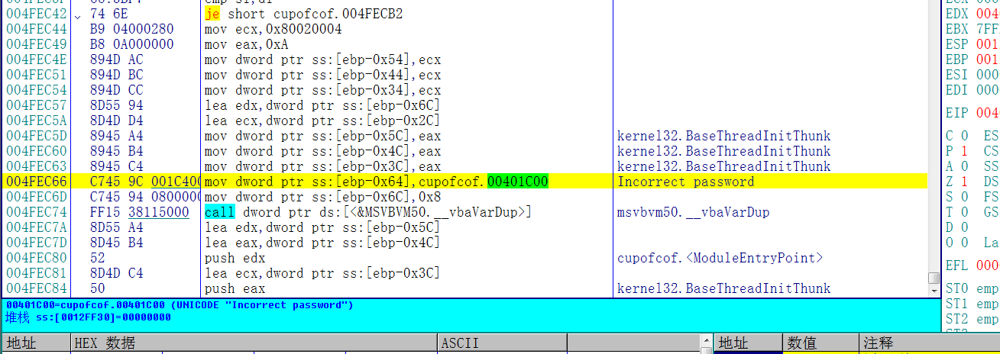
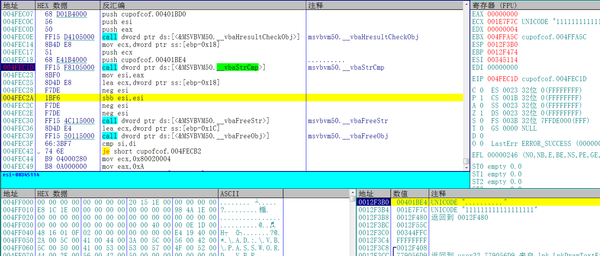
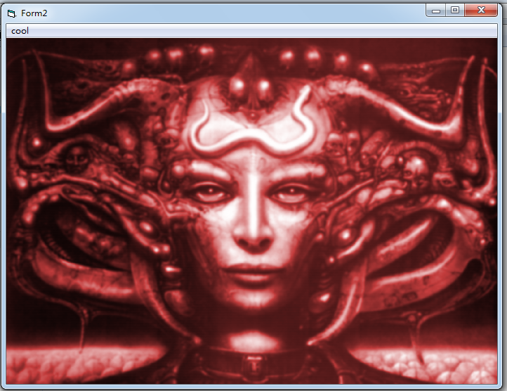

[TOC]

## 查壳

目标程序是一个VB写的，没有加壳。单纯的序列号保护

## 分析程序

根据字符串的错误提示，跟进去，然后接着向上找。在上面你会发现一个比较函数，下断点，随便输入一个序列号等待程序断下。

看堆栈中有一个自己输入的序列号和一个字符串，这个字符串是十个英文状态下的点(.)。这个作者还是挺有意思的

## 验证结果

输入刚刚看到的序列号：十个点，记得把输入法调成英文

提示cool，成功了。

需要相关文件可以到我的Github下载:<https://github.com/TonyChen56/160-Crackme>

