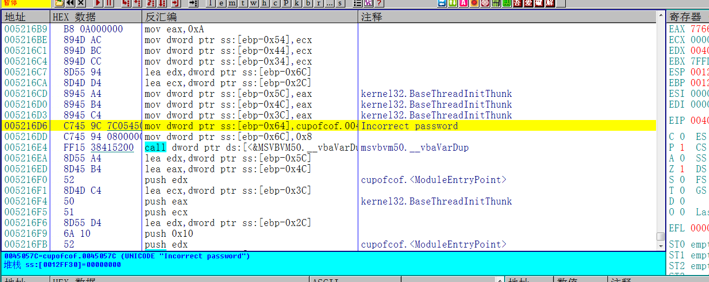
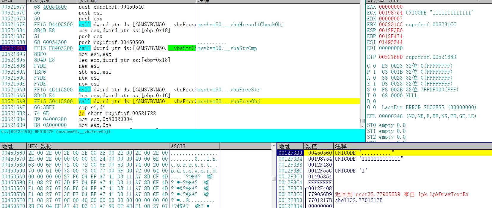
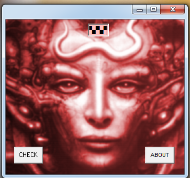
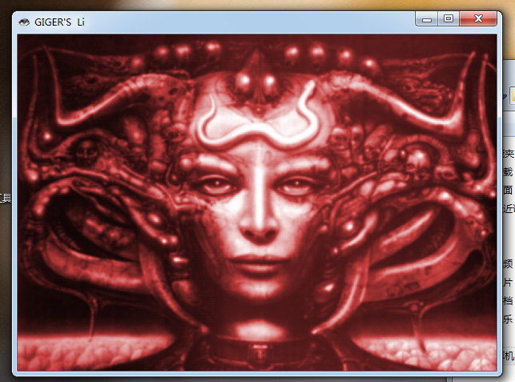

[TOC]

## 查壳

这个Crackme跟上一个是同一个作者，VB写的。无，难度一颗星

## 分析程序

找到这个错误提示之后往上翻，有一个比较函数， 下断点等待程序断下之后，观察堆栈

序列号还是十个点，跟上一个一样。只不过程序换了个界面而已

## 验证结果

输入英文状态下的十个点

点击CHECK

图片变大，破解完成

需要相关文件可以到我的Github下载:https://github.com/TonyChen56/160-Crackme