[TOC]

## 查壳

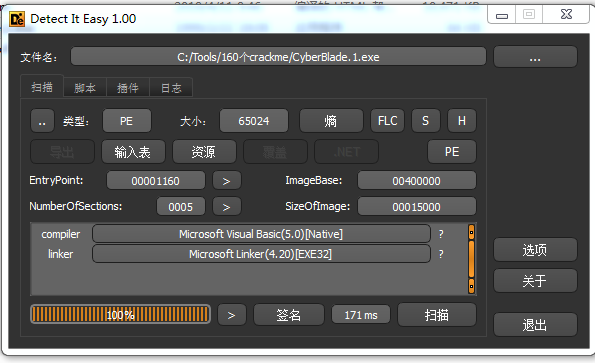

目标程序是用VB N-Code方式编译的，难度为一颗星，采用序列号保护方式

## 分析程序

这个程序的序列号保护方式是有算法的，单纯追踪注册码比较困难，所以直接用VB反编译工具查看按钮点击事件的RVA

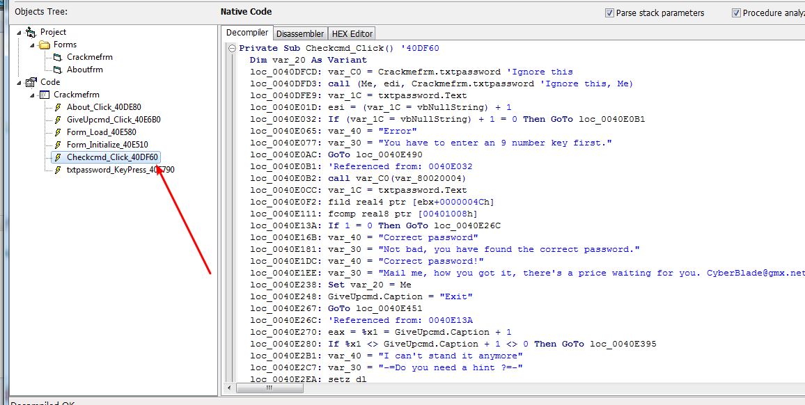

直接在40DF60的位置下断点，随便输入一个序列号

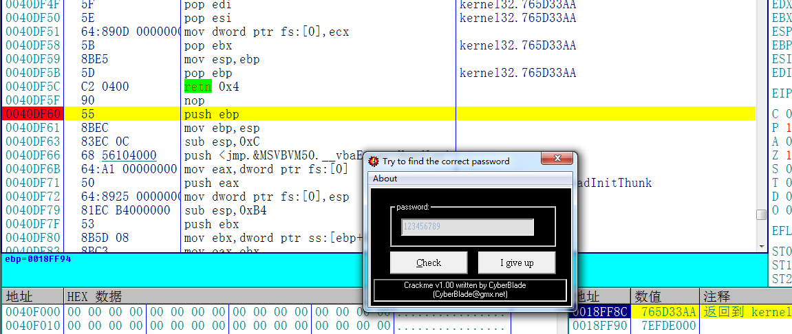

校验过程如下

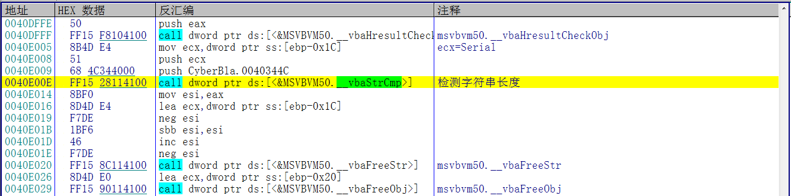

首先检测字符长度是否匹配，不满足则提示错误

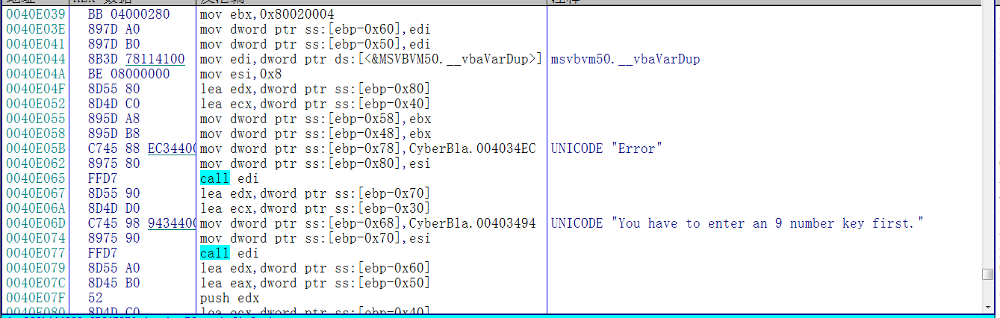

必须为9个字符

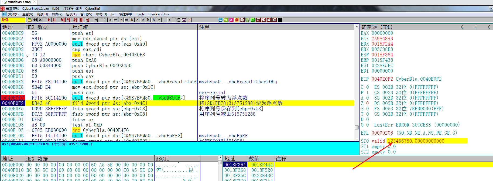

然后将输入的序列号转为浮点数

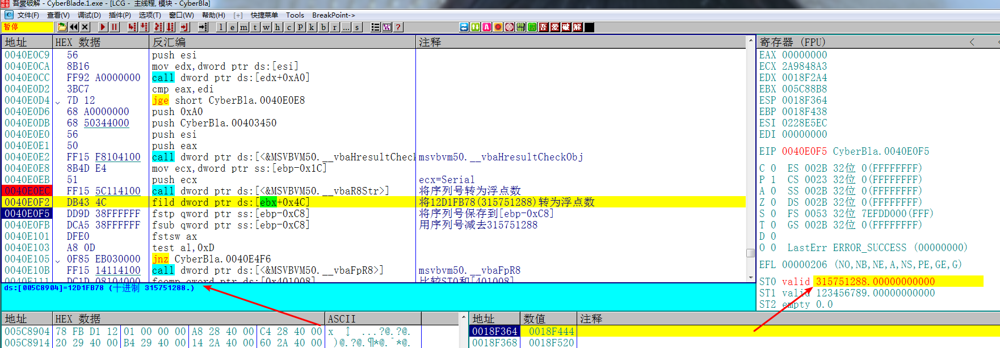

然后将315751288转为浮点数

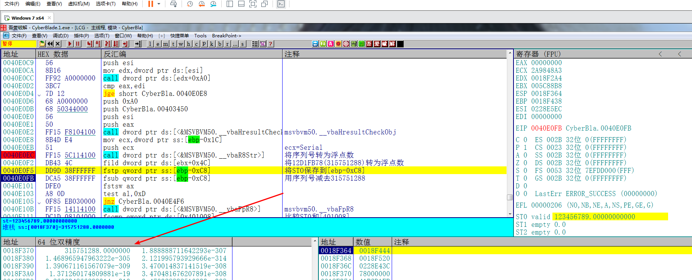

接着保存315751288到内存

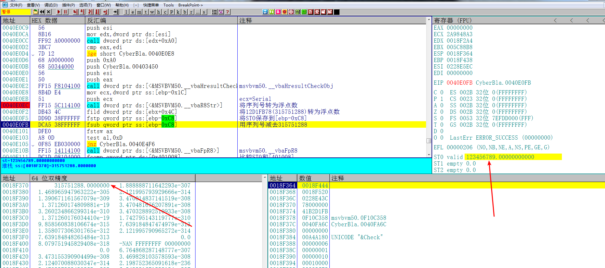

然后用序列号减去315751288

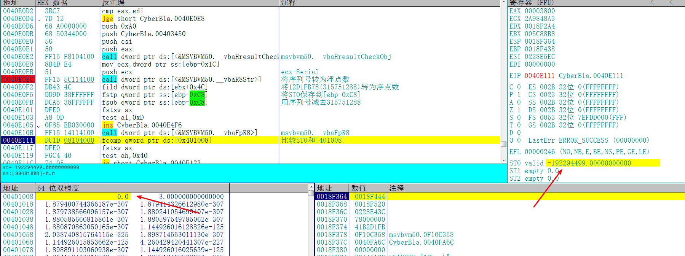

将两个数相减的结果和0进行比较，根据比较的结果提示是否正确注册。

**结论：**注册码很明显就是315751288了。

## 验证结果

输入315751288，

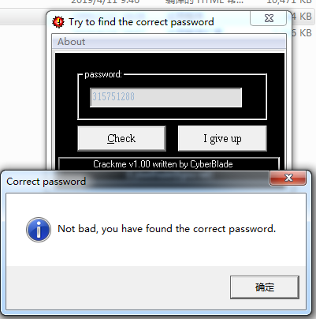

提升正确，破解完成。需要相关文件可以到我的Github下载:

<https://github.com/TonyChen56/160-Crackme>

