[TOC]

【软件名称】：damn.exe

【软件大小】：30KB

【下载地址】：https://github.com/TonyChen56/160-Crackme

【加壳方式】：Aspack

【保护方式】：Name/Serial

【编译语言】：汇编

【调试环境】：W10 64

【使用工具】：OD

【破解日期】：2019-05-04

【破解目的】：纯属兴趣

## 查壳


这个目标程序加了个Aspack的壳，用脱壳机或者ESP定律手动脱都行。

## 寻找突破口


这个程序按钮是被禁用的，所以不太好找突破口。

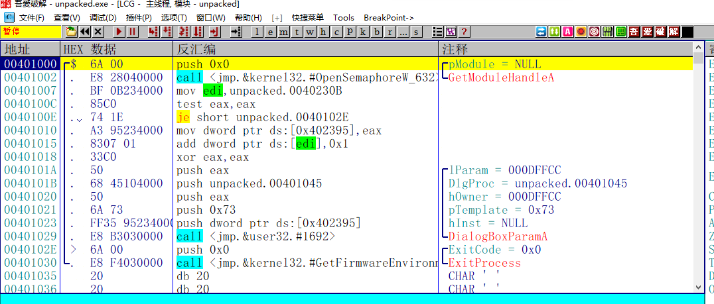

直接载入程序，发现是汇编写的。汇编写的程序不会有编译器生成的无用代码，所以可以一直往下拉，找到关键代码处，当然也可以在**GetDlgItemTextA**函数下断。

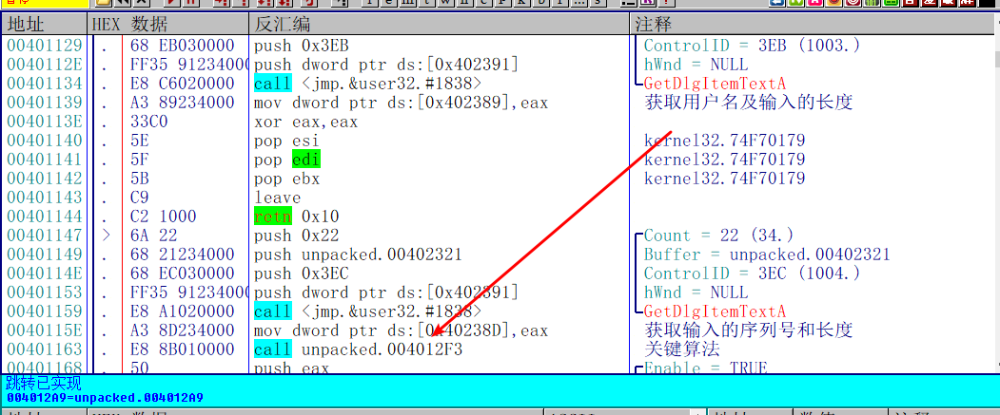

一直往下拉，你会发现有两个获取用户输入的函数，分别是获取用户名和序列号。下面那个函数就是关键的算法函数了。

## 分析算法

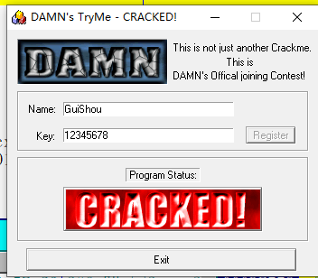

随便输入一个用户名，开始分析算法

### 第一部分

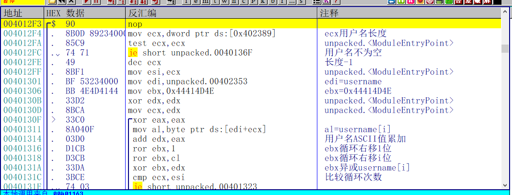

这个算法分为两个部分，第一个部分是对用户名进行处理，算出一个数。这个部分没什么好说的，直接看注释，无非是将用户名的ASCII值经过各种运算计算出来一个数而已。

### 第二部分

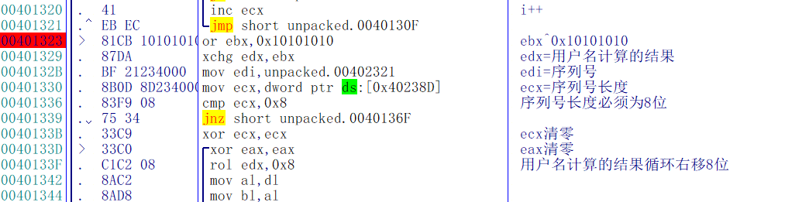

程序首先会将第一部分用户名计算的结果和0x10101010进行异或，然后比较序列号的长度是否为8位，不是则报错。

接着将用户名计算的结果循环右移8位，然后拆分为高位和低位，

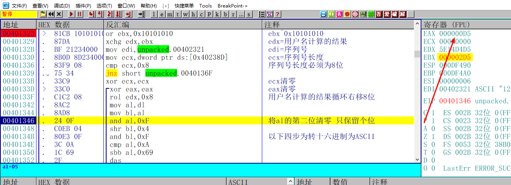

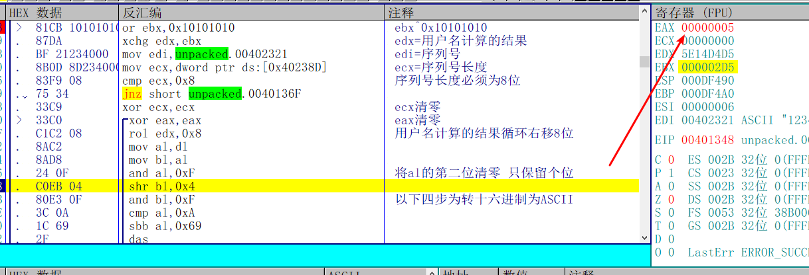

然后将al和0xF进行与运算，清掉十位，保留个位->5

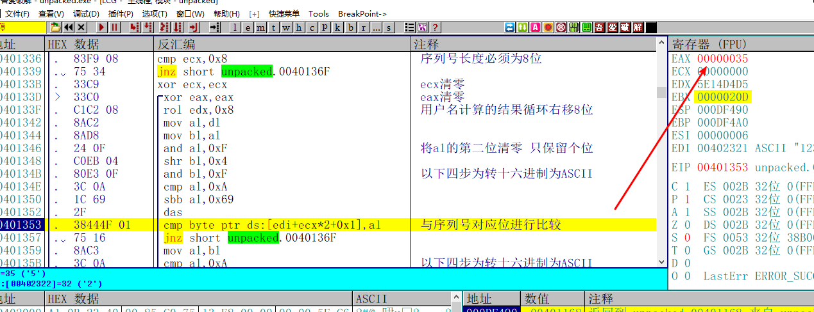

将保留位转成ASCII值->35

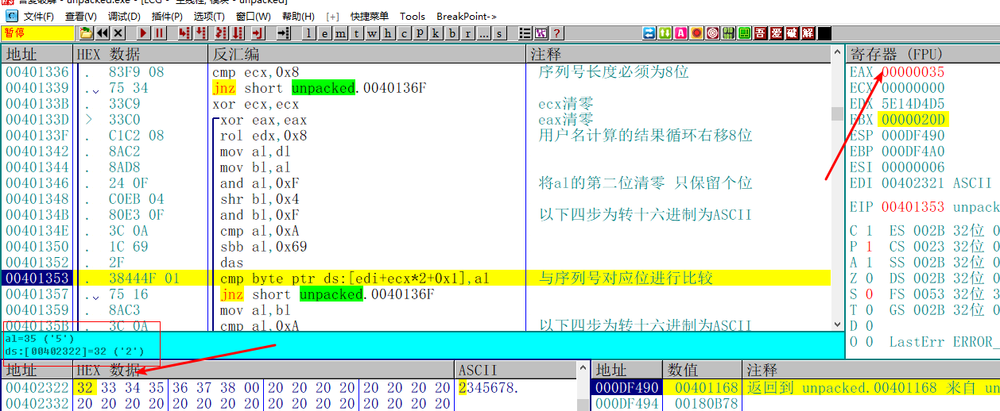

和输入的序列号对应的位进行比较

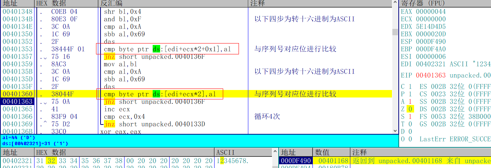

一次循环会比较两位，总共四次循环，一共比较8位，对应前面的序列号长度为8位

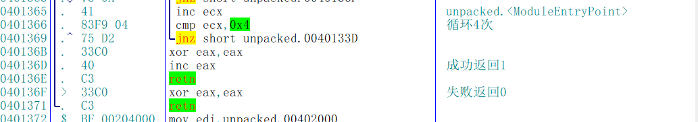

最后，根据比较的结果决定是否将eax置1

## 写出注册机

```c++
#include "pch.h"
#define _CRT_SECURE_NO_WARNINGS
#include <windows.h>
#include <stdio.h>


void ROR(DWORD * myd, unsigned char n)
{
	_asm
	{
		MOV EBX, myd;
		MOV eax, [EBX];
		MOV cl, n;
		ROR EAX, cl;
		MOV[EBX], eax;
	}
}


int main()
{
	char *username;
	unsigned long serial;
	serial = 0x44414D4E;
	unsigned long nTemp = 0;
	username = new char[260];
	memset(username, 0, 260);
	printf("请输入用户名：");
	scanf_s("%s", username, 260);
	for (int i = 0; i < strlen(username); i++)
	{
		nTemp += username[i];
		ROR(&serial, 1);
		ROR(&serial, i);
		serial ^= nTemp;
	}

	serial |= 0x10101010;
	delete[] username;

	printf("%x\n", serial);
	system("pause");
	return 0;
}
```

## 校验结果

输入用户名和计算的序列号，提示注册成功

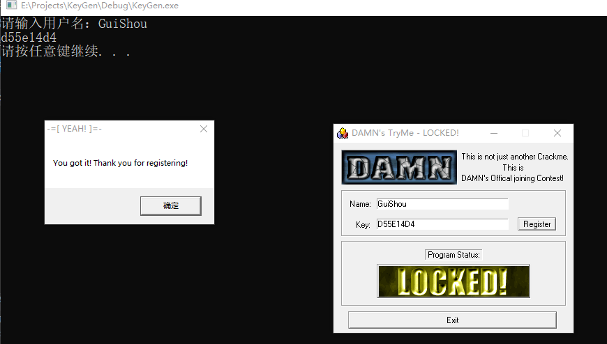

破解完成，最后需要相关文件可以到我的Github下载：

https://github.com/TonyChen56/160-Crackme