[TOC]

【软件名称】：DaNiEl-RJ.1.exe

【软件大小】：216KB

【下载地址】：https://github.com/TonyChen56/160-Crackme

【加壳方式】：无壳

【保护方式】：Name/Serial

【编译语言】：Delphi	

【调试环境】：W10 64

【使用工具】: OD+IDA+Darkde

【破解日期】：2019-05-04

【破解目的】：纯属兴趣

## 分析程序

Delphi的程序利用OD+IDA+Darkde的黄金组合破解起来可以说是相当简单了。因为程序是用户名和序列号的保护方式，所以直接找到按钮事件分析算法。

### 找到响应事件

首先打开Darkde

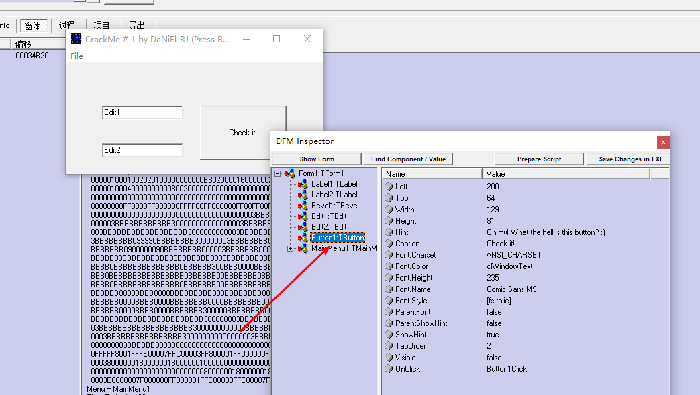

通过窗体找到按钮名，

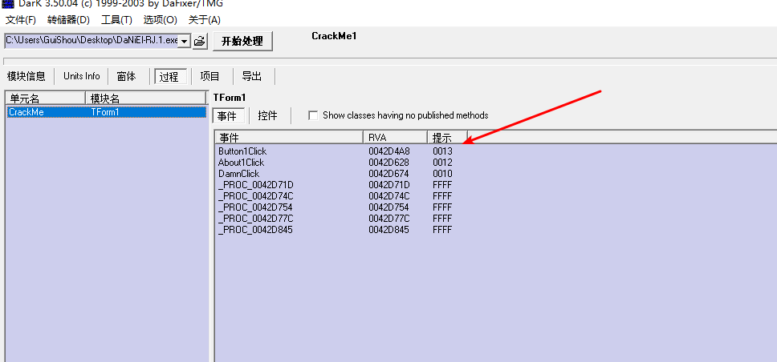

再到过程窗口根据按钮名找到响应事件

### 添加签名 导出map文件

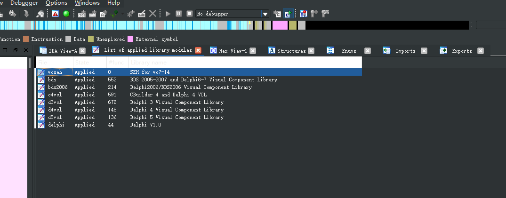

将文件拖入IDA，添加所有的Delphi签名


然后导出map文件

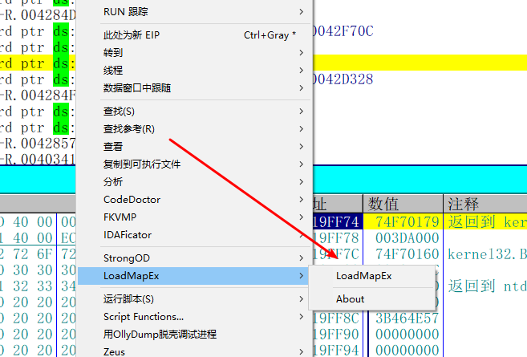

接着将map文件导入到OD

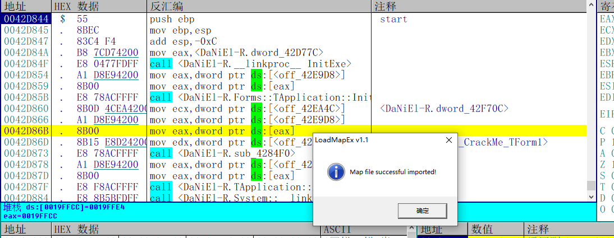

可以很清楚的看到已经IDA的符号已经被导入进来了。

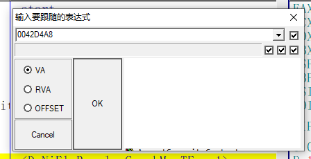

然后直接去到按钮响应事件，分析注册算法

## 分析算法

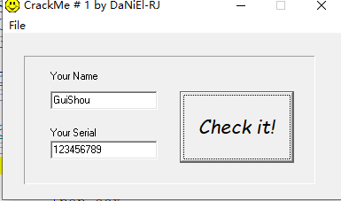

随便输入一个用户名和序列号，开始分析算法，在IDA中算法逻辑如下

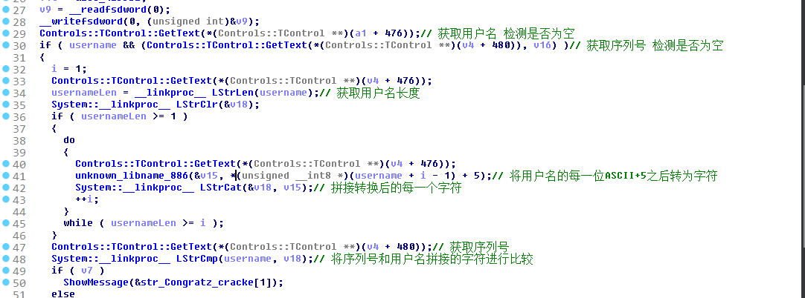

下面进行逐步讲解

1. 获取用户名 检测是否为空

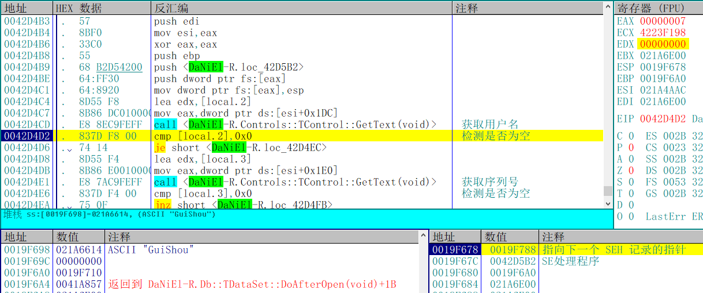

2. 获取序列号 检测是否为空

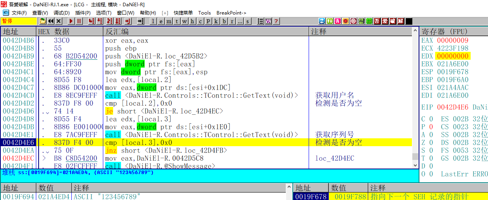

3. 初始化循环 并获取用户名长度

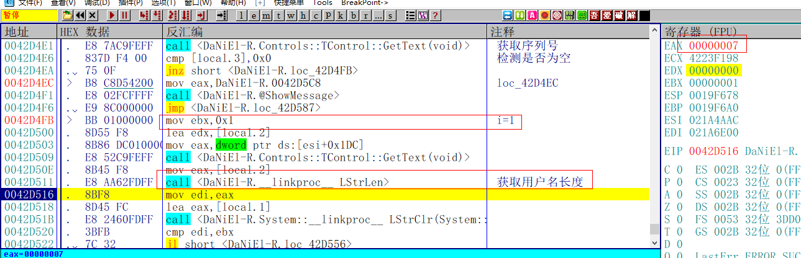

4. 获取用户名每一位的ASCII值+5

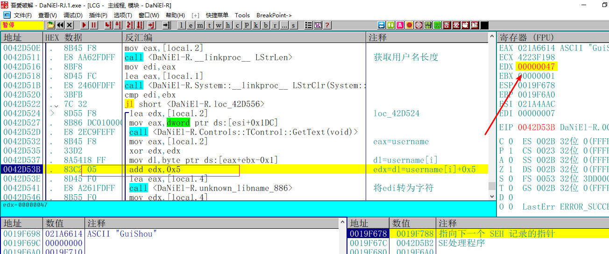

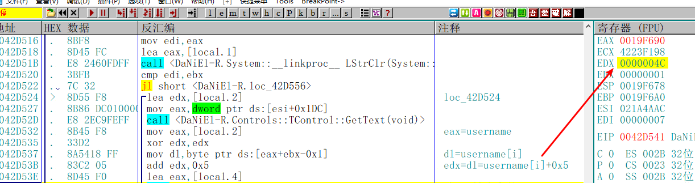

5. 将用户名的ASCII值+5后转为字符

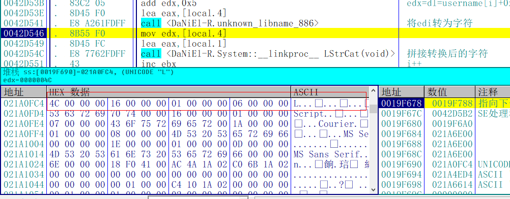

6. 拼接转换后的字符 并开始新一轮循环

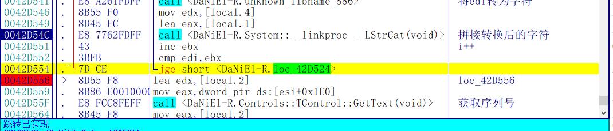

直接在42D556循环结束后下断点，可以看到最后拼接的结果

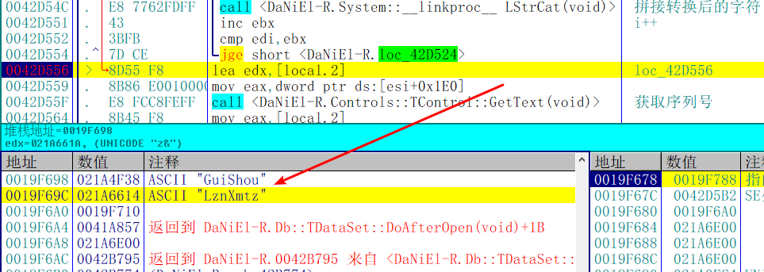

7. 获取序列号 将序列号和拼接的字符进行比较

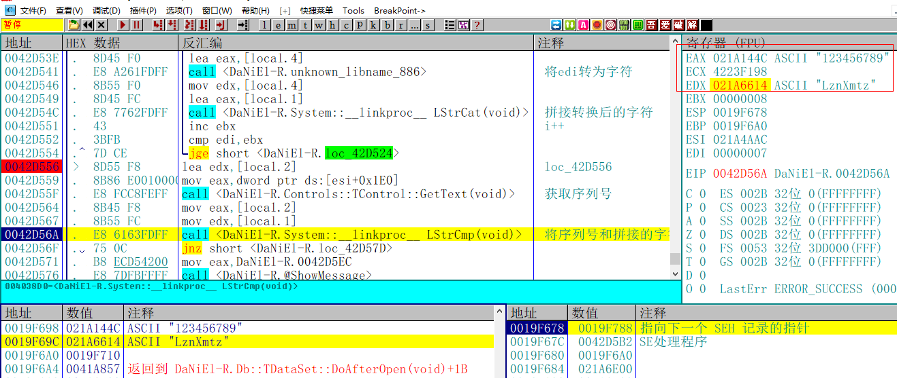

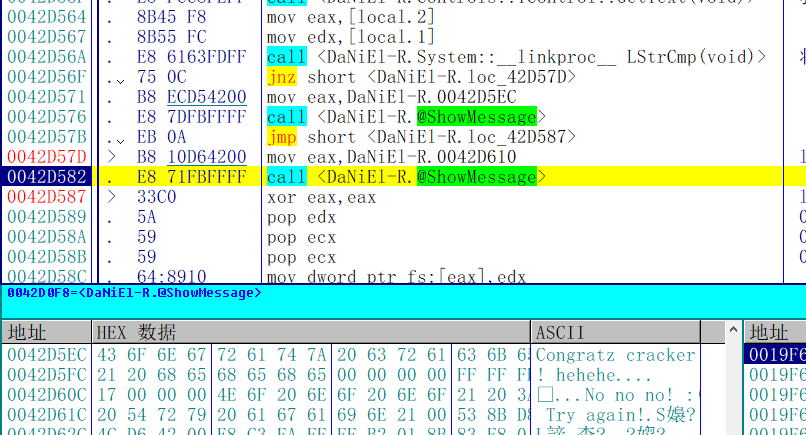

根据比较的结果提示是否注册成功

## 写出注册机

这个算法还是相对比较简单的，直接写出注册机，代码如下

```c++
#include "pch.h"
#define _CRT_SECURE_NO_WARNINGS
#include <windows.h>
#include <stdio.h>


int main()
{
	char username[20] = { 0 };
	char serial[20] = { 0 };
	printf("请输入用户名：");
	scanf_s("%s", username, 20);
	for (int i = 0; i < strlen(username); i++)
	{
		serial[i] = username[i] + 5;
	}
	printf("%s\n", serial);
	system("pause");
	return 0;
}
```

## 校验结果

输入用户名和计算的序列号，提示注册成功 破解完成

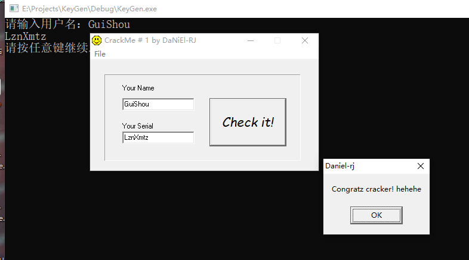

需要注册机和相关文件可以到我的Github下载：https://github.com/TonyChen56/160-Crackme

