[TOC]

【软件名称】：defiler.1.exe

【软件大小】：287KB

【下载地址】：自行搜索下载

【加壳方式】：无壳

【保护方式】：无保护

【编译语言】：Delphi

【调试环境】：W7 32

【使用工具】：OD + IDA + Darkde

【破解日期】：2019年5月15日

【破解目的】：纯属兴趣

## 前言

本文参考自吾爱破解论坛**zbnysjwsnd8**的文章：<https://www.52pojie.cn/thread-654237-1-1.html>

## 软件概况

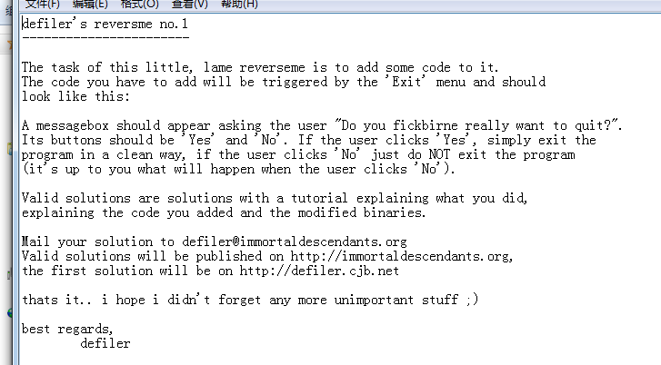

这个Crackme的要求大概是要我们往Exit菜单中添加代码，让程序在点击Exit菜单时弹出MessageBox框。这个属于软件重构的范围了。

## 分析程序

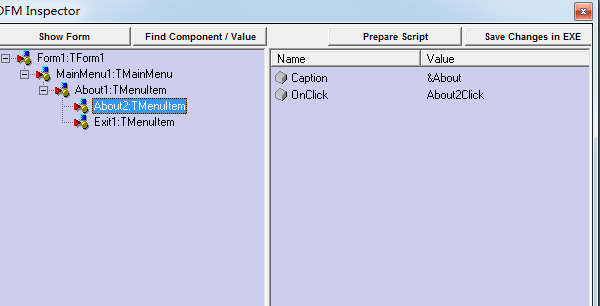


使用DarkDe分析程序，这两个菜单中，只有about是有点击事件的，Exit菜单是没有点击事件。那么我们先从about菜单事件开始分析

## 栈回溯分析About点击事件

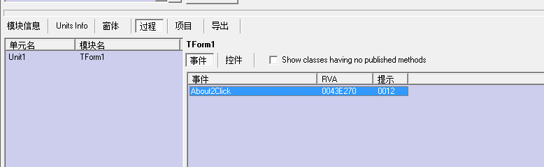

直接找到About的点击事件的RVA，在OD中下断点

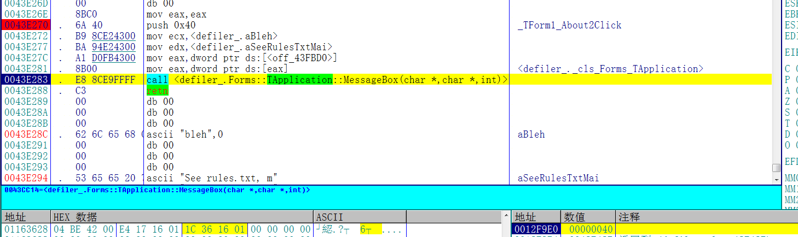

about的点击事件中调用了一个MessageBox，然后直接Ctrl+F9返回

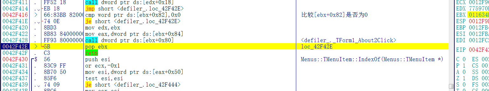

然后找到IDA中对应的代码

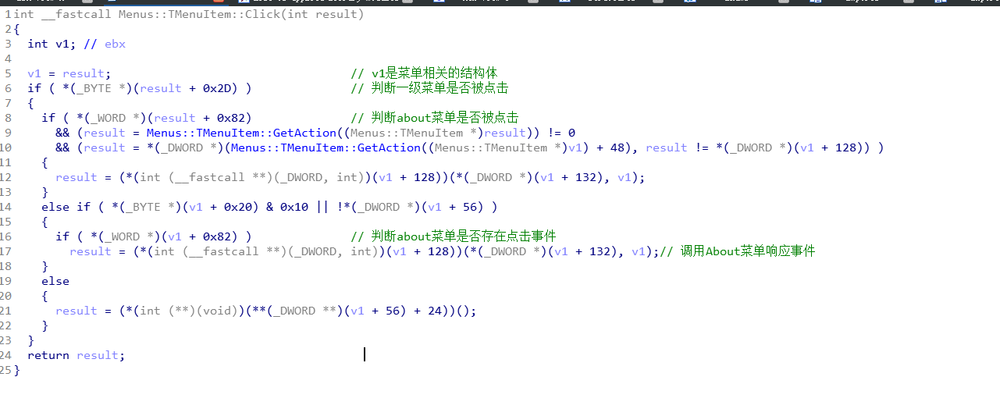

这里就是菜单的响应事件了，然后再次按Ctrl+F9返回


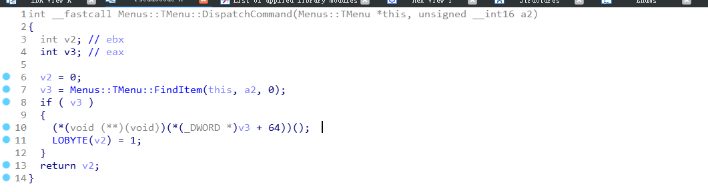

这里是DispatchCommand函数，再往上回溯就是消息循环了，我们直接在0043053B的菜单点击事件下断点，点击About按钮，F7进入函数


此时ebx的值为about控件的结构体，有about控件相关的字符串

然后再次点击Exit菜单，F7进入函数

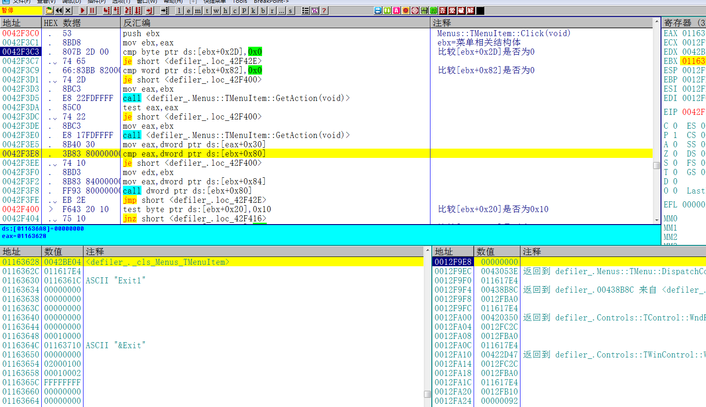

此时ebx的值为Exit控件的结构体，有Exit控件相关的字符串。

那么我们可以根据ebx的不同，植入一段代码，判断此时ebx值的情况，如果ebx值有Exit字符串的话，就说明Exit按钮被点击，然后执行我们自己的函数，否则继续执行原有函数。相当于是变相给菜单添加了点击事件

## 获取必要的API

首先需要拿到MessBox和ExitProcess的函数地址，查看导入表

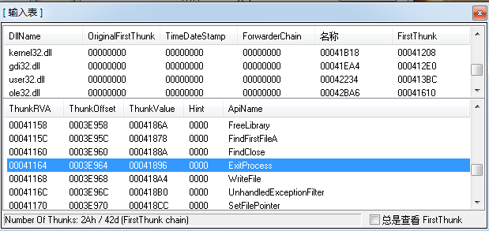

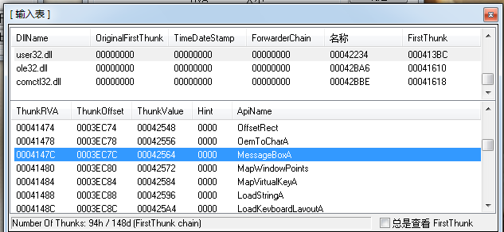

这个程序的导入表已经有这两个API，那么就不需要手工添加了

## 添加区段

由于植入的代码量较多，所以需要添加一个区段。

### 配置区段

打开LoadPE，加载目标程序，点击右键->添加区段

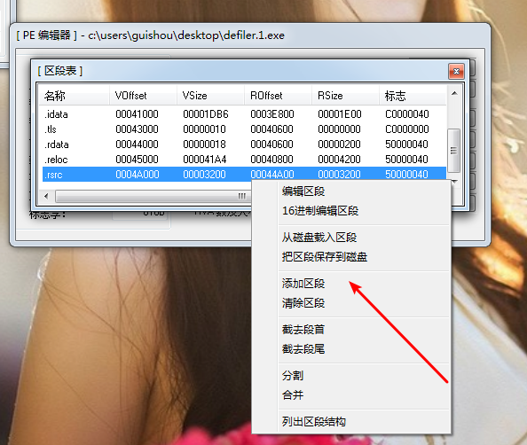

然后编辑新添加的区段，输入名称和虚拟大小以及物理大小即可，点击保存

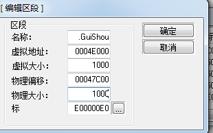

添加完成之后如图，记下新区段的RVA是4E000

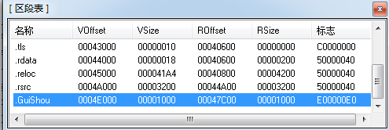

### 添加区段数据

区段虽然添加好了,但真正重要的区段数据还需要插入到文件中,以扩充文件的大小. 因为区段只是一个相当于目录的存在,如果只有目录而没有内容,就会造成一个无效的PE文件.

用010Edit打开目标文件，拉到文件末尾的位置，点击编辑->插入->插入字节

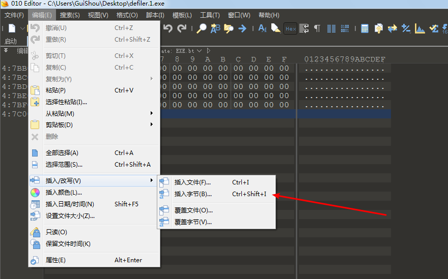

输入起始地址和大小，点击确定 然后保存即可


添加区段后如果文件能正常运行，说明添加成功

## 植入代码

接着将程序载入到OD，直接用RVA来到新区段地址处，我这里是4E000，

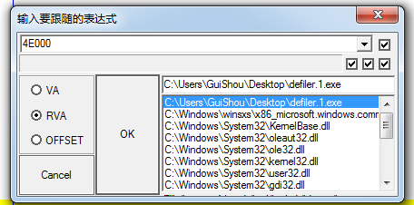

然后添加如下代码

```assembly
0044E000    60              pushad
0044E001    90              nop
0044E002    FF73 08         push    dword ptr [ebx+0x8]
0044E005    68 87E04400     push    0044E087                                 ; ASCII "Exit1"
0044E00A    E8 28000000     call    0044E037
0044E00F    85C0            test    eax, eax
0044E011    74 1B           je      short 0044E02E
0044E013    FF73 24         push    dword ptr [ebx+0x24]
0044E016    68 8DE04400     push    0044E08D                                 ; ASCII "&Exit"
0044E01B    E8 17000000     call    0044E037
0044E020    85C0            test    eax, eax
0044E022    74 0A           je      short 0044E02E
0044E024    C783 80000000 9>mov     dword ptr [ebx+0x80], 0044E093           ; 新函数的地址
0044E02E    90              nop
0044E02F    61              popad
0044E030    68 E4E04400     push    0044E0E4                                 ; UNICODE "荦刍"
0044E035    C3              retn
0044E036    90              nop
0044E037    FF7424 04       push    dword ptr [esp+0x4]                      ; 字符串比较
0044E03B    E8 33000000     call    0044E073
0044E040    50              push    eax
0044E041    FF7424 08       push    dword ptr [esp+0x8]
0044E045    E8 29000000     call    0044E073
0044E04A    8BD0            mov     edx, eax
0044E04C    58              pop     eax
0044E04D    3BC2            cmp     eax, edx
0044E04F    75 1D           jnz     short 0044E06E
0044E051    33C9            xor     ecx, ecx
0044E053    8B7424 04       mov     esi, dword ptr [esp+0x4]
0044E057    8B7C24 08       mov     edi, dword ptr [esp+0x8]
0044E05B    8A1431          mov     dl, byte ptr [ecx+esi]
0044E05E    3A1439          cmp     dl, byte ptr [ecx+edi]
0044E061    75 0B           jnz     short 0044E06E
0044E063    41              inc     ecx
0044E064    3BC8            cmp     ecx, eax
0044E066  ^ 75 F3           jnz     short 0044E05B
0044E068    33C0            xor     eax, eax
0044E06A    40              inc     eax
0044E06B    C2 0800         retn    0x8
0044E06E    33C0            xor     eax, eax
0044E070    C2 0800         retn    0x8
0044E073    33C9            xor     ecx, ecx                                 ; 取字符串长度
0044E075    8B4424 04       mov     eax, dword ptr [esp+0x4]
0044E079    803C08 00       cmp     byte ptr [eax+ecx], 0x0
0044E07D    74 03           je      short 0044E082
0044E07F    41              inc     ecx
0044E080  ^ EB F7           jmp     short 0044E079
0044E082    8BC1            mov     eax, ecx
0044E084    C2 0400         retn    0x4
0044E087    45              inc     ebp
0044E088    78 69           js      short 0044E0F3
0044E08A    74 31           je      short 0044E0BD
0044E08C    0026            add     byte ptr [esi], ah
0044E08E    45              inc     ebp
0044E08F    78 69           js      short 0044E0FA
0044E091    74 00           je      short 0044E093
0044E093    6A 24           push    0x24                                     ; MB_YESNO | MB_ICONQUESTION
0044E095    68 DCE04400     push    0044E0DC                                 ; ASCII "_KaQqi"
0044E09A    68 B6E04400     push    0044E0B6                                 ; ASCII "Do you fickbirne really want to quit?"
0044E09F    6A 00           push    0x0
0044E0A1    FF15 A4114400   call    dword ptr [<&user32.MessageBoxA>]        ; user32.MessageBoxA
0044E0A7    83F8 06         cmp     eax, 0x6
0044E0AA    75 09           jnz     short 0044E0B5
0044E0AC    6A 00           push    0x0
0044E0AE    2E:FF15 6411440>call    dword ptr cs:[<&kernel32.ExitProcess>]   ; kernel32.ExitProcess
0044E0B5    C3              retn
0044E0B6    44              inc     esp                                      ; 提示信息和标题
0044E0B7    6f              outs    dx, dword ptr [esi]
0044E0B8    2079 6F         and     byte ptr [ecx+0x6F], bh
0044E0BB    75 20           jnz     short 0044E0DD
0044E0BD    66:6963 6B 6269 imul    sp, word ptr [ebx+0x6B], 0x6962
0044E0C3    72 6E           jb      short 0044E133
0044E0C5    65:2072 65      and     byte ptr gs:[edx+0x65], dh
0044E0C9    61              popad
0044E0CA    6c              ins     byte ptr [edi], dx
0044E0CB    6c              ins     byte ptr [edi], dx
0044E0CC    79 20           jns     short 0044E0EE
0044E0CE    77 61           ja      short 0044E131
0044E0D0    6e              outs    dx, byte ptr [esi]
0044E0D1    74 20           je      short 0044E0F3
0044E0D3    74 6F           je      short 0044E144
0044E0D5    2071 75         and     byte ptr [ecx+0x75], dh
0044E0D8    69743F 00 5F4B6>imul    esi, dword ptr [edi+edi], 0x51614B5F
0044E0E0    71 69           jno     short 0044E14B
0044E0E2    0000            add     byte ptr [eax], al
0044E0E4    66:83BB 8200000>cmp     word ptr [ebx+0x82], 0x0                 ; 转移
0044E0EC  - E9 2D13FEFF     jmp     0042F41E
0044E0F1    90              nop
0044E0F2    0000            add     byte ptr [eax], al
```

十六进制代码如图

```
60 90 FF 73 08 68 87 E0 44 00 E8 28 00 00 00 85 C0 74 1B FF 73 24 68 8D E0 44 00 E8 17 00 00 00
85 C0 74 0A C7 83 80 00 00 00 93 E0 44 00 90 61 68 E4 E0 44 00 C3 90 FF 74 24 04 E8 33 00 00 00
50 FF 74 24 08 E8 29 00 00 00 8B D0 58 3B C2 75 1D 33 C9 8B 74 24 04 8B 7C 24 08 8A 14 31 3A 14
39 75 0B 41 3B C8 75 F3 33 C0 40 C2 08 00 33 C0 C2 08 00 33 C9 8B 44 24 04 80 3C 08 00 74 03 41
EB F7 8B C1 C2 04 00 45 78 69 74 31 00 26 45 78 69 74 00 6A 24 68 DC E0 44 00 68 B6 E0 44 00 6A
00 FF 15 A4 11 44 00 83 F8 06 75 09 6A 00 2E FF 15 64 11 44 00 C3 44 6F 20 79 6F 75 20 66 69 63
6B 62 69 72 6E 65 20 72 65 61 6C 6C 79 20 77 61 6E 74 20 74 6F 20 71 75 69 74 3F 00 5F 4B 61 51
71 69 00 00 66 83 BB 82 00 00 00 00 E9 2D 13 FE FF 90 00 00
```

直接复制，右键->二进制->二进制粘贴即可

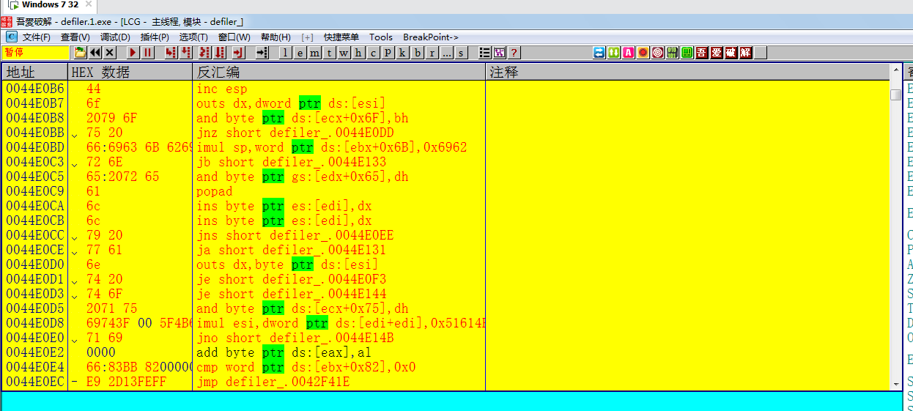

修改完成之后保存

## 修改目标函数

接下来我们要修改关键函数，让目标程序点击菜单时，跳转到自己的新添加的区段，直接来到0x0042F216处，

修改为如下代码：

```assembly
0042F416    68 00E04400     push    0044E000
0042F41B    C3              retn
0042F41C    90              nop
0042F41D    90              nop
```

对应的十六进制为

```
68 00 E0 44 00 C3 90 90
```

## 校验结果

修改完成之后来检验一下结果，点击Exit菜单，弹出对话框


点击是，退出程序。Patch完成！

最后，需要相关文件可以到我的Github下载：<https://github.com/TonyChen56/160-Crackme>


