[TOC]

【软件名称】：Dope2112.1.exe

【软件大小】：178KB

【下载地址】：自行搜索下载

【加壳方式】：无壳

【保护方式】：无保护

【编译语言】：Delphi

【调试环境】：W7 32

【使用工具】：OD + IDA 

【破解日期】：2019年5月21日

【破解目的】：纯属兴趣

## 寻找切入点

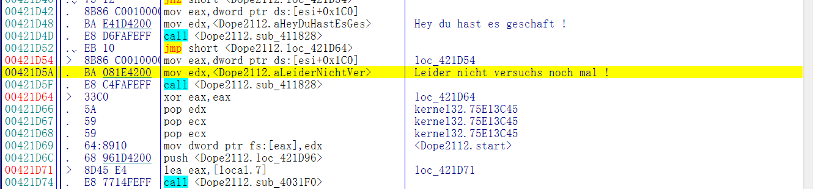

首先搜索关键字符串，根据这个地址对应到IDA可以很快找到函数头部00421B84，从这里开始分析整个算法

## 算法分析

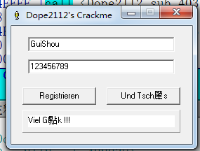

随便输入一个用户名和序列号，开始分析整个注册算法

### 基础校验

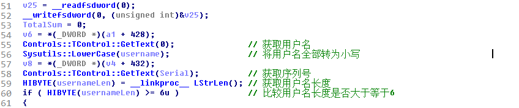

首先是基础校验部分，在IDA中如图，下面开始详细讲解每一步

1. 获取用户名

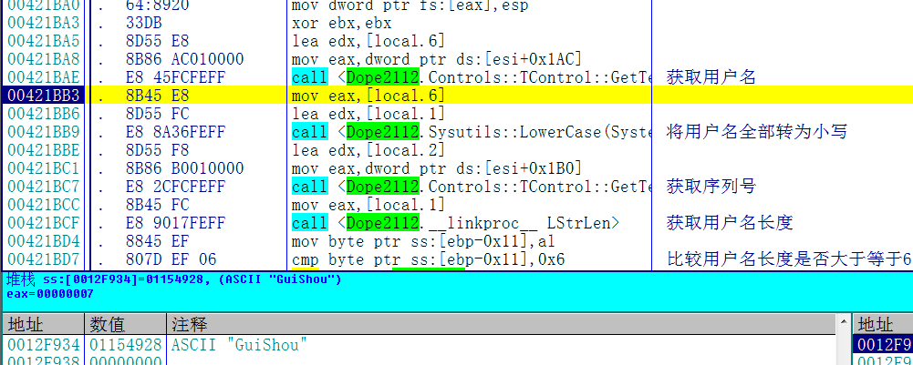

2. 将用户名全部转为小写

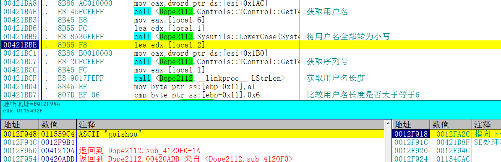

3. 获取输入的序列号

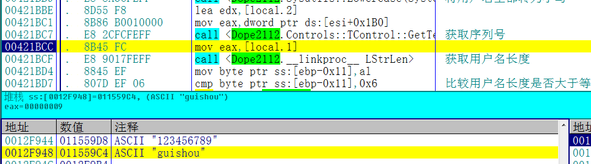

4. 比较用户名长度是否大于等于6

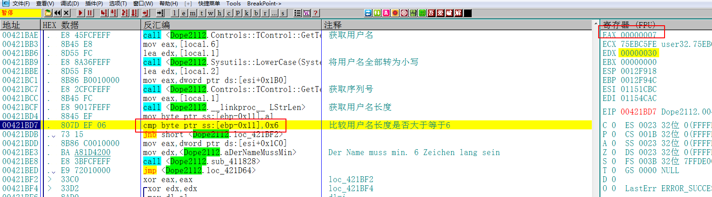

至此基础校验部分结束，开始计算注册码。真正的注册码分为两部分，首先解释第一部分

### 第一部分

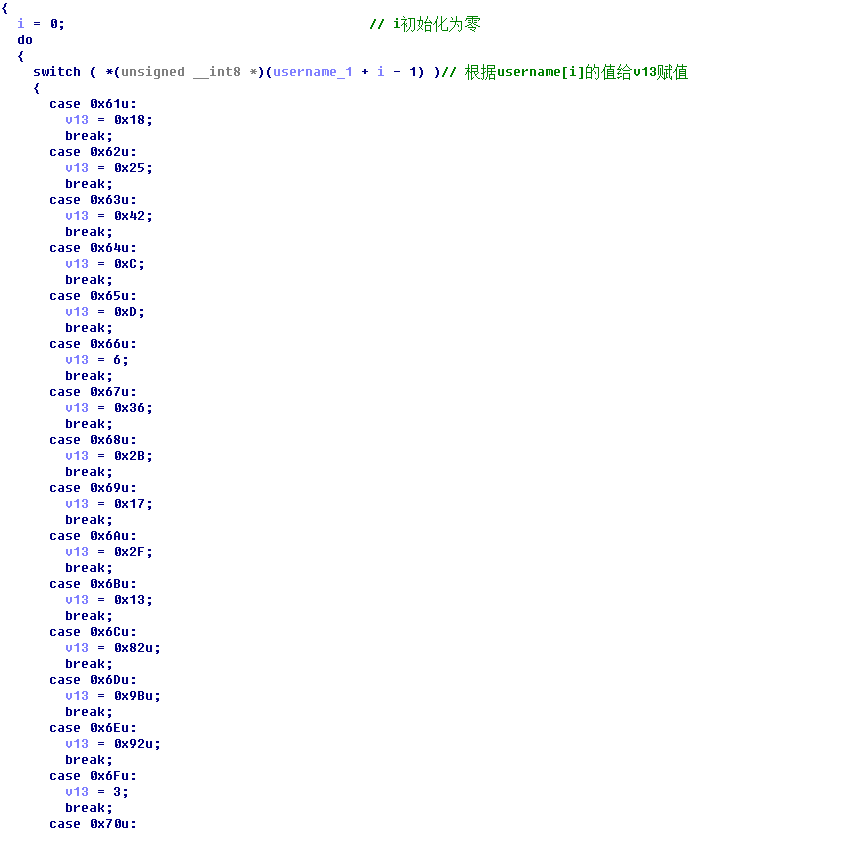

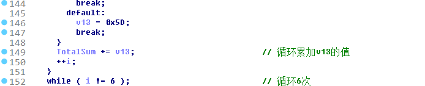

第一部分的算法根据用户名的ASCII值循环六次计算出来一个结果，算法和IDA反汇编出来的伪代码是一致的，这里就不多做说明了。

### 第二部分

接下来是第二部分，这一部分在IDA反汇编的伪代码中是没有的。

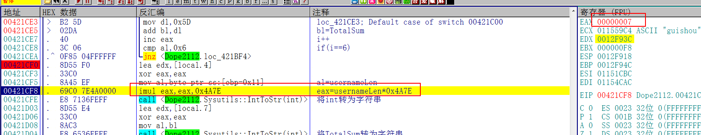

首先计算出用户名长度乘以0x4A7E的结果，

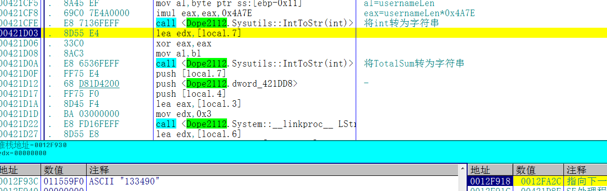

接着将计算的结果转为字符串

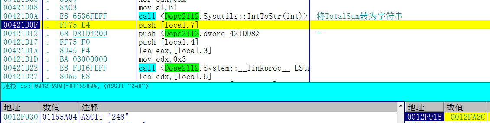

然后再将第一部分用户名计算的结果转为字符串

### 校验部分

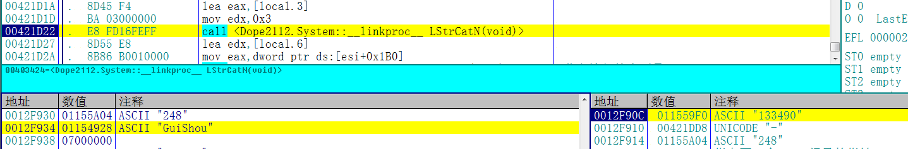

将两个部分的注册码拼接

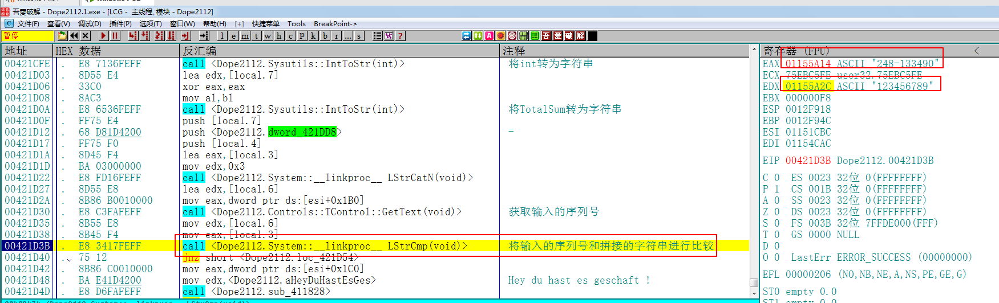

接着将输入的序列号和两部分拼接的字符串进行比较，根据比较的结果提示是否注册成功

## 写出注册机

这个注册机也是好写的不行啊，直接把IDA的代码拷下来稍微改改就行了，代码如下：

```c++
#include <iostream>
#include <windows.h>


int main()
{
	char username[20] = { 0 };
	printf("请输入用户名:");
	scanf_s("%s", username, 20);
	int usernameLen = strlen(username);
	if (usernameLen<6)
	{
		printf("用户名长度必须大于等于6");
	}
	//大写转小写
	for (int i=0;i<usernameLen;i++)
	{
		if (username[i]>='A'&&username[i]<='Z')
		{
			username[i] += 32;
		}
	}

	int v13 = 0;
	int TotalSum = 0;
	int i = 0;                                      // i初始化为零
	do
	{
		switch ((username[i- 1]))// 根据username[i]的值给v13赋值
		{
		case 0x61u:
			v13 = 0x18;
			break;
		case 0x62u:
			v13 = 0x25;
			break;
		case 0x63u:
			v13 = 0x42;
			break;
		case 0x64u:
			v13 = 0xC;
			break;
		case 0x65u:
			v13 = 0xD;
			break;
		case 0x66u:
			v13 = 6;
			break;
		case 0x67u:
			v13 = 0x36;
			break;
		case 0x68u:
			v13 = 0x2B;
			break;
		case 0x69u:
			v13 = 0x17;
			break;
		case 0x6Au:
			v13 = 0x2F;
			break;
		case 0x6Bu:
			v13 = 0x13;
			break;
		case 0x6Cu:
			v13 = 0x82u;
			break;
		case 0x6Du:
			v13 = 0x9Bu;
			break;
		case 0x6Eu:
			v13 = 0x92u;
			break;
		case 0x6Fu:
			v13 = 3;
			break;
		case 0x70u:
			v13 = 0x63;
			break;
		case 0x71u:
			v13 = 0x21;
			break;
		case 0x72u:
			v13 = 0x42;
			break;
		case 0x73u:
			v13 = 0x5C;
			break;
		case 0x74u:
			v13 = 0x29;
			break;
		case 0x75u:
			v13 = 0xC7u;
			break;
		case 0x76u:
			v13 = 0x66;
			break;
		case 0x77u:
			v13 = 0x58;
			break;
		case 0x78u:
			v13 = 0xA;
			break;
		case 0x79u:
			v13 = 0x28;
			break;
		case 0x7Au:
			v13 = 0x50;
			break;
		default:
			v13 = 0x5D;
			break;
		}
		TotalSum += v13;                          // 循环累加v13的值
		++i;
		//这里记得超出范围清掉高位
		if (TotalSum>0xFF)
		{
			TotalSum &= 0x00FF;
		}
	} while (i != 6);

	printf("%d-%d\n", TotalSum,0x4A7E*usernameLen);
	system("pause");
	return 0;
}
```

## 校验结果

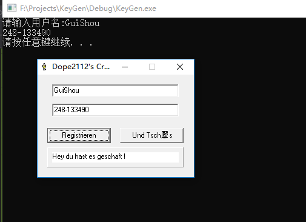


输入用户名和计算的序列号，提示成功，破解完成

最后，需要相关文件可以到我的Github下载：<https://github.com/TonyChen56/160-Crackme>