[TOC]

【软件名称】：Dope2112.2.exe

【软件大小】：171kb

【下载地址】：自行搜索下载

【加壳方式】：无壳

【保护方式】：Name/Serial

【编译语言】：Delphi

【调试环境】：W10 64

【使用工具】: OD+IDA

【破解日期】：2019-5-28

【破解目的】：纯属兴趣

## 导入符号

首先将程序载入到IDA，导入所有的Delphi签名

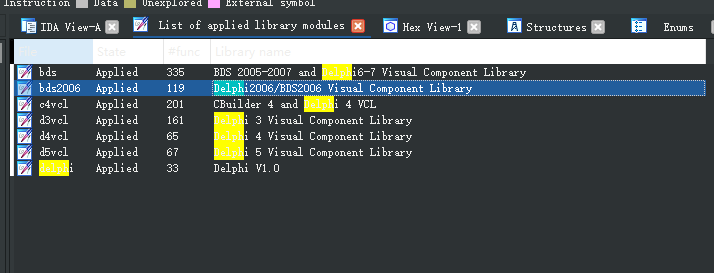

接着生成map文件

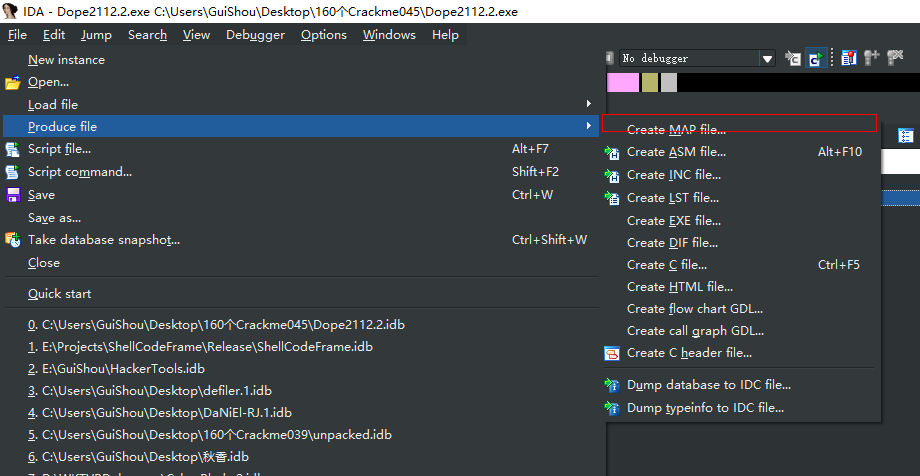

然后在OD中导入

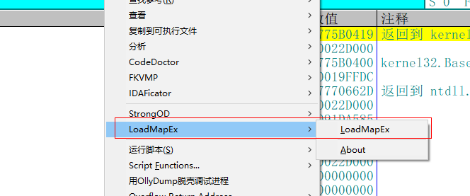

## 用CE寻找切入点

由于不能用DarkDe，而且无法搜索到字符串，我试了好几个API断点也断不下来，所以只能用CE来搜索地址，首先用OD载入，然后再打开CE，这样可以省去后面再用OD附加的麻烦

由于Delphi中存储的都是ASCII的形式，所以我们直接搜索1111的十六进制ASCII值31313131

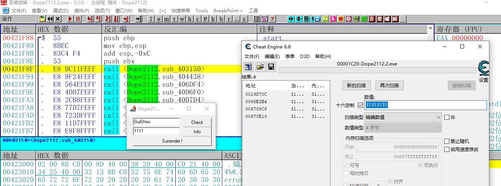

接着变换1111为2222

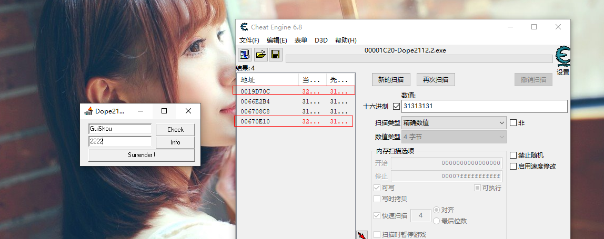

可以很明显的看到我们要的地址就是这两个中的一个了

找到上面两个地址，依次对下面两个地址下一个字节的内存访问断点

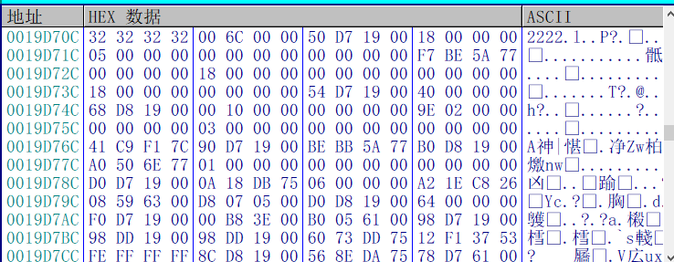

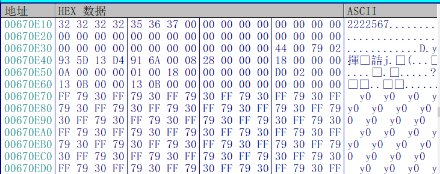

程序断下

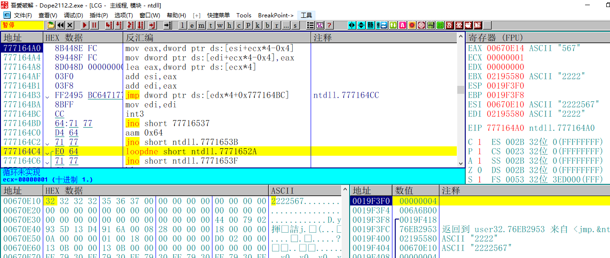

接着点击K，查看调用堆栈

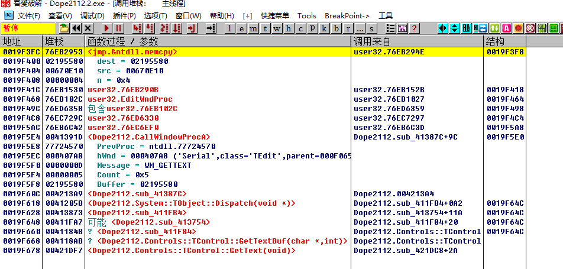

可以看到当前所在的是memcpy这个函数，而最下面的是GetText获取用户输入，直接记下这个地址0x421DF7

## 分析算法

找到0x421DF7函数头的位置0x00421DC8 ，开始分析整个算法，校验步骤如下

1. 获取序列号

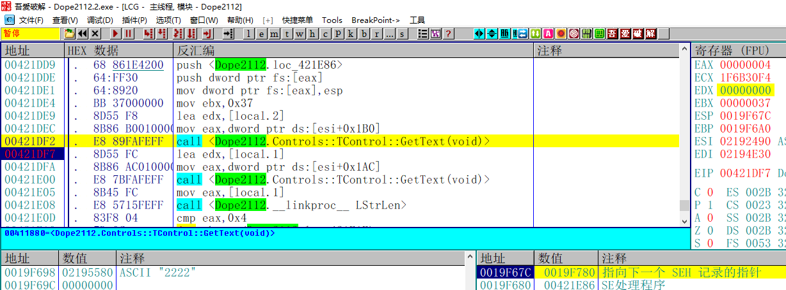

2. 获取用户名

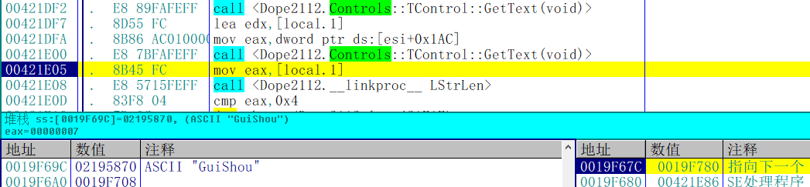

3. 比较用户名长度是否大于等于4

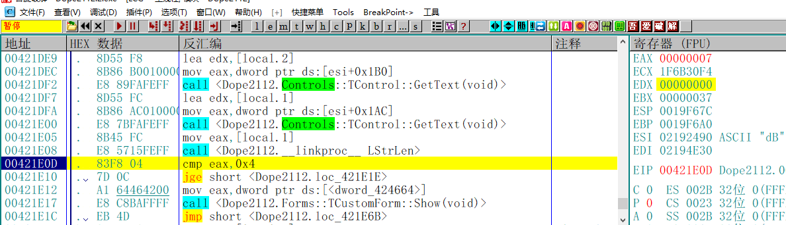

4. 再次获取用户名长度

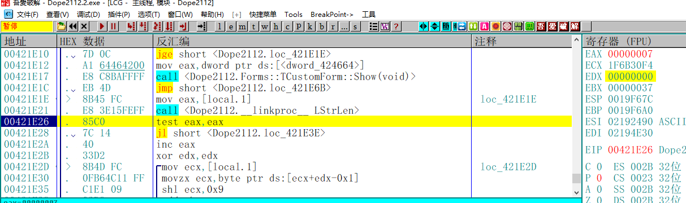

5. 循环累加用户名的ASCII值右移9位的和

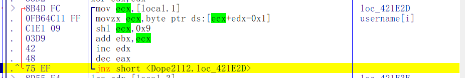

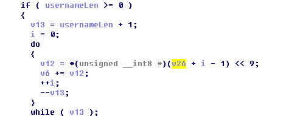

6. 将累加的结果转为字符串

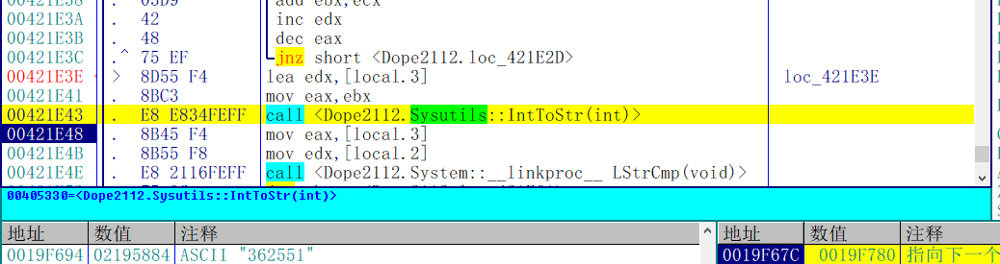

7. 和序列号进行比较

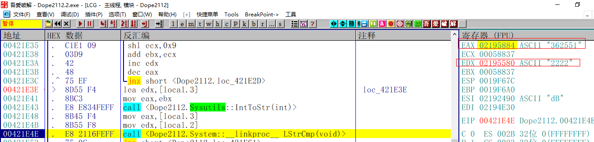

下面贴上IDA的伪代码注释

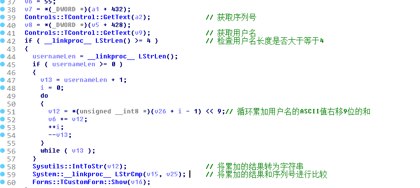

## 写出注册机

注册机代码如下:

```c++
#define _CRT_SECURE_NO_WARNINGS
#include <windows.h>
#include <stdio.h>


int main()
{
	int result = 0x37;
	char username[20] = { 0 };
	char serial[20] = { 0 };
	printf("请输入用户名：");
	scanf_s("%s", username, 20);
	int usernameLen = strlen(username);
	if (usernameLen>=4)
	{
		for (int i = 0; i < usernameLen; i++)
		{
			result += username[i] << 9;
		}
	}
	printf("%d\n", result);
	system("pause");
	return 0;
}

```

## 校验结果

输入用户名和计算的序列号

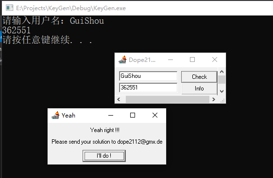

提示成功 破解完成

需要相关文件的可以到我的Github下载：https://github.com/TonyChen56/160-Crackme