[TOC]

【软件名称】：Dope2112.2.exe

【软件大小】：12.0 KB

【下载地址】：自行搜索下载

【加壳方式】：无壳

【保护方式】：Keyfile

【编译语言】：MASM

【调试环境】：W7 32

【使用工具】:  OD

【破解日期】：2019-6-15

【破解目的】：纯属兴趣

## 校验步骤

### 条件一

用OD载入后直接往下拉就能看到CreateFile函数，我们在这下个断点

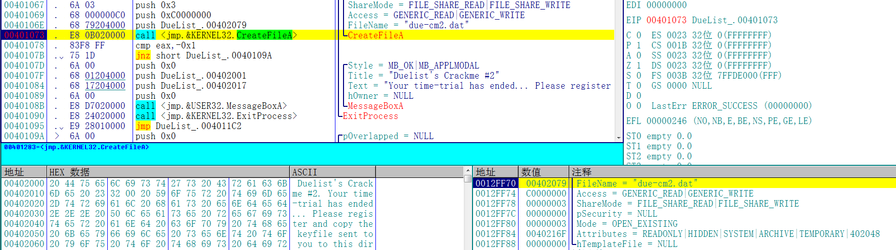

该函数以读写的方式打开due-cm2.dat文件，为了通过校验，我们需要在同路径下创建一个名为due-cm2.dat的文件，并在文件内填充任意内容

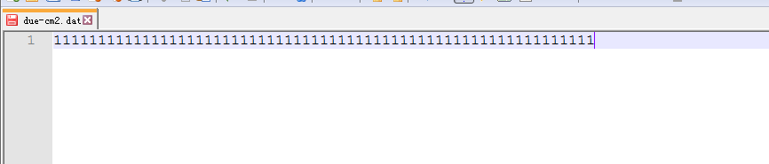

接着读取0x46个字节的文件内容到缓冲区

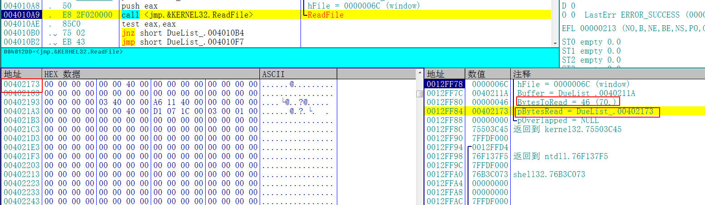

这里重点关注pBytesRead实际读取到的字节数

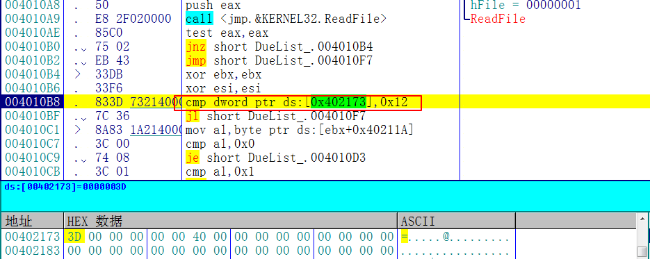

然后会比较[0x402173]的位置的值是否小于0x12，这个地址就是实际读取的字节数，所以我们得出

**条件1：due-cm2.dat文件内容不能小于0x12个字节**

### 条件二

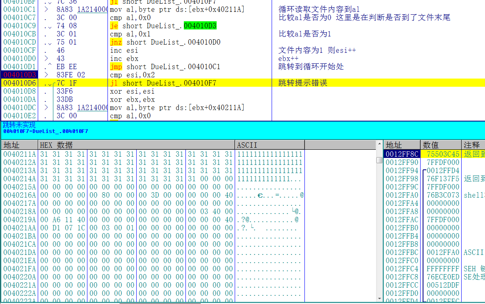

接着到了一个循环，这个循环会读取文件的每一个字节，并且和1比较，如果内容为1，则esi++。然后再循环结束之后，会比较esi是否小于2。所以我们得出：

**条件二：文件内容的ASCII必须有至少两个0x1**

### 条件三

继续往下，我们暂时先将esi的值修改为2

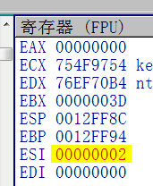

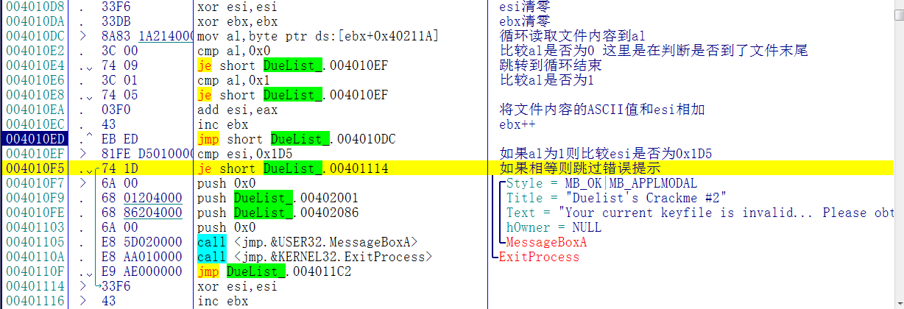

接着又是一轮循环，这一次将上轮循环的esi和ebx清零之后，依旧是循环读取文件内容到al，如果al的值为1则比较esi是否为0x1D5，接着会根据比较的结果决定是否跳转。所以我们得出：

**条件三：在第一个0x1之前的文件内容的ASCII值之和必须为0x1D5**

### 条件四

继续跟踪，这里先暂时通过修改零标志位让程序通过条件三的验证

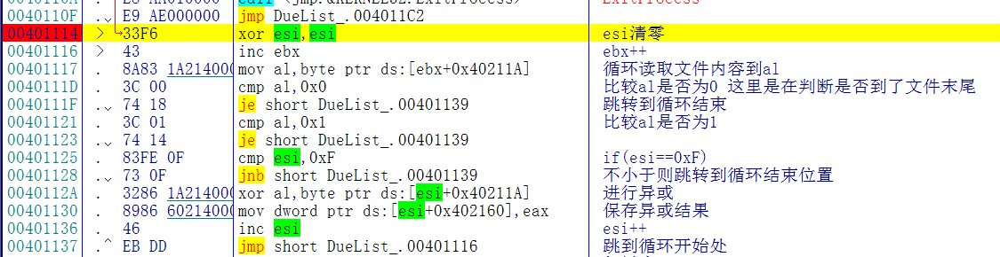

这里还是循环读取文件内容，不同的是这一次ebx的值没有被清零，ebx的值是条件三的循环次数。这里将进行循环异或然后将异或的结果保存，保存的结果最终将显示为成功注册的用户名

### 条件五

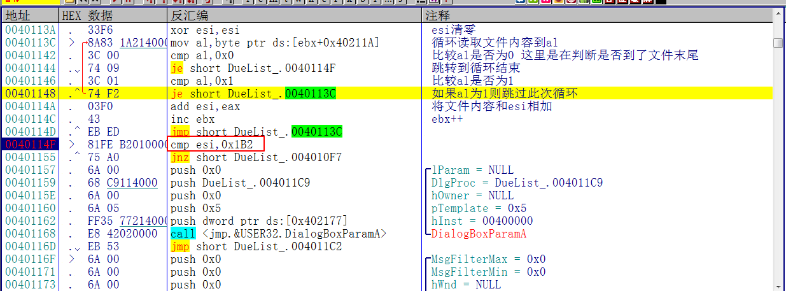

这里同样没有把ebx清零，也是读取文件内容，将文件内容的ASCII值累加到esi，如果遇到文件内容为1则跳过循环。最后循环结束之后比较esi的值是否为0x1B2，如果相等则校验通过，所以我们得出

**条件四：文件内容的ASCII值(除去0x1)累加必须等于0x1B2**

## 注册机的编写

看到这么繁琐的校验我就脑阔疼。这个程序分析出了注册条件还得自己去推注册机！直接从吾爱拷了一个过来。。。。代码如下：

```c++
#define _CRT_SECURE_NO_WARNINGS
#include<iostream>
#include <windows.h>
using namespace std;
int main()
{
	const char * path = "E:\\due-cm2.dat";
	FILE * keyfile;
	char * youkey = new char[40];         //输入用户名
	memset(youkey, 0, 40);
	unsigned char * writekey = new unsigned char[40];
	memset(writekey, 0, 40);             //存入文件的内容
	cout << "Enter your name:";
	scanf_s("%s",youkey,40);
	if (strlen(youkey) >= 8)
		cout << "用户名最多支持13位，其余部分将被截断!" << endl;
	int now = 0;

	writekey[0] = 0xEA;
	writekey[1] = 0xEB;
	writekey[2] = 0x01;
	for (unsigned int x = 0; x < 13 && x < strlen(youkey); x++)
	{
		writekey[x + 3] = youkey[x] ^ writekey[x];
	}
	if (strlen(youkey) >= 13)
		now = 16;
	else
		now = strlen(youkey) + 3;

	writekey[now] = 0x01;
	writekey[now + 1] = 0xD9;
	writekey[now + 2] = 0xD9;
	errno_t err = fopen_s(&keyfile, path, "w+b");
	if (err != 0)
	{
		cout << "file open or create failed!" << endl;
		system("pause");
		return -1;
	}
	rewind(keyfile);
	fwrite(writekey, sizeof(byte), 40, keyfile);
	fclose(keyfile);
	cout << "write file over!" << endl;
	delete[] youkey;
	delete[] writekey;
	system("pause");
	return 1;
}
```

设置好文件路径，然后输入用户名

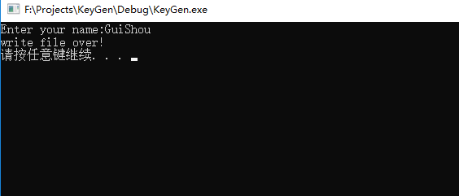

就会将用户名和密码写入到文件，然后再次打开程序

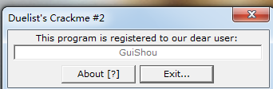

显示注册成功 KO！

需要相关文件的可以到我的Github下载：https://github.com/TonyChen56/160-Crackme